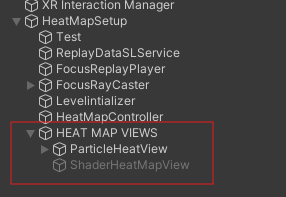
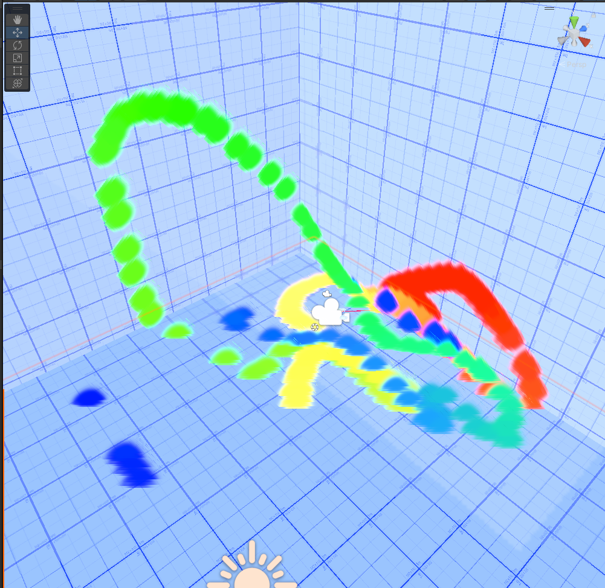
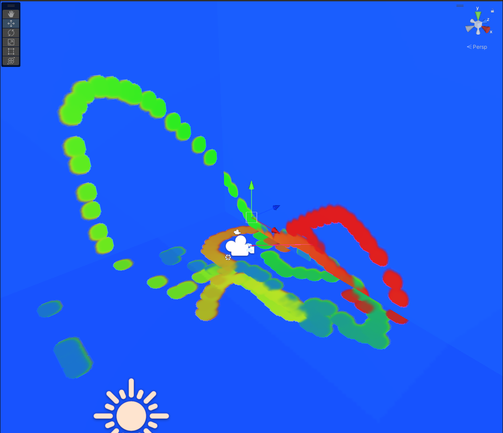
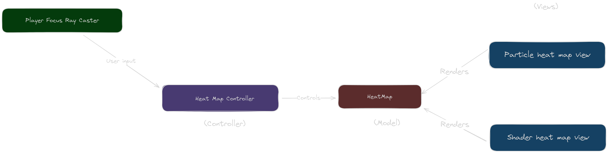

# Insight Analytics Heat Map By Dhruv Pant

## Introduction

The heat map system I have created for this assignment uses ray casting, to determine focus points during the replay and keeps a record of the points on the level player is looking at.
The current system does not look the most impressive or relisting visually because i tried to make something that renders realtime in the replay mode. We can extend this system to make much more realistic heat maps that generate at the end taking some time to process, after tracking the focus data from replay.

## How to use?

Find the **HeatMapTest** scene in the **Samples/HeatMap** directory after installing the InsightXR SDK. Heat Map view is already set up in this scene. Disable or enable the game objects associated with the different heat map views to disable or enable the view itself.

Enter replay mode and play the replay as usual the heat map will generate and render along with the replay 

The particle heat map should show you a result like this

The Shader heat map view should show you a result like this

## How it works

` HeatMapAnalyticsInitializer ` initializes the level for collecting heat map data using ray casting by adding a mesh collider to every mesh in the scene which does not already have one

` PlayerFocusRayCaster ` casts a ray every **DistributionRequestEvent** and creates a **PlayerFocusChanged** event if the casted ray hits a collider passing down the ""hit" data

The ` HeatMapController ` listens to player focus changed events and generates a ` HeatMap ` model by adding a heat value of "1.1f" to the hit point, there is also a cool down method that applies a cool down every replay frame, therefore each point on the heat map cool downs over time hence the newest focus points and points looked at for a long amount of time appear as hotter older focus points are cooler

The different views use different techniques to render this Heat Map data, we have two views at the moment on particle based and one shader based the detailed functioning of these views are better understood by looking at the `ParticleHeatMapView.cs` and `HeatMapTexturePainter.cs`
scripts respectively

## Architecture

The system uses a MVC pattern, the ` PlayerFocusRayCaster ` is used to detect changes is user's focus
The ` HeatMapController ` listens to these changes and generates a ` HeatMap ` model, the heat map views can listen to updates and ` HeatMap ` and visualize this in game space using different techniques. I have added two Heat Map views one utilizes **Unity's particle system** and other using **Shaders**

