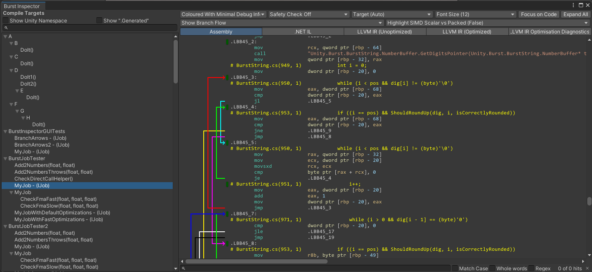

# Burst Inspector window reference

The Burst Inspector window displays all the jobs and other Burst compile targets in the project. To open the Burst Inspector window, go to **Jobs** &gt; **Burst** &gt; **Open Inspector**.

The Burst Inspector displays all the Jobs that it can compile. It also displays the generated intermediate and native assembly code.

When opening a new target job in the Burst Inspector, it will try to focus the assembly directly related to the chosen bursted job. Furthermore, if branch flow arrows are shown, and they fill more than half of the assembly view, the inspector will scroll horizontally rightwards to focus the code instead of the branches.

 _Burst Inspector with Branch Flow enabled_

## Burst Inspector panes

The **Compile Targets** pane on the left of the window displays an alphabetical list of the jobs in the project that Burst can compile. By default jobs either in the Unity namespace or with ".Generated" in the name are excluded. This can be changed via the toggles **Show Unity Namespace** and **Show ".Generated"** respectively. Disabled jobs in the list don't have the `[BurstCompile]` attribute.

The right output pane of the Burst Inspector window displays options to view the assembly and intermediate code for the job you've selected in the **Compile Targets** list. To expand or collapse elements of the code, select the colored boxes (some with ellipses) . By default. the Burst Inspector automatically collapses blocks that it considers non-essential, such as most directives and data.

It is possible to select lines of assembly. This will highlight the selected line, by underlining it. If this line contains any registers, the usage of these registers will be highlighted throughout the code; note that implicit registers are ignored for this feature.

To select and copy the text in this pane, either click and drag with your mouse, or use Shift + arrow keys to select the text. To copy the text, either right-click and select **Copy Selection**, or press Ctrl + C (Command + C on macOS). Default behavior for the Burst Inspector's copy is to include underlying color tags. To change this, right-click with the mouse on the right pane, to open up the context menu, and untick **Copy Color Tags**.

At the top of the window, the following display options are available:

| **Display option**                                                                              | **Function**                                                                                                                                                                                                                                                                                             |
|-------------------------------------------------------------------------------------------------|----------------------------------------------------------------------------------------------------------------------------------------------------------------------------------------------------------------------------------------------------------------------------------------------------------|
| **Output dropdown**                                                                             | Use the dropdown to select how to output the information in the Burst Inspector window                                                                                                                                                                                                                   |
| Plain Without Debug Information                                                                 | Displays the raw output.                                                                                                                                                                                                                                                                                 |
| Plain With Debug Information                                                                    | Displays the raw output with debug information.                                                                                                                                                                                                                                                          |
| Enhanced with Minimal Debug Information (Only available in **Assembly** view)               | Displays the line information interweaved with the assembly to guide you to what line in your code matches what assembly output. If you've enabled **Show Branch Flow**, the branch flow indicates where jump instruction might branch off to.                                                           |
| Enhanced With Full Debug Information (Only available in **Assembly** view)                  | Displays the same information as Enhanced with Minimal Debug Information but with debug information included.                                                                                                                                                                                            |
| Coloured With Minimal Debug Information (Only available in **Assembly** view)               | Displays the same information as Enhanced with Minimal Debug Information, but displays the output in color.                                                                                                                                                                                              |
| Coloured With Full Debug Information (Only available in **Assembly** view)                  | Displays the same information as Enhanced with Full Debug Information, but displays the output in color.                                                                                                                                                                                                 |
| **Safety Checks**                                                                               | Enable this option to generate code that includes container access safety checks, for example, to check if a job is attempting to write to a read-only native container.                                                                                                                                 |
| **Font Size**                                                                                   | Select the size of the text in the output pane.                                                                                                                                                                                                                                                          |
| **Architecture dropdown**                                                                       | Select the target architecture for your build.                                                                                                                                                                                                                                                           |
| **Focus on Code** (Only available in **Enhanced** or **Coloured** output)                   | Collapses the least important blocks of the disassembly. When you select this, Unity hides most of the assembly language directives and non code segments, allowing you to focus on the code itself.                                                                                                     |
| **Expand all**  (Only available in **Enhanced** or **Coloured** output)                     | Expands all collapsed blocks of disassembly and displays all the hidden assembly language directives and data elements.                                                                                                                                                                                  |
| **Show Branch Flow** (Only available in **Enhanced** or **Coloured** output)                | Enable this option to display arrows that show branch flow in the code. When enabled, the code moves to the right, to make space to display the arrows.                                                                                                                                                  |
| **Highlight SIMD Scalar vs Packed** (Only available in **Enhanced** or **Coloured** output) | Enable this option to display SIMD instruction differently depending on their nature (Whether they work on packed or scalar inputs). This can be used to quickly assess the quality of the generated vectorized code (see [SIMD smell test by Andreas Fredriksson](https://youtu.be/BpwvXkoFcp8?t=447)). |                                                                                                                                                                                                |
| **Assembly**                                                                                    | Displays the final optimized native code that Burst generated.                                                                                                                                                                                                                                           |
| **.NET IL**                                                                                     | Displays the original .NET IL extracted from the job method.                                                                                                                                                                                                                                             |
| **LLVM IR (Unoptimized)**                                                                       | Displays the internal LLVM IR before optimizations.                                                                                                                                                                                                                                                      |
| **LLVM IR (Optimized)**                                                                         | Displays the internal LLVM IR after optimizations.                                                                                                                                                                                                                                                       |
| **LLVM IR Optimization Diagnostics**                                                            | Displays LLVM diagnostics of the optimizations, such as if they succeeded or failed.                                                                                                                                                                                                                     |
