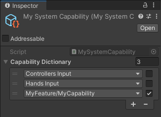
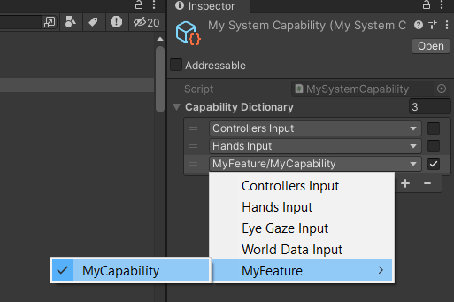

# Capability

The Capability system abstracts the current capabilities of the application. A capability is a key-value pair consisting of a `string` key and a `boolean` value. When not defined, the capability has the `Undefined` value. These capabilities can represent input capabilities (such as Controllers or Hands Input), OS permission flags, rendering capability settings (can render particles, text, etc) or any other system capabilities or flags.

## Capability Profile

 *A custom Capability Profile asset*

The capability profile is an asset in the project that abstracts the capabilities of a system, such as a device, a platform, an OS or a combination of them. These capabilities can change during authoring or/and runtime.

> [!NOTE]
> A capability should only be set to `false` if it's prohibited to be used. If the capability is just unsupported it should have the `Undefined` value. For example, if a device has no support for hand tracking, its capability profile should set the `Hands Input` to `Undefined`, rather than explicitly `false`. Usually OS or platform (and similar system) capability profiles are the ones that set a capability to `false`.

### Custom Capability Profile

You can create a custom capability profile by inheriting from the [CapabilityProfile](xref:Unity.XR.CoreUtils.Capabilities.CapabilityProfile) class (a [ScriptableObject](xref:UnityEngine.ScriptableObject)) and implementing the interface [ICapabilityModifier](xref:Unity.XR.CoreUtils.Capabilities.ICapabilityModifier).

[!code-cs[custom_capability_sample](../Tests/CodeSamples/ScriptedCapabilityProfileSamples.cs#custom_capability_sample)]

> [!NOTE]
> The [CapabilityDictionary](xref:Unity.XR.CoreUtils.Capabilities.CapabilityDictionary) is a dictionary to store a set of capabilities, and uses a custom UI drawer to display these capabilities in the Inspector.

## Custom Capability

 *A custom capability key in a `CapabilityDictionary`*

You can add a new capability key by tagging a `const string` definition with the [CustomCapabilityKey](xref:Unity.XR.CoreUtils.Capabilities.CustomCapabilityKeyAttribute) attribute. Custom capability keys tagged with this attribute will showup in the Inspectors of a `CapabilityDictionary`. You can specify the order that your custom capability key will be displayed in the context menu by passing an `int` value to the attribute constructor, high values are displayed later.

[!code-cs[custom_capability_key_sample](../Tests/CodeSamples/ScriptedCapabilityProfileSamples.cs#custom_capability_key_sample)]

### Custom Capability with non Boolean Value

It's possible to define a capability that has a different value type than boolean (for example, a screen width and height maximum size). In this case it's recommended to define an interface as the capability key and query for the values using this interface. The code below has an example for this situation:

[!code-cs[custom_capability_type_sample](../Tests/CodeSamples/ScriptedCapabilityProfileSamples.cs#custom_capability_type_sample)]
