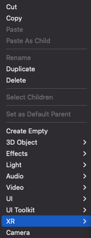
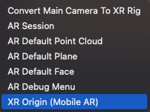

# Add XR Origin to a scene

This *XR Core Utilities* package defines the [XROrigin](xref:Unity.XR.CoreUtils.XROrigin) component. Other XR packages use this component to provide XR Origin configurations for different types of XR applications:

* [AR Foundation (com.unity.xr.arfoundation)](https://docs.unity3d.com/Packages/com.unity.xr.arfoundation@latest/index.html) provides XR Origin GameObjects configured for AR. 
* The [XR Interaction Toolkit (com.unity.xr.interaction.toolkit)](https://docs.unity3d.com/Packages/com.unity.xr.interaction.toolkit@latest/index.html) provides XR Origin GameObjects configured for VR. 

AR Foundation and the XR Interaction Toolkit are independent packages, but can also be used together to build XR applications. 

| **XR Origin configuration** | **Purpose** | **Package** |
| :-------------------------- | :---------- | :---------- |
| **XR Origin (AR)** | Apps that support multiple XR modes, such as both HMD and hand-held configurations, and use the current [Input System](https://docs.unity3d.com/Packages/com.unity.inputsystem@latest) package.| [AR Foundation (com.unity.xr.arfoundation)](https://docs.unity3d.com/Packages/com.unity.xr.arfoundation@latest/index.html) |
| **XR Origin (Mobile AR)** | Apps that support hand-held AR only. | [AR Foundation (com.unity.xr.arfoundation)](https://docs.unity3d.com/Packages/com.unity.xr.arfoundation@latest/index.html) |
| **XR Origin (VR)** | Apps that support VR only and use the current [Input System](https://docs.unity3d.com/Packages/com.unity.inputsystem@latest) package. | [XR Interaction Toolkit (com.unity.xr.interaction.toolkit)](https://docs.unity3d.com/Packages/com.unity.xr.interaction.toolkit@latest/index.html) |
| **Device-based** > **XR Origin (VR)** | Apps that support VR only and use the legacy [Input Manager](xref:xr_input) for device-based input. | [XR Interaction Toolkit (com.unity.xr.interaction.toolkit)](https://docs.unity3d.com/Packages/com.unity.xr.interaction.toolkit@latest/index.html) |

See [XR Origin components and properties](xref:xr-core-utils-xr-origin-reference) for information about the contents of these XR Origin configurations.

Once you have installed the AR Foundation or XR Interaction Toolkit packages, you can add the appropriate XR Origin to your scene from the **GameObject > XR** menu. You can also right-click in the Scene Hierarchy window and select an XR Origin option from the context menu:

Right-click in the Hierarchy window       |  Select XR Origin (Mobile AR)
:-------------------------:|:-------------------------:
  |  

> [!NOTE]
> Without the AR Foundation or XR Interaction Toolkit packages installed, the **XR** menu only contains a **Convert main camera to XR Rig** option. This option converts the main camera to a simple **XR Rig** GameObject that configures the Camera object to track the user's XR device. Unity recommends that you use the **XR Origin** setup when possible for better compatibility across the Unity XR ecosystem.   

## Set up XR input

For apps that use XR controllers and the [Input System](https://docs.unity3d.com/Packages/com.unity.inputsystem@latest) for input, you must also set up the Input System actions. The XR Interaction Toolkit package provides Starter Assets containing Input Action presets and other assets that you can use to quickly configure standard controller set ups. See the [XR Interaction Toolkit Samples](https://docs.unity3d.com/Packages/com.unity.xr.interaction.toolkit@latest?subfolder=/manual/samples.html) for information about how to install and use these presets and assets.

> [!NOTE]
> If your project depends on the legacy Input Manager, you can add a device-based XR Origin to a scene by right-clicking in the Hierarchy window and selecting **XR** &gt; **Device-based** &gt; **XR Origin (Device-based)**. This XR Origin configuration provides controller GameObjects that map interactions directly to controller buttons and joysticks. See [Action-based vs Device-based behaviors](https://docs.unity3d.com/Packages/com.unity.xr.interaction.toolkit@latest?subfolder=/manual/general-setup.html) in the XR Interaction Toolkit manual for more information about the differences between action- and device-based input. Not all XR Interaction Toolkit features support device-based input.

For additional configuration guidance about the XR Origin GameObject and its components, see the [XR Interaction Toolkit](https://docs.unity3d.com/Packages/com.unity.xr.interaction.toolkit@latest?subfolder=/manual/general-setup.html) and [AR Foundation](https://docs.unity3d.com/Packages/com.unity.xr.arfoundation@latest?subfolder=/manual/index.html) manuals.
