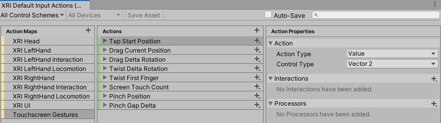
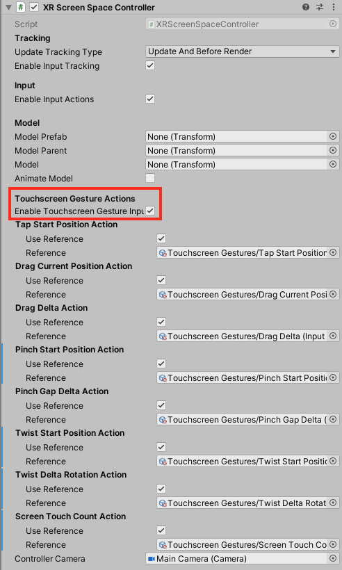
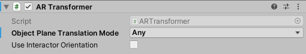

# AR Interaction Overview

This page provides a brief explanation for setting up a scene for mobile touchscreen  AR and the related components.

> [!NOTE]
> AR interaction components are only available in a Project that also includes the [AR Foundation](https://docs.unity3d.com/Manual/com.unity.xr.arfoundation.html) package. You can install the AR Foundation package via the [Package Manager](https://docs.unity3d.com/Manual/upm-ui-install.html).

## Touchscreen gestures

Touchscreen gesture data is surfaced by the `TouchscreenGestureInputController` which translates touch events into gestures such as tap, drag, pinch and twist. This gesture data can be used as bindings for [Input System](https://docs.unity3d.com/Manual/com.unity.inputsystem.html) actions.

The XR Interaction Toolkit package comes with a number of pre-defined gestures and gesture interactables, but you can always extend this package by defining your own gestures.

| Gesture | Triggered by input |
|---|---|
| **Tap** | User touches the screen | 
| **Drag** | User drags finger across screen |
| **Pinch** | User moves two fingers toward or away from each other along a straight line | 
| **Twist** | User rotates two fingers around a center point | 
| **Two Finger Drag** | User drags with two fingers |

## Setting up for Touchscreen AR 

> [!NOTE]
> The AR Starter Assets sample contains an already configured input action map which can be used in place of creating one from scratch.

To set up a scene for Touchscreen AR you will want to create an Input Action Map with action bindings to the `TouchscreenGestureInputController` gesture data. (An action map asset can be created by right-clicking on the Assets folder and going to **Create** &gt; **Input Actions**.)

> [!NOTE]
> The AR Starter Assets sample contains a screen-space controller preset, but if creating the controller from scratch, follow the instructions below.

Add an [XR Screen Space Controller](xr-screen-space-controller.md) to the scene and toggle `Enable Touchscreen Gesture Input Control`. This will ensure that a `TouchscreenGestureInputController` device gets added to the scene. Additionally, make sure to include an XR Ray Interactor and that `Enable AR Raycasting` is checked. 

Connect the input actions to the appropriate properties on the screen space controller. The application should now be ready to receive touchscreen input.

## AR Transformer

In order to have interactables adhere to the AR environment, adding an `ARTransformer` is necessary. The AR transformer allows objects to be moved and rotated only within the limits of the AR environment. Currently, only AR planes are supported.

## AR Starter Assets

A configured scene for touchscreen AR is available in the AR Starter Assets sample which is installable through the Samples tab under the XR Interaction Toolkit package in the Package Manager window.

This scene includes key mappings to simulate gestures in-editor. The following are keys to note:

- 'E' and 'R' rotate the object around the up axis.
- 'Z', 'X' and the scroll wheel scale the object up and down.
