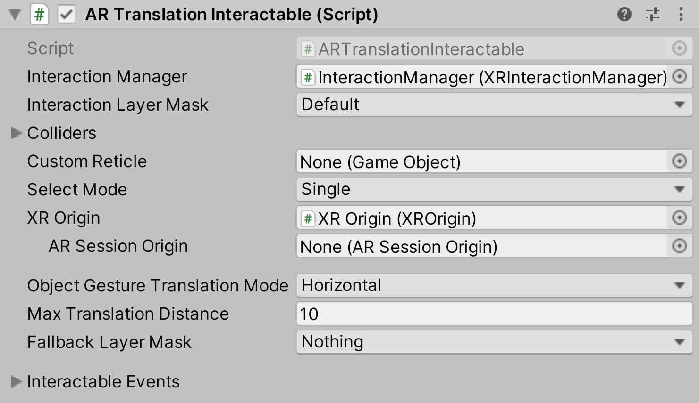

# AR Translation Interactable

Manipulates the position of an object via a drag gesture. If not selected, the object will be selected when the drag gesture starts.

| **Property** | **Description** |
|---|---|
| **Interaction Manager** | The [XRInteractionManager](xr-interaction-manager.md) that this Interactable will communicate with (will find one if **None**). |
| **Interaction Layer Mask** | Allows interaction with Interactors whose [Interaction Layer Mask](interaction-layers.md) overlaps with any Layer in this Interaction Layer Mask. |
| **Colliders** | Colliders to use for interaction with this Interactable (if empty, will use any child Colliders). |
| **Custom Reticle** | The reticle that appears at the end of the line when valid. |
| **Select Mode** | Indicates the selection policy of an Interactable. This controls how many Interactors can select this Interactable. The value is only read by the Interaction Manager when a selection attempt is made, so changing this value from **Multiple** to **Single** will not cause selections to be exited. |
| &emsp;Single | Set **Select Mode** to **Single** to prevent additional simultaneous selections from more than one Interactor at a time. |
| &emsp;Multiple | Set **Select Mode** to **Multiple** to allow simultaneous selections on the Interactable from multiple Interactors. |
| **XR Origin** | The `XROrigin` that this Interactable will use (such as to get the `Camera` or to transform from Session space). Will find one if **None**. |
| **AR Session Origin** | This is deprecated. Use the above **XR Origin** instead. |
| **Exclude UI Touches** | Enable to exclude touches that are over UI. Used to make screen space canvas elements block touches from hitting planes behind it. |
| **Object Gesture Translation Mode** | Controls whether the object will be constrained vertically, horizontally, or free to move in all axes. |
| &emsp;Horizontal | Allow translation when the plane is horizontal. |
| &emsp;Vertical | Allow translation when the plane is vertical. |
| &emsp;Any | Allow translation on any plane. |
| **Max Translation Distance** | The maximum translation distance of this object. |
| **Fallback Layer Mask** | The `LayerMask` that Unity uses during an additional ray cast when a user touch does not hit any AR trackable planes. |
| **Interactable Events** | See the [Interactable Events](interactable-events.md) page. |