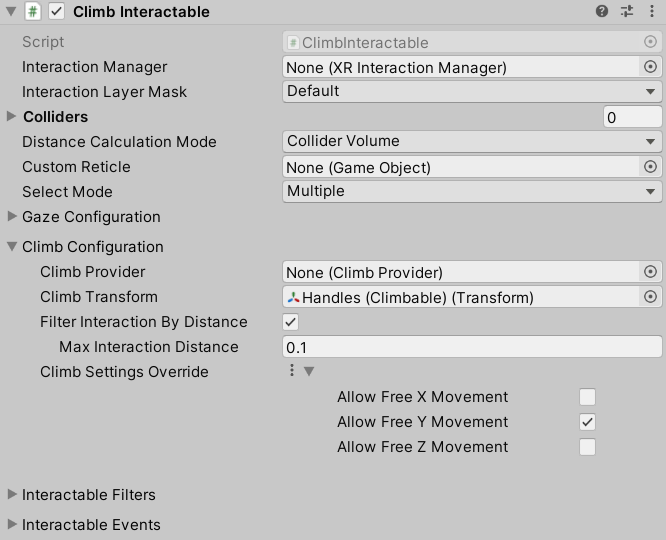

# Climb Interactable

Interactable that can be climbed while selected.

| **Property** | **Description** |
|---|---|
| **Interaction Manager** | The [XRInteractionManager](xr-interaction-manager.md) that this Interactable will communicate with (will find one if **None**). |
| **Interaction Layer Mask** | Allows interaction with Interactors whose [Interaction Layer Mask](interaction-layers.md) overlaps with any Layer in this Interaction Layer Mask. |
| **Colliders** | Colliders to use for interaction with this Interactable (if empty, will use any child Colliders). |
| **Custom Reticle** | The reticle that appears at the end of the line when valid. |
| **Select Mode** | Indicates the selection policy of an Interactable. This controls how many Interactors can select this Interactable. The value is only read by the Interaction Manager when a selection attempt is made, so changing this value from **Multiple** to **Single** will not cause selections to be exited. |
| &emsp;Single | Set **Select Mode** to **Single** to prevent additional simultaneous selections from more than one Interactor at a time. |
| &emsp;Multiple | Set **Select Mode** to **Multiple** to allow simultaneous selections on the Interactable from multiple Interactors. Unlike other Interactables, Climb Interactable uses **Multiple** by default. |
| **Allow Gaze Interaction** | Enable for basic interaction events from an [XRGazeInteractor](xr-gaze-interactor.md) and other gaze features. |
| **Allow Gaze Select** | Enable selection from an [XRGazeInteractor](xr-gaze-interactor.md). |
| **Override Gaze Time To Select** | Enables this Interactable to override the hover to select time on an [XRGazeInteractor](xr-gaze-interactor.md). |
| **Gaze Time To Select** | Number of seconds an [XRGazeInteractor](xr-gaze-interactor.md) must hover this interactable to select it if **Hover To Select** is enabled on the gaze Interactor. |
| **Override Time To Auto Deselect** | Enables this Interactable to override the auto deselect time on an [XRGazeInteractor](xr-gaze-interactor.md). |
| **Time To Auto Deselect** | Number of seconds this Interactable will be selected by an [XRGazeInteractor](xr-gaze-interactor.md) before being automatically deselected if **Auto Deselect** is enabled on the gaze Interactor. |
| **Allow Gaze Assistance** | If enabled, an [XR Gaze Interactor](xr-gaze-interactor.md) will place an [XR Interactable Snap Volume](xr-interactable-snap-volume.md) at this interactable to allow a properly configured [XR Ray Interactor](xr-ray-interactor.md) to snap to this interactable. See the [XR Interactable Snap Volume](xr-interactable-snap-volume.md) or [XR Ray Interactor](xr-ray-interactor.md) pages for further information about correctly configuring an `XRRayInteractor` to support an `XRInteractableSnapVolume`. |
| **Climb Provider** | The climb provider that performs locomotion while this interactable is selected. If no climb provider is configured, the system will attempt to find one. |
| **Climb Transform** | Transform that defines the coordinate space for climb locomotion. Will use this GameObject's Transform by default. |
| **Filter Interaction By Distance** | Controls whether to apply a distance check when validating hover and select interaction. |
| **Max Interaction Distance** | The maximum distance that an interactor can be from this interactable to begin hover or select. |
| **Climb Settings Override** | Optional override of locomotion settings specified in the climb provider. Only applies as an override if set to **Use Value** or if the asset reference is set. |
| &emsp;**Use Asset** | Enable to use a `ClimbSettings` object externally defined in a `ClimbSettingsDatum` asset that can be assigned using the accompanying field. |
| &emsp;**Use Value** | Enable to use a `ClimbSettings` object which comes with default values editable in the component editor. |
| &emsp;Allow Free X Movement | Controls whether to allow unconstrained movement along the Climb Interactable's x-axis. |
| &emsp;Allow Free Y Movement | Controls whether to allow unconstrained movement along the Climb Interactable's y-axis. |
| &emsp;Allow Free Z Movement | Controls whether to allow unconstrained movement along the Climb Interactable's z-axis. |
| **Interactable Events** | See the [Interactable Events](interactable-events.md) page. |