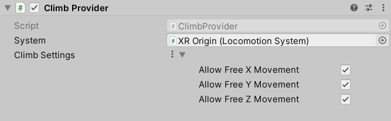

# Climb Provider

Locomotion provider that allows the user to climb a [Climb Interactable](climb-interactable.md) by selecting it. Climb locomotion moves the XR Origin counter to movement of the last selecting interactor, with optional movement constraints along each axis of the interactable.

|**Property**|**Description**|
|---|---|
|**System**|The Locomotion System that this locomotion provider will communicate with for exclusive access to an XR Origin. If one is not provided, the system will attempt to locate one during its `Awake` call.|
|**Climb Settings**|Climb locomotion settings. Can be overridden by the Climb Interactable used for locomotion.|
|&emsp;**Use Asset**|Enable to use a `ClimbSettings` object externally defined in a `ClimbSettingsDatum` asset that can be assigned using the accompanying field.|
|&emsp;**Use Value**|Enable to use a `ClimbSettings` object which comes with default values editable in the component editor.|
|&emsp;Allow Free X Movement|Controls whether to allow unconstrained movement along the Climb Interactable's x-axis.|
|&emsp;Allow Free Y Movement|Controls whether to allow unconstrained movement along the Climb Interactable's y-axis.|
|&emsp;Allow Free Z Movement|Controls whether to allow unconstrained movement along the Climb Interactable's z-axis.|