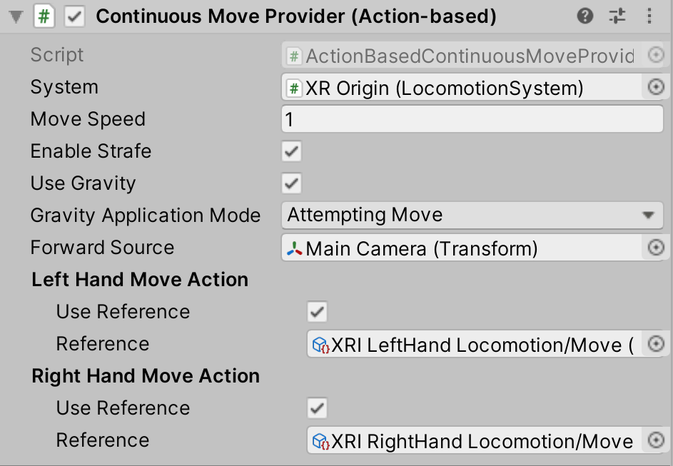

# Continuous Move Provider (Action-based)

Locomotion provider that allows the user to smoothly move their rig continuously over time using a specified 2D axis input.

| **Property** | **Description** |
|---|---|
| **System** | The [LocomotionSystem](locomotion-system.md) that this `LocomotionProvider` communicates with for exclusive access to an XR Origin. If one is not provided, the behavior will attempt to locate one during its Awake call. |
| **Move Speed** | The speed, in units per second, to move forward. |
| **Enable Strafe** | Controls whether to enable strafing (sideways movement). |
| **Enable Fly** | Controls whether to enable flying (unconstrained movement). This overrides **Use Gravity**. |
| **Use Gravity** | Controls whether gravity affects this provider when a `CharacterController` is used. This only applies when **Enable Fly** is disabled. |
| **Gravity Application Mode** | Controls when gravity begins to take effect. |
| &emsp;Attempting Move | Use this style when you don't want gravity to apply when the player physically walks away and off a ground surface. Gravity will only begin to move the player back down to the ground when they try to use input to move. |
| &emsp;Immediately | Applies gravity and locomotion every frame, even without move input. Use this style when you want gravity to apply when the player physically walks away and off a ground surface, even when there is no input to move. |
| **Forward Source** | The source `Transform` that defines the forward direction. |
| **Left Hand Move Action** | |
| &emsp;Use Reference | Enable to reference an action externally defined using the accompanying field. |
| &emsp;Reference | The Input System Action that Unity uses to read Move data from the left hand controller. Must be a `InputActionType.Value` `Vector2Control` Control. |
| **Right Hand Move Action** | |
| &emsp;Use Reference | Enable to reference an action externally defined using the accompanying field. |
| &emsp;Reference | The Input System Action that Unity uses to read Move data from the right hand controller. Must be a `InputActionType.Value` `Vector2Control` Control. |