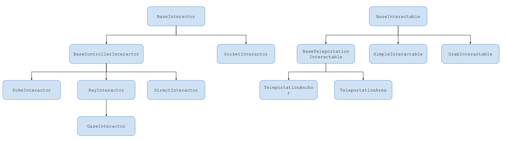
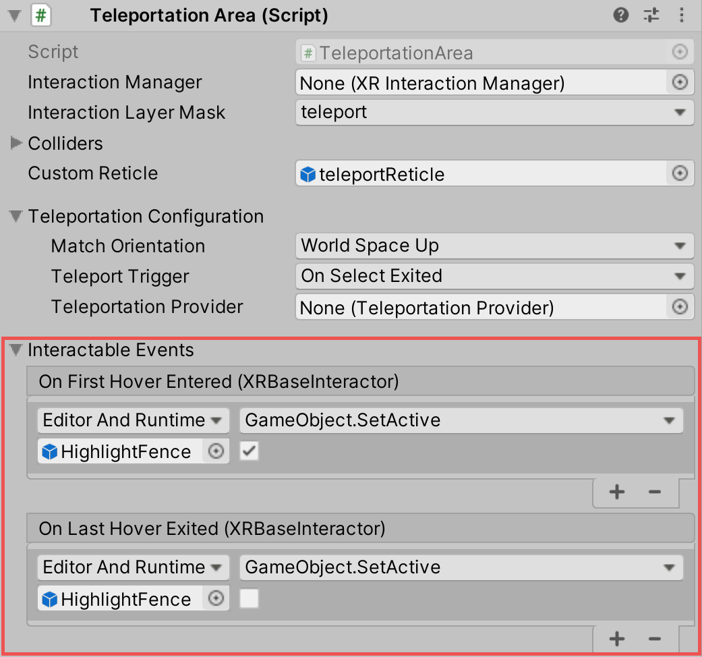

# Extending the XR Interaction Toolkit

You can extend the XR Interaction Toolkit system through either [inheritance](https://unity3d.com/learn/tutorials/topics/scripting/inheritance) or composition. Both Interactors and Interactables derive from an abstract base class that you can derive from and use to hook into the Interaction Manager to provide your own functionality. Additionally, you can use event callbacks to add functionality to the existing components. Below is a diagram showing how existing Interactor and Interactable classes inherit their base classes. 



The rest of this documentation details the ways to extend the XR Interaction Toolkit.  

## Interactor and Interactable event callbacks

Interactors and Interactables both have various event callbacks that can be used to drive reactions to interaction state changes. You can use these events to define your own behavior to hover, to select, and to activate state changes with no additional coding.



## Extending Interactors

You can derive from the `XRBaseInteractor` and/or `XRBaseControllerInteractor` abstract base classes to define your own way of interacting with the world. Unity currently provides Direct (collision) and Ray Interactors, but you can decide how you want the user to choose objects in the world and what they can do with them (though typically you do the latter by deriving from the Base Interactable class).

In addition to standard Unity callbacks, you can override the following methods and properties:

|Method/Property|Description|
|---|---|
|**`GetValidTargets`**|Retrieves the list of interactables that this interactor can interact with this frame.|
|**`isHoverActive`**|Returns true if this Interactor is in a state where it could hover, false otherwise.|
|**`isSelectActive`**|Gets whether this interactor is in a state where it could select.|
|**`CanHover`**|Returns true if this Interactor is in a state where it could select, false otherwise.|
|**`CanSelect`**|Returns true if the Interactable is valid for selection this frame, false otherwise.|
|**`selectedInteractableMovementTypeOverride`**|Gets the movement type to use when overriding the selected Interactable's movement.|
|**`OnRegistered` and `OnUnregistered`**|The Interaction Manager calls these methods when the Interactor is registered and unregistered from it.|
|**`OnHoverEntering` and `OnHoverEntered`**|The Interaction Manager calls these methods when the Interactor first initiates hovering over an Interactable.|
|**`OnHoverExiting` and `OnHoverExited`**|The Interaction Manager calls these methods when the Interactor ends hovering over an Interactable. The event arguments will describe whether the hover was canceled, such as from either being unregistered due to being disabled or destroyed.|
|**`OnSelectEntering` and `OnSelectEntered`**|The Interaction Manager calls these methods when the Interactor first initiates selection of an Interactable.|
|**`OnSelectExiting` and `OnSelectExited`**|The Interaction Manager calls these methods when the Interactor ends selection of an Interactable. The event arguments will describe whether the selection was canceled, such as from either being unregistered due to being disabled or destroyed.|

## Extending Interactables

You can derive from the `XRBaseInteractable` abstract base class to define your own way of interacting with the world. Currently, Unity only provides the Grab Interactable, but you can either create your own Interactables from the base class or derive from Grab Interactable if you want to adopt grabbing behavior.

In addition to standard Unity callbacks, you can override the following methods:

|Method|Description|
|---|---|
|**`IsHoverableBy`**|Determines if this Interactable can be hovered by a given Interactor.|
|**`IsSelectableBy`**|Determines if this Interactable can be selected by a given Interactor.|
|**`OnRegistered` and `OnUnregistered`**|The Interaction Manager calls these methods when the Interactable is registered and unregistered from it.|
|**`OnHoverEntering` and `OnHoverEntered`**|The Interaction Manager calls these methods when an Interactor first initiates hovering over the Interactable.|
|**`OnHoverExiting` and `OnHoverExited`**|The Interaction Manager calls these methods when an Interactor ends hovering over the Interactable. The event arguments will describe whether the hover was canceled, such as from either being unregistered due to being disabled or destroyed.|
|**`OnSelectEntering` and `OnSelectEntered`**|The Interaction Manager calls these methods when an Interactor first initiates selection of the Interactable.|
|**`OnSelectExiting` and `OnSelectExited`**|The Interaction Manager calls these methods when an Interactor ends selection of the Interactable. The event arguments will describe whether the selection was canceled, such as from either being unregistered due to being disabled or destroyed.|
|**`OnActivated` and `OnDeactivated`**|The Controller Interactor calls these methods when the Interactor begins an activation event on the selected Interactable, or ends the activation.|

An Interactable can be hovered by multiple Interactors at the same time. The `firstHoverEntered` and `lastHoverExited` events can be used to control highlight states of objects as they will fire when just the first hover is started, and once all hovers are stopped. Similarly, the `firstSelectEntered` and `lastSelectExited` events can be used on Interactables that support multiple selections.

### Interactable select modes

The `selectMode` of an Interactable is used to set the selection policy. The value is only read by the Interaction Manager when a selection attempt is made, so changing this value from **Multiple** to **Single** will not cause selections to be exited.

|Select Mode|Description|
|---|---|
|**Single**|Can only be selected by a single Interactor at a time and allows other Interactors to take selection by automatically deselecting.|
|**Multiple**|Can be selected by multiple Interactors at a time.|

The Multiple option can be disabled in the Inspector window by using the `CanSelectMultiple` attribute on your component script.

 ```csharp
using UnityEngine.XR.Interaction.Toolkit;

[CanSelectMultiple(false)]
public class ExampleInteractable : XRBaseInteractable
{
}
```

## Extending target filters

You can derive from `XRBaseTargetFilter` (a `MonoBehaviour`) or implement `IXRTargetFilter` to create a custom Target Filter. At runtime, you can link an instance of your custom Target Filter by assigning it to the `targetFilter` property of an Interactor.

An instance of an `XRBaseTargetFilter` can also be assigned in the Inspector to the **Starting Target Filter** property of an Interactor. During the Interactor runtime initialization, it'll link itself with the filter in this property.

### Extending evaluators

You can derive from `XRTargetEvaluator` to create a custom Evaluator. An `XRTargetEvaluator` has virtual lifecycle callbacks similar to a `MonoBehaviour` and an additional method (`CalculateNormalizedScore`) for its score calculation. All these callbacks are invoked by its `XRTargetFilter`. The `CalculateNormalizedScore` method can be invoked several times in a single frame, as it can be called one time for each target Interactable in the linked Interactors.

An `XRTargetEvaluator` can optionally implement the interface `IXRTargetEvaluatorLinkable` to receive callbacks whenever an Interactor links to or unlinks from its filter.

For Evaluators that do binary tests, it's recommended that its `CalculateNormalizedScore` method returns `1` when the condition is met, and `0` otherwise.

```csharp
using System;
using UnityEngine.XR.Interaction.Toolkit;
using UnityEngine.XR.Interaction.Toolkit.Filtering;

[Serializable]
public class ExcludeByTagEvaluator : XRTargetEvaluator
{
    public string tagToExclude;

    protected override float CalculateNormalizedScore(IXRInteractor interactor, IXRInteractable target)
    {
        return target.transform.CompareTag(tagToExclude) ? 0f : 1f;
    }
}
```

#### Troubleshooting missing evaluator types

Evaluators are [serialized as reference](https://docs.unity3d.com/ScriptReference/SerializeReference.html) in the `XRTargetFilter`, and Unity does not keep track of the script (or its GUID) that the Evaluator objects originated from. If an Evaluator type becomes missing, Unity will log an error in the Console window. Follow the instructions below to fix this issue:
- If you are changing the Evaluator type (by renaming its class, namespace, etc) or moving it to another assembly, then you should decorate the Evaluator class with the [MovedFromAttribute](https://github.com/Unity-Technologies/UnityCsReference/blob/master/Runtime/Export/Scripting/APIUpdating/UpdatedFromAttribute.cs) passing the information of the old type.
- Before deleting an Evaluator script, make sure that no other `XRTargetFilter` in your project is using it. If you are using Unity version 2021.2 or above, you can select the missing types from the filter Inspector and delete them. Otherwise, to delete these objects, you'll need to create a new Evaluator script, and decorate it with a `MovedFromAttribute` containing the deleted type information.

## Inspectors

Custom [Editor](https://docs.unity3d.com/ScriptReference/Editor.html) classes are used to change the appearance and order of properties that appear in the Inspector, particularly for Interactors and Interactables. Derived behaviors that add additional serialized fields (those that are `public` or have the `SerializeField` attribute) will automatically have those appear in the Inspector. The Editor classes can be extended to further customize the Inspector, at which point any declared `SerializedProperty` fields that are assigned will no longer be automatically drawn during `DrawDerivedProperties`. Within those derived Editor classes, you will typically only need to override methods such as `DrawProperties` in `XRBaseInteractorEditor` or `XRBaseInteractableEditor` rather than the entire `OnInspectorGUI`.

  ```csharp
  // ExampleInteractable.cs in Assets.
  public class ExampleInteractable : XRBaseInteractable
  {
      [SerializeField]
      bool m_AdditionalField;
  }

  // ExampleInteractableEditor.cs in an Editor folder in Assets
  // which explicitly defines a SerializedProperty to choose
  // where to display it in the Inspector rather than using
  // the default location.
  [CustomEditor(typeof(ExampleInteractable), true), CanEditMultipleObjects]
  public class ExampleInteractableEditor : XRBaseInteractableEditor
  {
      protected SerializedProperty m_AdditionalField;

      protected override void OnEnable()
      {
          base.OnEnable();
          m_AdditionalField = serializedObject.FindProperty("m_AdditionalField");
      }

      protected override void DrawProperties()
      {
          base.DrawProperties();
          EditorGUILayout.PropertyField(m_AdditionalField);
      }
  }
  ```
The [`Editor.DrawDefaultInspector`](https://docs.unity3d.com/ScriptReference/Editor.DrawDefaultInspector.html) method can be used to draw the built-in Inspector instead. The [`PropertyDrawer`](https://docs.unity3d.com/ScriptReference/PropertyDrawer.html) class can also be utilized rather than creating custom `Editor` classes.
