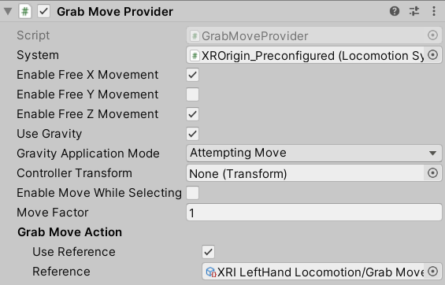

# Grab Move Provider

Locomotion provider that allows the user to move as if grabbing the whole world around them. When the controller moves, the XR Origin counter-moves in order to keep the controller fixed relative to the world.

| **Property** | **Description** |
|---|---|
| **System** | The [LocomotionSystem](locomotion-system.md) that this `LocomotionProvider` communicates with for exclusive access to an XR Origin. If one is not provided, the behavior will attempt to locate one during its Awake call. |
| **Enable Free X Movement** | Controls whether to enable unconstrained movement along the x-axis. |
| **Enable Free Y Movement** | Controls whether to enable unconstrained movement along the y-axis. |
| **Enable Free Z Movement** | Controls whether to enable unconstrained movement along the z-axis. |
| **Use Gravity** | Controls whether gravity applies to constrained axes when a `CharacterController` is used. |
| **Gravity Application Mode** | Controls when gravity begins to take effect. |
| &emsp;Attempting Move | Use this style when you don't want gravity to apply when the player physically walks away and off a ground surface. Gravity will only begin to move the player back down to the ground when they try to use input to move. |
| &emsp;Immediately | Applies gravity and locomotion every frame, even without move input. Use this style when you want gravity to apply when the player physically walks away and off a ground surface, even when there is no input to move. |
| **Controller Transform** | The controller Transform that will drive grab movement with its local position. Will use this GameObject's Transform if not set. |
| **Enable Move While Selecting** | Controls whether to allow grab movement while the controller is selecting an interactable. |
| **Move Factor** | The ratio of actual movement distance to controller movement distance. |
| **Grab Move Action** | |
| &emsp;Use Reference | Enable to reference an action externally defined using the accompanying field. |
| &emsp;Reference | The Input System Action that Unity uses to perform grab movement while held. Must be a `ButtonControl` Control. |
