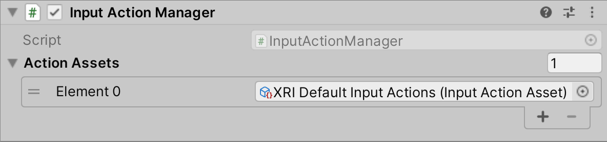

# Input Action Manager

This component automatically enables or disables all the inputs of type `InputAction` in a list of assets of type `InputActionAsset`.

| **Property** | **Description** |
|---|---|
| **Action Assets** | The `InputActionAsset`s this component automatically enables and disables in response to `OnEnable` and `OnDisable` from `MonoBehaviour`. |