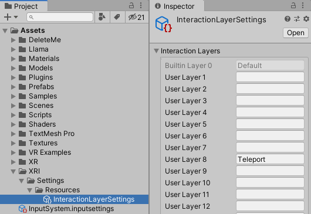
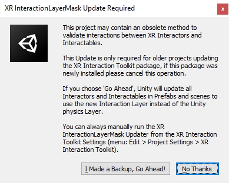

# Interaction layers

The interaction layers are used as a mechanism for filtering which interactors can act upon which interactables. Interactors and interactables that share at least one interaction layer in their **Interaction Layer Mask** properties are allowed to interact. If an interactor and interactable do not share at least one interaction layer in their Interaction Layer Mask then they are not allowed to interact. Mask comparisons do not consider the Layer set in the GameObject header on either the interactor or interactable, it only considers the Interaction Layer Mask.

You can add new interaction layers by editing the [Interaction Layers](#interaction-layers-settings) in the Project Settings window. They are unrelated to the physics layers defined in **Edit &gt; Project Settings &gt; Tags and Layers**.

The Interaction Layer Mask specifies whether an interactor and interactable can interact through state changes such as select and hover. Interaction Layer Mask can be set on both interactors and interactables. Interactors interact with all layers by default, and interactables interact with the `Default` built-in layer by default.

The XR Ray Interactor makes use of both interaction layers and physics layers. The **Interaction Layer Mask** property is common to all Interactors and is used for filtering, as described above. However, the **Raycast Mask** property is specific to the XR Ray Interactor and is a [LayerMask](https://docs.unity3d.com/ScriptReference/LayerMask.html) used to limit which Colliders are hit when ray casting. The **Layer** in the GameObject header of the interactable's Collider components will determine if the ray cast can hit it. Other GameObjects that do not have an Interactable component will also play a role since anything hit will block Interactables behind it from being a valid target.

The XR Direct Interactor similarly uses both interaction layers and physics layers. The [Layer Collision Matrix](https://docs.unity3d.com/Manual/LayerBasedCollision.html) in **Edit &gt; Project Settings &gt; Physics** determines if the trigger Collider on the XR Direct Interactor GameObject will detect collisions at all with the interactable's Collider components.

## Interaction Layers Settings

Add and remove interaction layers using **Edit** &gt; **Project Settings** &gt; **XR Plug-in Management** &gt; **XR Interaction Toolkit** and editing the fields under Interaction Layers.

The settings are stored in an asset in the `Assets/XRI/Settings/Resources` folder inside your project. You should not move or rename the `InteractionLayerSettings` asset file from that folder. Its relative path in your project is used internally to update and create it. If you delete the asset, a new asset with default values will be created in the same place when required.

## Interaction Layer Mask Updater

If you're upgrading your project from a version prior to XR Interaction Toolkit 2.0.0 then it's recommended to update the interaction layer masks in your Interactables and Interactors. This can be done through the following dialog box that is shown after the package installation or by clicking **Run Interaction Layer Mask Updater** in **Edit** &gt; **Project Settings** &gt; **XR Plug-in Management** &gt; **XR Interaction Toolkit**. Select **I Made a Backup, Go Ahead!** to scan your project for layers that were used and convert to interaction layers.

