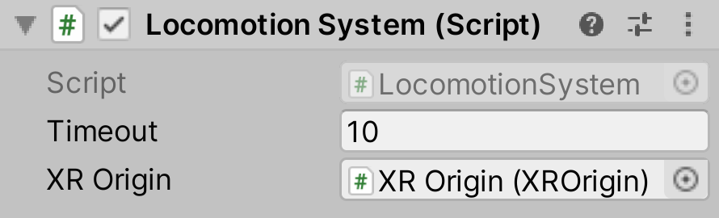

# Locomotion System

The `LocomotionSystem` object is used to control access to the XR Origin. This system enforces that only one Locomotion Provider can move the XR Origin at one time. This is the only place that access to an XR Origin is controlled, having multiple instances of a `LocomotionSystem` drive a single XR Origin is not recommended.

Locomotion Providers:
- [Continuous Move Provider (Action-based)](continuous-move-provider-action-based.md)
- [Continuous Move Provider (Device-based)](continuous-move-provider-device-based.md)
- [Continuous Turn Provider (Action-based)](continuous-turn-provider-action-based.md)
- [Continuous Turn Provider (Device-based)](continuous-turn-provider-device-based.md)
- [Snap Turn Provider (Action-based)](snap-turn-provider-action-based.md)
- [Snap Turn Provider (Device-based)](snap-turn-provider-device-based.md)
- [Teleportation Provider](teleportation-provider.md)

| **Property** | **Description** |
|---|---|
| **Timeout** | The timeout (in seconds) for exclusive access to the XR Origin. |
| **XR Origin** | The XR Origin object to provide access control to. |