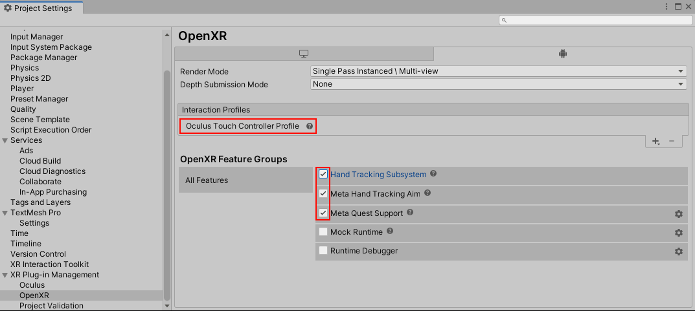
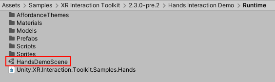
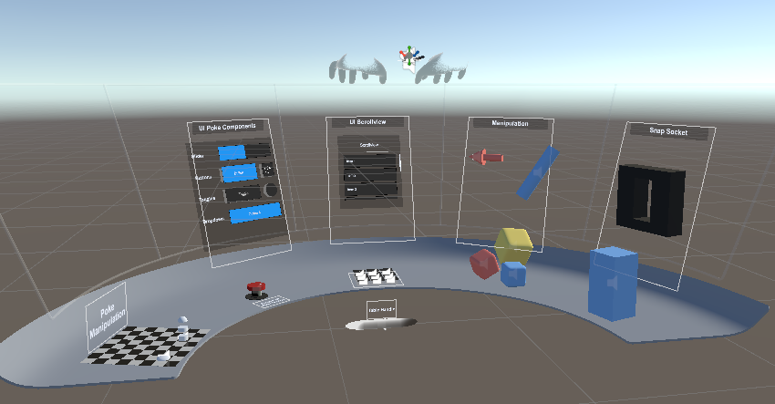
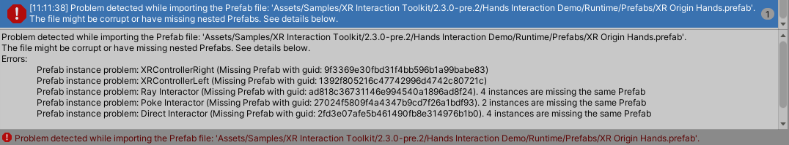
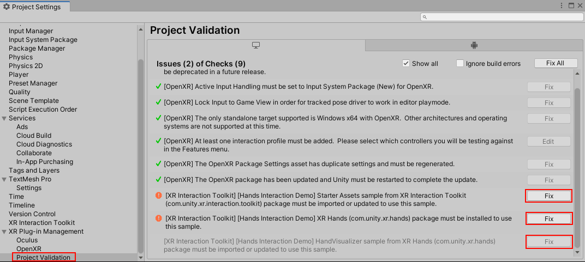
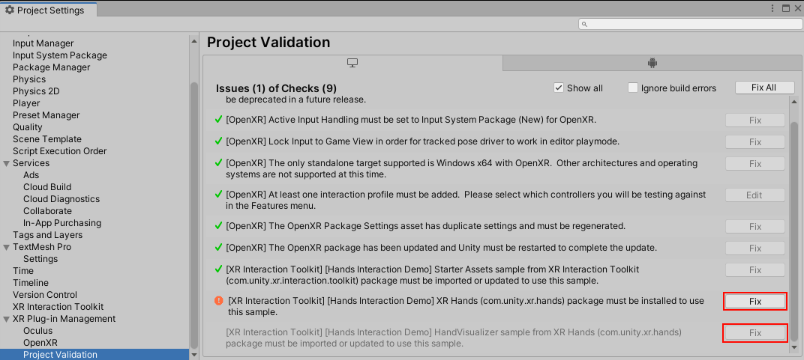
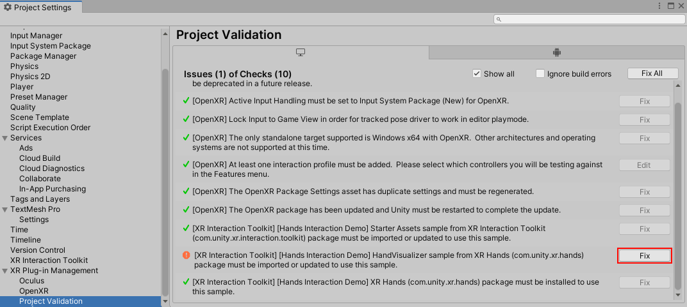

# Hands Interaction Demo

This sample demonstrates hand tracking interactions with the XR Interaction Toolkit, containing a sample scene and other assets used by the scene.

This sample is installed into the default location for package samples, in the `Assets\Samples\XR Interaction Toolkit\[version]\Hands Interaction Demo` folder. You can move these Assets to a different location.

|**Asset**|**Description**|
|---|---|
|**`AffordanceThemes\`**|Asset folder containing Affordance Theme Datums used by [Affordance receivers](affordance-system.md#affordance-receivers) in the hand visuals. An example is coloring finger tips upon interaction.|
|**`DatumPresets\`**|Asset folder containing Follow Preset Datums used by hand menus.|
|**`Editor\Scripts\`**|Asset folder containing Unity Editor scripts which adds Project Validation rules for the sample.|
|**`HandsDemoSceneAssets\`**|Asset folder containing assets only used for the `HandsDemoScene`.|
|**`Materials\`**|Asset folder containing materials for hand visuals.|
|**`Models\`**|Asset folder containing models for hand visuals.|
|**`Prefabs\`**|Asset folder containing prefabs of hand visuals and a hand variant of the XR Origin (XR Rig).|
|**`Scripts\`**|Asset folder containing scripts to detect gestures.|
|**`Shaders\`**|Asset folder containing shaders for hand visuals.|
|**`Textures\`**|Asset folder containing textures for hand visuals.|
|**`HandsDemoScene`**|Scene that illustrates a basic rig setup that supports hand tracking and controllers along with example interactable objects and UI.|

## Prerequisites and setup

> [!IMPORTANT]
> There is a known issue when upgrading from an older version of the Hands Interaction Demo to a newer version. Script references in the Demo Scene for scripts included in the Hands Interaction Demo become disconnected when upgrading in-place. It is recommended that you delete the `Starter Assets` and `Hands Interaction Demo` folders from your `Samples` directory before importing the new Hands Interaction Demo sample package.

In order for this sample to function properly, a few additional packages are required. Install these by clicking **Fix** in **Edit** &gt; **Project Settings** &gt; **XR Plug-in Management** &gt; **Project Validation** or by using the **Window** &gt; **Package Manager** window. See [Install XR Hands](https://docs.unity3d.com/Packages/com.unity.xr.hands@latest/index.html?subfolder=/manual/project-setup/install-xrhands.html) for installation steps for that package when using the Package Manager window.
  * [Starter Assets](samples-starter-assets.md) - imported from Package Manager under XR Interaction Toolkit in the Samples area 
  * [XR Plug-in Management (com.unity.xr.management)](https://docs.unity3d.com/Manual/com.unity.xr.management.html) - 4.3.1 or newer
  * [OpenXR Plugin (com.unity.xr.openxr)](https://docs.unity3d.com/Manual/com.unity.xr.openxr.html) - 1.6.0 or newer
  * [XR Hands (com.unity.xr.hands)](https://docs.unity3d.com/Packages/com.unity.xr.hands@latest) - 1.2.1 or newer (1.3.0 recommended)
    * HandVisualizer - imported from Package Manager under XR Hands in the Samples area
  * [Shader Graph](https://docs.unity3d.com/Manual/com.unity.shadergraph.html) - For the materials used on the rendered hands

To enable hand tracking support with an OpenXR project, enable the **OpenXR** plug-in provider in **Edit** &gt; **Project Settings** &gt; **XR Plug-in Management**. Then open **Edit** &gt; **Project Settings** &gt; **XR Plug-in Management** &gt; **OpenXR** and enable [Hand Tracking Subsystem](https://docs.unity3d.com/Packages/com.unity.xr.hands@latest/index.html?subfolder=/manual/features/handtracking.html) under OpenXR Feature Groups.

### Meta Quest support via OpenXR

If building for Quest, Quest 2, or Quest Pro, you will also need to enable [Meta Quest Support](https://docs.unity3d.com/Packages/com.unity.xr.openxr@1.6/manual/features/oculusquest.html) (only available in the Android tab) and [Meta Hand Tracking Aim](https://docs.unity3d.com/Packages/com.unity.xr.hands@latest/index.html?subfolder=/manual/features/metahandtrackingaim.html). Then add an Interaction Profile in that same window, such as [Oculus Touch Controller Profile](https://docs.unity3d.com/Packages/com.unity.xr.openxr@latest/index.html?subfolder=/manual/features/oculustouchcontrollerprofile.html), for controller support.

The main Hands Interaction Demo scene can be opened from the location `Assets\Samples\XR Interaction Toolkit\[version]\Hands Interaction Demo\HandsDemoScene`. This scene uses the assets in the list below. The prefabs are designed as a starting point for your own XR hand interaction based projects.

## Demo scene layout

In the `HandsDemoScene` there are multiple interaction areas. On the right side you will find objects to interact with and manipulate. You will need to use a pinch gesture to pick up and move them around the table. The blocks on the table can be thrown, but the floating objects remain in place. When pinching with two hands, the floating objects can be scaled and rotated. The socket will snap objects into place when grabbed and brought close.

On the left and center of the scene you will find the UI interactions. The UI elements can be interacted with in 2 ways:
  * Ray & Pinch: UI can be clicked by pointing the hand Ray Interactor and then bringing your index finger and thumb together in a pinch gesture to activate selection.
  * Poke: UI can also be clicked by pressing into the UI with your index finger. Some UI buttons have included the Poke Follow Affordance sample script which uses the finger depth to depress the UI buttons.

On the far left of the scene you will find chess pieces that can be poked and then moved around the surface.

The handle below the table allows you to reposition the whole table when grabbed and moved.

## Hierarchy configuration

The XR Origin (XR Rig) in this scene supports either motion controllers or hand tracking, which is managed by the XR Input Modality Manager component.

A Poke Gesture Detector component and Meta System Gesture Detector component are on the hand tracking GameObjects which manages automatically toggling interactors to disable them and their visuals by activating or deactivating those child GameObjects when the hand is making certain gestures.

The Hand Visualizer GameObject uses the HandVisualizer sample component from the [XR Hands](https://docs.unity3d.com/Manual/com.unity.xr.hands.html) package to visually represent the hands.

See Starter Assets [Hierarchy configuration](samples-starter-assets.md#hierarchy-configuration) for the base prefab hierarchy.

<table>
<thead>
  <tr>
    <th colspan="5">GameObject</th>
    <th>Components</th>
    <th>Description</th>
  </tr>
</thead>
<tbody>
  <tr>
    <td colspan="5"><strong>XR Origin Hands (XR Rig)</strong></td>
    <td>See base prefab.</td>
    <td>Variant of the XR Origin (XR Rig) prefab that adds support for tracked hands. The XR Input Modality Manager is overridden to add references to Left Hand and Right Hand.</td>
  </tr>
  <tr>
    <td rowspan="20"></td>
    <td colspan="4"><strong>Camera Offset</strong></td>
    <td>See base prefab.</td>
    <td>See base prefab.</td>
  </tr>
  <tr>
    <td rowspan="17"></td>
    <td colspan="3"><strong>Main Camera</strong></td>
    <td>See base prefab.</td>
    <td>See base prefab.</td>
  </tr>
  <tr>
    <td colspan="3"><strong>Gaze Interactor</strong></td>
    <td>See base prefab.</td>
    <td>See base prefab.</td>
  </tr>
  <tr>
    <td colspan="3"><strong>Gaze Stabilized</strong></td>
    <td>See base prefab.</td>
    <td>See base prefab.</td>
  </tr>
  <tr>
    <td colspan="3"><strong>Left</strong>/<strong>Right Controller</strong></td>
    <td>See base prefab.</td>
    <td>See base prefab.</td>
  </tr>
  <tr>
    <td colspan="3"><strong>Left</strong>/<strong>Right Controller Stabilized</strong></td>
    <td>See base prefab.</td>
    <td>See base prefab.</td>
  </tr>
  <tr>
    <td colspan="3"><strong>Left</strong>/<strong>Right Hand</strong></td>
    <td>
      <a href="xr-interaction-group.md">XR Interaction Group</a>

      Poke Gesture Detector

      Meta System Gesture Detector

      <a href="https://docs.unity3d.com/Manual/class-AudioSource.html">Audio Source</a>
    </td>
    <td>Represents the interaction groups for tracked hand-based interaction. The Poke Gesture Detector is used to mediate between poke and ray pinch interactions. The Meta System Gesture Detector is used to disable interactions while doing menu palm pinch gestures. The Audio Source is used as an example response to the menu palm pinch gesture.</td>
  </tr>
  <tr>
    <td rowspan="10"></td>
    <td colspan="2"><strong>Poke Interactor</strong></td>
    <td>
      <a href="xr-poke-interactor.md">XR Poke Interactor</a>

      <a href="https://docs.unity3d.com/Packages/com.unity.inputsystem@latest?subfolder=/api/UnityEngine.InputSystem.XR.TrackedPoseDriver.html">Tracked Pose Driver</a>
    </td>
    <td>Interactor used for interacting with interactables by poking. Pose driven by the index finger's tip.</td>
  </tr>
  <tr>
    <td colspan="2"><strong>Direct Interactor</strong></td>
    <td>
      <a href="xr-direct-interactor.md">XR Direct Interactor</a>

      <a href="https://docs.unity3d.com/Manual/class-SphereCollider.html">Sphere Collider</a>

      <a href="xr-controller-action-based.md">XR Controller</a>
    </td>
    <td>Interactor used for interacting with interactables by pinching at close range. The Sphere Collider is configured as a trigger collider and used by the XR Direct Interactor to detect collisions with interactables. Has an XR Controller to override the Position action to use the pinch position of the hand.</td>
  </tr>
  <tr>
    <td colspan="2"><strong>Ray Interactor</strong></td>
    <td>
      <a href="xr-ray-interactor.md">XR Ray Interactor</a>

      <a href="https://docs.unity3d.com/Manual/class-LineRenderer.html">Line Renderer</a>

      <a href="xr-interactor-line-visual.md">XR Interactor Line Visual</a>

      <a href="https://docs.unity3d.com/Manual/class-SortingGroup.html">Sorting Group</a>

      <a href="xr-controller-action-based.md">XR Controller</a>
    </td>
    <td>Interactor used for interacting with interactables by pinching at a distance. Uses physics ray casts to detect collisions with interactables. The Sorting Group is used to make the line visual draw in the expected order over UI. Has an XR Controller to override the Position and Rotation actions to use the Meta Hand Tracking Aim feature.</td>
  </tr>
  <tr>
    <td colspan="2"><strong>Poke Stabilized Attach</strong></td>
    <td><a href="xr-transform-stabilizer.md">XR Transform Stabilizer</a></td>
    <td>Stabilized left or right poke pose used as the Attach Transform of the XR Poke Interactor.</td>
  </tr>
  <tr>
    <td colspan="2"><strong>Direct Stabilized Attach</strong></td>
    <td><a href="xr-transform-stabilizer.md">XR Transform Stabilizer</a></td>
    <td>Stabilized left or right pinch pose used as the Attach Transform of the XR Direct Interactor.</td>
  </tr>
  <tr>
    <td colspan="2"><strong>Ray Stabilized</strong></td>
    <td><a href="xr-transform-stabilizer.md">XR Transform Stabilizer</a></td>
    <td>Stabilized left or right aim pose used as the Ray Origin Transform of the XR Ray Interactor.</td>
  </tr>
  <tr>
    <td rowspan="1"></td>
    <td><strong>Ray Stabilized Attach</strong></td>
    <td></td>
    <td>Stabilized pose used as the Attach Transform of the XR Ray Interactor.</td>
  </tr>
  <tr>
    <td colspan="2"><strong>Pinch Point Stabilized</strong></td>
    <td>
      Pinch Point Follow

      <a href="xr-interactor-affordance-state-provider.md">XR Interactor Affordance State Provider</a>

      Hide Object When Ray Interactor Blocked
    </td>
    <td>Stabilized left or right pinch dropper pose used as the Line Origin Transform of the XR Interactor Line Visual on the Ray Interactor.</td>
  </tr>
  <tr>
    <td rowspan="1"></td>
    <td><strong>Pinch Visual</strong></td>
    <td>
      <a href="https://docs.unity3d.com/Manual/class-SkinnedMeshRenderer.html">Skinned Mesh Renderer</a>

      Multiple <a href="affordance-system.md#affordance-receivers">Affordance Receivers</a>
    </td>
    <td>Pinch dropper visual.</td>
  </tr>
  <tr>
    <td colspan="2"><strong>Left/Right Hand Interaction Visual</strong></td>
    <td>
      <a href="https://docs.unity3d.com/Packages/com.unity.xr.hands@latest/index.html?subfolder=/manual/hand-data/xr-hand-access-data.html">XR Hand Tracking Events</a>

      <a href="https://docs.unity3d.com/Packages/com.unity.xr.hands@latest/index.html?subfolder=/manual/hand-data/xr-hand-visuals.html#xr-hand-mesh-controller">XR Hand Mesh Controller</a>

      <a href="https://docs.unity3d.com/Packages/com.unity.xr.hands@latest/index.html?subfolder=/manual/hand-data/xr-hand-visuals.html#xr-hand-skeleton-driver">XR Hand Skeleton Driver</a>

      <a href="xr-hand-skeleton-poke-displacer.md">XR Hand Skeleton Poke Displacer</a>
    </td>
    <td>Adds hand interaction shader affordances that highlight the hand and fingers during interactions.</td>
  </tr>
  <tr>
    <td colspan="3"><strong>Hand Visualizer</strong></td>
    <td><a href="https://docs.unity3d.com/Packages/com.unity.xr.hands@latest/index.html#samples">Hand Visualizer</a></td>
    <td>Visual representation of the tracked hands.</td>
  </tr>
  <tr>
    <td colspan="4"><strong>Locomotion System</strong></td>
    <td>See base prefab.</td>
    <td>See base prefab.</td>
  </tr>
  <tr>
    <td colspan="4"><strong>Hands Smoothing Post Processor</strong></td>
    <td>Hands One Euro Filter Post Processor</td>
    <td>Filters and smooths the position of the tracked hands.</td>
  </tr>
</tbody>
</table>

## Troubleshooting

If you find yourself in an error state when trying to import the packages, it can be helpful to use the below images to identify the issue and take the appropriate steps to correct them:

The above error will happen if you have not imported the **Starter Assets** from the XR Interaction Toolkit Samples first. Once imported, these errors should be cleared. You can navigate to **Project Validation** in XR Plug-in Management to see this error as well (see image below). Clicking **Fix** will import the Starter Assets for you.

If you are unable to run the sample scene correctly, you may not have imported the **XR Hands** package correctly. Checking the **Project Validation** in XR Plug-in Management will reveal what might be missing. Clicking **Fix** will import the main package. 

Note: if the XR Hands package has not been imported, you will also need to import the **HandVisualizer** sample package by clicking **Fix** as shown in the image below:

