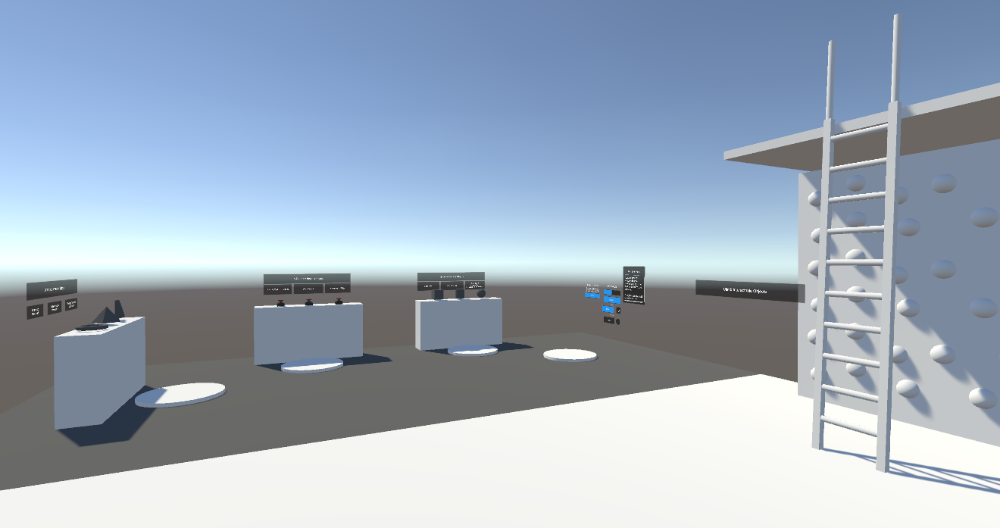
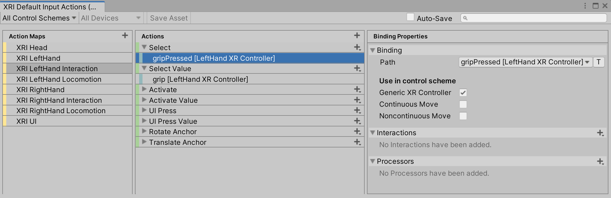
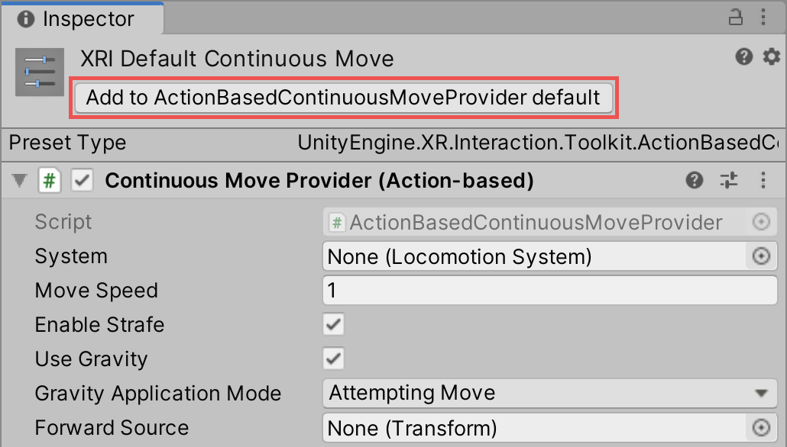
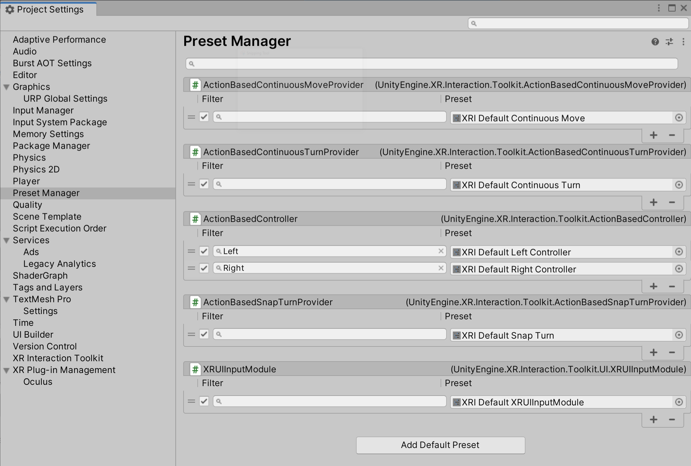

# Starter Assets

This sample is installed into the default location for package samples, in the `Assets\Samples\XR Interaction Toolkit\[version]\Starter Assets` folder. You can move these Assets to a different location.

This sample contains an [Input Action Asset](https://docs.unity3d.com/Packages/com.unity.inputsystem@1.7/manual/ActionAssets.html) that contains [Actions](https://docs.unity3d.com/Packages/com.unity.inputsystem@1.7/manual/Actions.html) with typical [Input Bindings](https://docs.unity3d.com/Packages/com.unity.inputsystem@1.7/manual/ActionBindings.html) for use with behaviors in the XR Interaction Toolkit that read input. This sample also includes XR Origin, teleport, and interactable sample prefabs.

This sample also contains [Presets](https://docs.unity3d.com/Manual/Presets.html) for behaviors that use actions to streamline their configuration.

> [!IMPORTANT]
> There is a known issue when upgrading from an older version of the Starter Assets to a newer version. Script references in the Demo Scene for scripts included in the Starter Assets become disconnected when upgrading in-place. It is recommended that you delete the `Starter Assets` folder from your `Samples` directory before importing the new Starter Assets sample package.

|**Asset**|**Description**|
|---|---|
|**`DemoSceneAssets\`**|Asset folder containing assets only used for the `DemoScene`.|
|**`Editor\Scripts\`**|Asset folder containing Unity Editor scripts which adds Project Validation rules for the sample.|
|**`Models\`**|General-use models, such as left and right controllers.|
|**`Prefabs\`**|XRI prefabs for use in any project. See [Prefabs](#prefabs) below.|
|**`Presets\`**|Preset configurations for many of the most common XRI components. See [Presets](#presets) below.|
|**`Scripts\`**|General-use scripts that can accelerate development when using XRI. See [Scripts](#scripts) below.|
|**`Tunneling Vignette\`**|Folder containing a prefab and shaders required to use the provided tunneling vignette comfort mode option. See [Tunneling vignette](#tunneling-vignette) below.|
|**`DemoScene`**|Scene that illustrates a basic setup using the package. See [Demo Scene](#demo-scene) below.|
|**`XRI Default Input Actions.inputactions`**|Asset that contains actions with typical bindings and several [Control Schemes](https://docs.unity3d.com/Packages/com.unity.inputsystem@1.7/manual/ActionBindings.html#control-schemes) for use in XR experiences. See [Input Actions Asset](#input-actions-asset) below.|

## Demo Scene

The Demo Scene in the Starter Assets sample package contains a number of simplified demonstrations for how to configure and use the XR Interaction Toolkit in your own projects. We encourage you to explore these to understand how XRI was designed to be used. For a more comprehensive example, you can download a larger example from the [XR Interaction Toolkit Examples](https://github.com/Unity-Technologies/XR-Interaction-Toolkit-Examples) repository on GitHub.

|**Demo Scene Assets**|**Description**|
|---|---|
|**`AffordanceThemes\`**|Affordance Theme Datums used by [Affordance receivers](affordance-system.md#affordance-receivers) in the demo scene.|
|**`Audio\`**|Simple sound effects used in the demo scene.|
|**`Models\`**|Simple shapes used as part of the example prefabs.|
|**`Prefabs\`**|Asset folder containing prefabs to streamline adding an XR Origin camera rig and interactable prefabs showcased in the `DemoScene`.|
|**`Prefabs\Climb\`**|Folder containing additional prefabs used to construct the `Climb Sample` used in the `DemoScene`.|
|**`Prefabs\Climb Sample`**|Prefab containing preconfigured `XR Climb Interactables` used in the `DemoScene`.|
|**`Prefabs\Interactables\`**|Folder containing additional preconfigured prefabs used in the `DemoScene`.|
|**`Prefabs\Interactables Sample`**|Prefab containing preconfigured `XR Grab Interactables` used in the `DemoScene`.|
|**`Prefabs\Teleport\`**|Folder containing additional prefabs used as part of teleport configuration.|
|**`Prefabs\Teleportation Environment.prefab`**|Teleportation prefab used in the `DemoScene` which includes the `Teleportation Area` and `Teleportation Anchor` prefabs. Configured to the `Teleport Interactor` in the `XR Interaction Setup` prefab included in these starter assets.|
|**`Prefabs\UI\`**|Folder containing additional prefabs used as part of the `UI Sample` prefab.|
|**`Prefabs\UI Sample`**|Prefab containing interactable UI elements in a world space canvas.|
|**`Scripts\`**|Asset folder containing scripts used for demo scene functionality.|

## Input Actions Asset

The following image shows the [Action editor](https://docs.unity3d.com/Packages/com.unity.inputsystem@1.7/manual/ActionAssets.html#editing-input-action-assets) of the Asset included in the sample, while editing one of the bindings of an action in one of the maps.

The Asset contains several Action Maps, separated based on the bound device. Having different sets of actions based on the controller handedness, rather than one set of actions with input bindings for multiple controllers, allows for easier fine-grained management of the allowed actions per-hand. For example, the `XRI RightHand Locomotion/Turn` action can be disabled while the right hand has picked something up, while turning is still allowed by having the `XRI LeftHand Locomotion/Turn` action enabled.

|**Action Map**|**Description**|
|---|---|
|**XRI Head**|Actions with input bindings to a head-mounted display (that is, `<XRHMD>`) or eye gaze (that is, [`<EyeGaze>`](https://docs.unity3d.com/Packages/com.unity.xr.openxr@latest/index.html?subfolder=/manual/features/eyegazeinteraction.html)).|
|**XRI LeftHand**|Actions with input bindings to a left hand controller (that is, `<XRController>{LeftHand}`) related to tracking and haptic feedback.|
|**XRI LeftHand Interaction**|Actions with input bindings to a left hand controller related to interaction state.|
|**XRI LeftHand Locomotion**|Actions with input bindings to a left hand controller related to locomotion and interaction state for a teleportation interactor.|
|**XRI RightHand**|Actions with input bindings to a right hand controller (that is, `<XRController>{RightHand}`) related to tracking and haptic feedback.|
|**XRI RightHand Interaction**|Actions with input bindings to a right hand controller related to interaction state.|
|**XRI RightHand Locomotion**|Actions with input bindings to a right hand controller related to locomotion and interaction state for a teleportation interactor.|
|**XRI UI**|Actions with input bindings to drive UI input and navigation used in the XR UI Input Module component.|

There are also several Input Control Schemes to group different input controls. You can use these to selectively enable or disable some of the bindings based on the locomotion movement control scheme in use.

|**Control Scheme**|**Description**|
|---|---|
|**Generic XR Controller**|Bindings that should remain enabled when applying any movement control scheme.|
|**Continuous Move**|Bindings that should remain enabled when applying the continuous movement control scheme.|
|**Noncontinuous Move**|Bindings that should remain enabled when applying the noncontinuous movement control scheme.|

For a complete example of configuring input actions for each controller, and using control schemes, see the [XR Interaction Toolkit Examples](https://github.com/Unity-Technologies/XR-Interaction-Toolkit-Examples) project.

## Presets
|**Preset**|**Description**|
|---|---|
|**`XRI Default Continuous Move.preset`**|Preset for [Continuous Move Provider](locomotion.md#continuous-move-provider).|
|**`XRI Default Continuous Turn.preset`**|Preset for [Continuous Turn Provider](locomotion.md#continuous-turn-provider).|
|**`XRI Default Gaze Controller.preset`**|Preset for [XR Controller (Action-based)](xr-controller-action-based.md) associated with the [Gaze Interactor](xr-gaze-interactor.md).|
|**`XRI Default Left ActionBasedControllerManager.preset`**|Preset for left hand [ActionBasedControllerManager](#scripts).|
|**`XRI Default Left Controller.preset`**|Preset for left hand [Controllers](architecture.md#controllers).|
|**`XRI Default Left Grab Move.preset`**|Preset for left hand [Grab Move Provider](locomotion.md#grab-move-providers).|
|**`XRI Default Right ActionBasedControllerManager.preset`**|Preset for right hand [ActionBasedControllerManager](#scripts).|
|**`XRI Default Right Controller.preset`**|Preset for right hand [Controllers](architecture.md#controllers).|
|**`XRI Default Right Grab Move.preset`**|Preset for right hand [Grab Move Provider](locomotion.md#grab-move-providers).|
|**`XRI Default Snap Turn.preset`**|Preset for [Snap Turn Provider](locomotion.md#snap-turn-provider).|
|**`XRI Default XR Screen Space Controller.preset`**|Preset for [XR Screen Space Controller](xr-screen-space-controller.md).|
|**`XRI Default XR UI Input Module.preset`**|Preset for [XR UI Input Module](ui-setup.md#xr-ui-input-module).|

### Configuring Preset Manager defaults

After importing the sample into your Project, if you want to use the Assets, it is recommended to use the [Preset Manager](https://docs.unity3d.com/Manual/class-PresetManager.html) to change the default Presets to those included in this sample. This will allow the objects you create from the **GameObject &gt; XR** menu to automatically populate the action properties of the behavior, as configured in each preset.

To easily set a preset as the default for its associated behavior, select the Asset in the Project window, then click the **Add to [behavior] default** button in the Inspector.

Access the Preset Manager from Unity's main menu (go to **Edit &gt; Project Settings**, then select **Preset Manager**).

The following image shows the Preset Manager with the included presets set as default for their associated behavior. For the presets which depend on the hand of the controller, a Filter value of **Left** and **Right** is set for XRI Default Left Controller and XRI Default Right Controller to allow the appropriate preset to be chosen based on the name of the GameObject.

## Scripts

The following scripts are included to support the prefabs and `DemoScene`.

|**Script**|**Description**|
|---|---|
|**`ActionBasedControllerManager`**|Component used to mediate the controllers and their associated interactors and input actions under different interaction states.|
|**`DestroySelf`**|Destroys the GameObject it is attached to after a specified amount of time.|
|**`DynamicMoveProvider`**|A version of action-based continuous movement that automatically controls the frame of reference that determines the forward direction of movement based on user preference for each hand.|
|**`GazeInputManager`**|Component used to manage input fallback for an [XRGazeInteractor](xr-gaze-interactor.md) when eye tracking is not available.|
|**`ObjectSpawner`**|Component with an API for spawning objects from a given set of prefabs. This component has additional options to constrain when spawning happens and behavior of object when spawned.|
|**`XRPokeFollowAffordance`**|Component used to animate a Transform to follow the poke position. Used by poke buttons in the `DemoScene`.|

## Prefabs

|**Prefab**|**Description**|
|---|---|
|**`Controllers\`**|Folder containing preconfigured left and right controllers ready for interaction.|
|**`Interactors\`**|Folder containing individual interactors to use to construct an XR Interaction rig.|
|**`Teleport\`**|Folder containing prefabs for common teleportation reticles for use in your own projects.|
|**`XR Interaction Setup`**|Prefab containing everything for enabling XR interactions with interactables in your scene. Contains `XR Origin (XR Rig)` as a nested prefab, [XR Interaction Manager](xr-interaction-manager.md) to facilitate interactions between interactors and interactables, [Input Action Manager](input-action-manager.md) to enable input actions used by the rig, [Event System](ui-setup.md#event-system) to enable interaction with UI GameObjects, and [Canvas Optimizer](canvas-optimizer.md) to reduce performance overhead of nested canvases.|
|**`XR Origin (XR Rig)`**|Prefab representing the camera rig. It is configured for smooth locomotion, grab locomotion, climb locomotion, teleportation locomotion, as well as smooth and snap turn. Each hand also contains a `Poke Interactor`, `Direct Interactor` and a `Ray Interactor`, as well as an [Interaction Group](xr-interaction-group.md) that first prioritizes the Poke Interactor then the Direct Interactor and lastly the Ray Interactor. Additionally, there is an [XR Gaze Interactor](xr-gaze-interactor.md) that is configured with the `XRI Default Gaze Controller` and the `GazeInputManager`.|

## Tunneling vignette

Assets to let users set up and configure tunneling vignette effects as a comfort mode option.

|**Asset**|**Description**|
|---|---|
|**`TunnelingVignette.mat`**|Material used to display the tunnelling vignette with configurable properties, including aperture size, feathering effect, and vignette color.|
|**`TunnelingVignette.prefab`**|Prefab that contains a complete setup with necessary components for configuring and controlling the tunneling vignette. This Prefab is intended to be a child GameObject of the Main Camera.|
|**`TunnelingVignette.shader`**|Default shader used by the material and Prefab to compute the vignette effect. Works with the built-in rendering pipeline and Scriptable Render Pipeline (SRP).|
|**`TunnelingVignetteHemisphere.fbx`**|Hemisphere model with the mesh for showing the tunneling vignette on its inner surface.|
|**`TunnelingVignetteSG.shadergraph`**|[Shader Graph](https://docs.unity3d.com/Manual/com.unity.shadergraph.html) asset primarily used as reference material to demonstrate the computation of the default shader. Notes in the asset explain the math involved and the steps needed to generate a SRP shader that achieves the same function as the default shader. This is not used by the material or Prefab, however this can be used as an alternative starting point to create a modified shader.|

## Hierarchy configuration

The `XR Interaction Setup` has the following hierarchy, which contains the `XR Origin (XR Rig)` as a nested prefab.

<table>
<thead>
  <tr>
    <th colspan="2">GameObject</th>
    <th>Components</th>
    <th>Description</th>
  </tr>
</thead>
<tbody>
  <tr>
    <td colspan="2"><strong>XR Interaction Setup</strong></td>
    <td></td>
    <td></td>
  </tr>
  <tr>
    <td rowspan="4"></td>
    <td><strong>Input Action Manager</strong></td>
    <td><a href="input-action-manager.md">Input Action Manager</a></td>
    <td>Enables the input actions used by the interactors. Input actions in an Input Action Asset are not enabled by default, so this component will automatically enable them.</td>
  </tr>
  <tr>
    <td><strong>XR Interaction Manager</strong></td>
    <td><a href="xr-interaction-manager.md">XR Interaction Manager</a></td>
    <td>Enables XR interactions between the interactors and interactables in your scene.</td>
  </tr>
  <tr>
    <td><strong>EventSystem</strong></td>
    <td>
      <a href="https://docs.unity3d.com/Packages/com.unity.ugui@1.0/manual/EventSystem.html">Event System</a>

      <a href="ui-setup.md#xr-ui-input-module">XR UI Input Module</a>

      <a href="canvas-optimizer.md">Canvas Optimizer</a>
    </td>
    <td>The XR Poke Interactor and XR Ray Interactor communicate with the XR UI Input Module to enable UI pointer events in world space canvases.</td>
  </tr>
  <tr>
    <td><strong>XR Origin (XR Rig)</strong></td>
    <td></td>
    <td>Nested prefab, see below.</td>
  </tr>
</tbody>
</table>

The `XR Origin (XR Rig)` prefab has the following hierarchy.

> [!NOTE]
> The prefab uses Action-based variants of components when applicable. For more information, see [Action-based vs Device-based behaviors](general-setup.md#action-based-vs-device-based-behaviors).

<table>
<thead>
  <tr>
    <th colspan="5">GameObject</th>
    <th>Components</th>
    <th>Description</th>
  </tr>
</thead>
<tbody>
  <tr>
    <td colspan="5"><strong>XR Origin (XR Rig)</strong></td>
    <td>
      <a href="https://docs.unity3d.com/Packages/com.unity.xr.core-utils@2.2/manual/xr-origin.html">XR Origin</a>

      <a href="https://docs.unity3d.com/Manual/class-CharacterController.html">Character Controller</a>

      <a href="character-controller-driver.md">Character Controller Driver</a>

      <a href="xr-input-modality-manager.md">XR Input Modality Manager</a>
    </td>
    <td>Represents the center of the tracking space for the user's tracked devices. Implements the generic concept of a camera rig. This is the GameObject moved when doing locomotion. The Character Controller allows the move locomotion providers to move the rig without moving through colliders. The XR Input Modality Manager component manages automatically swapping between sets of interactors used for hand tracking (Left Hand and Right Hand GameObjects) and for motion controllers (Left Controller and Right Controller GameObjects) by activating or deactivating those GameObjects.</td>
  </tr>
  <tr>
    <td rowspan="19"></td>
    <td colspan="4"><strong>Camera Offset</strong></td>
    <td></td>
    <td>Transform y-axis is automatically adjusted by the XR Origin component based on the tracking origin mode in order to place the tracked XR devices at the correct height from the floor. Floor will set this to 0. Device will set this to the fixed height set by Camera Y Offset.</td>
  </tr>
  <tr>
    <td rowspan="12"></td>
    <td colspan="3"><strong>Main Camera</strong></td>
    <td>
      <a href="https://docs.unity3d.com/Manual/class-Camera.html">Camera</a>

      <a href="https://docs.unity3d.com/Manual/class-AudioListener.html">Audio Listener</a>

      <a href="https://docs.unity3d.com/Packages/com.unity.inputsystem@latest?subfolder=/api/UnityEngine.InputSystem.XR.TrackedPoseDriver.html">Tracked Pose Driver</a>
    </td>
    <td>Pose driven by the HMD.</td>
  </tr>
  <tr>
    <td colspan="3"><strong>Gaze Interactor</strong></td>
    <td>
      <a href="xr-gaze-interactor.md">XR Gaze Interactor</a>

      <a href="xr-controller-action-based.md">XR Controller</a>

      <a href="#scripts">Gaze Input Manager</a>
    </td>
    <td>Interactor which represents the eye gaze (if available) or the HMD direction. Interactables can interact with it if configured to do so under its Gaze Configuration foldout. The Gaze Input Manager will deactivate this GameObject when eye tracking is unavailable if falling back to HMD head tracking is not desired. This GameObject is deactivated by default to disable gaze interaction.</td>
  </tr>
  <tr>
    <td colspan="3"><strong>Gaze Stabilized</strong></td>
    <td><a href="xr-transform-stabilizer.md">XR Transform Stabilizer</a></td>
    <td>Stabilized eye gaze pose used as the Ray Origin Transform of the XR Gaze Interactor.</td>
  </tr>
  <tr>
    <td></td>
    <td colspan="2"><strong>Gaze Stabilized Attach</strong></td>
    <td></td>
    <td>Stabilized pose used as the Attach Transform of the XR Gaze Interactor.</td>
  </tr>
  <tr>
    <td colspan="3"><strong>Left</strong>/<strong>Right Controller</strong></td>
    <td>
      <a href="#scripts">Action Based Controller Manager</a>

      <a href="xr-controller-action-based.md">XR Controller</a>

      <a href="xr-interaction-group.md">XR Interaction Group</a>
    </td>
    <td>Pose driven by the left or right controller. The XR Interaction Group handles mediation between the interactors so only one can select at a time and so visuals can be disabled. The Action Based Controller Manager is what is responsible for swapping between the Ray Interactor and Teleport Interactor when Teleport Mode Activate input action is performed. It also toggles input actions used by locomotion while the XR Ray Interactor is selecting to resolve overlapping input bindings with the anchor controls. The XR Controller is shared by each of the interactors and is how the interactors read input data.</td>
  </tr>
  <tr>
    <td rowspan="5"></td>
    <td colspan="2"><strong>Poke Interactor</strong></td>
    <td><a href="xr-poke-interactor.md">XR Poke Interactor</a></td>
    <td>Interactor used for interacting with interactables by poking.</td>
  </tr>
  <tr>
    <td></td>
    <td><strong>Poke Point</strong></td>
    <td></td>
    <td>The Attach Transform of the XR Poke Interactor. Also serves as a visual representation of where a poke happens.</td>
  </tr>
  <tr>
    <td colspan="2"><strong>Direct Interactor</strong></td>
    <td>
      <a href="xr-direct-interactor.md">XR Direct Interactor</a>

      <a href="https://docs.unity3d.com/Manual/class-SphereCollider.html">Sphere Collider</a>
    </td>
    <td>Interactor used for interacting with interactables by grabbing at close range. The Sphere Collider is configured as a trigger collider and used by the XR Direct Interactor to detect collisions with interactables.</td>
  </tr>
  <tr>
    <td colspan="2"><strong>Ray Interactor</strong></td>
    <td>
      <a href="xr-ray-interactor.md">XR Ray Interactor</a>

      <a href="https://docs.unity3d.com/Manual/class-LineRenderer.html">Line Renderer</a>

      <a href="xr-interactor-line-visual.md">XR Interactor Line Visual</a>

      <a href="https://docs.unity3d.com/Manual/class-SortingGroup.html">Sorting Group</a>
    </td>
    <td>Interactor used for interacting with interactables by grabbing at a distance. Uses physics ray casts to detect collisions with interactables. The Sorting Group is used to make the line visual draw in the expected order over UI.</td>
  </tr>
  <tr>
    <td colspan="2"><strong>Teleport Interactor</strong></td>
    <td>
      <a href="xr-ray-interactor.md">XR Ray Interactor</a>

      <a href="https://docs.unity3d.com/Manual/class-LineRenderer.html">Line Renderer</a>

      <a href="xr-interactor-line-visual.md">XR Interactor Line Visual</a>

      <a href="https://docs.unity3d.com/Manual/class-SortingGroup.html">Sorting Group</a>

      <a href="xr-controller-action-based.md">XR Controller</a>
    </td>
    <td>Similar to the Ray Interactor but configured to use a Projectile Curve and only interact with interactables on the Teleport interaction layer mask. Has an XR Controller to override the Select Action and Select Action Value properties to use Teleport Select instead.</td>
  </tr>
  <tr>
    <td colspan="3"><strong>Left</strong>/<strong>Right Controller Stabilized</strong></td>
    <td><a href="xr-transform-stabilizer.md">XR Transform Stabilizer</a></td>
    <td>Stabilized left or right controller pose used as the Ray Origin Transform of the XR Ray Interactor.</td>
  </tr>
  <tr>
    <td></td>
    <td colspan="2"><strong>Left</strong>/<strong>Right Controller Stabilized Attach</strong></td>
    <td></td>
    <td>Stabilized pose used as the Attach Transform of the XR Ray Interactor.</td>
  </tr>
  <tr>
    <td colspan="4"><strong>Locomotion System</strong></td>
    <td><a href="locomotion-system.md">Locomotion System</a></td>
    <td>Holds a reference to the XR Origin which the locomotion providers use to move or rotate the player. Controls access to the XR Origin to ensure only one locomotion provider can move it at a time when locked.</td>
  </tr>
  <tr>
    <td rowspan="5"></td>
    <td colspan="3"><strong>Turn</strong></td>
    <td>
      <a href="snap-turn-provider-action-based.md">Snap Turn Provider</a>

      <a href="continuous-move-provider-action-based.md">Continuous Turn Provider</a>
    </td>
    <td>Locomotion providers which handle turning (rotating) the player, either in fixed angle intervals or continuously over time, typically via thumbstick input. The Action Based Controller Manager enables or disables the input actions to control whether snap turn or smooth turn is used.</td>
  </tr>
  <tr>
    <td colspan="3"><strong>Move</strong></td>
    <td><a href="#scripts">Dynamic Move Provider</a></td>
    <td>Locomotion provider which handles moving (translating) the player continuously over time, typically via thumbstick input.</td>
  </tr>
  <tr>
    <td colspan="3"><strong>Grab Move</strong></td>
    <td>
      <a href="grab-move-provider.md">Grab Move Provider</a>

      Grab Move Provider

      <a href="two-handed-grab-move-provider.md">Two-Handed Grab Move Provider</a>
    </td>
    <td>Locomotion providers which handle moving and/or turning the player typically via squeezing the grip of a controller and moving them as if grabbing the whole world and pulling. This GameObject is deactivated by default to disable this locomotion style.</td>
  </tr>
  <tr>
    <td colspan="3"><strong>Teleportation</strong></td>
    <td><a href="teleportation-provider.md">Teleportation Provider</a></td>
    <td>Locomotion provider which handles teleporting the player to a desired location. This component is what allows the Teleportation Anchor and Teleportation Area components to move the player when they are triggered, in this case by the Teleport Interactor.</td>
  </tr>
  <tr>
    <td colspan="3"><strong>Climb</strong></td>
    <td><a href="climb-provider.md">Climb Provider</a></td>
    <td>Locomotion provider which handles moving the player counter to controller movement while they are grabbing a Climb Interactable.</td>
  </tr>
</tbody>
</table>

## Known issues

- When upgrading from an older version of the Starter Assets to a newer version, the Unity Editor may crash or script references in the Demo Scene for scripts included in the Starter Assets become disconnected when upgrading in-place. It is recommended that you delete the old `Starter Assets` folder from your `Samples` directory before importing the Starter Assets sample from a new package version.
- When using [OpenXR Plugin](https://docs.unity3d.com/Manual/com.unity.xr.openxr.html) `1.8.0` or `1.8.1` there is a bug that effects the `XRInputModalityManager` which causes issues with the controllers and input actions. This issue is fixed in OpenXR Plugin `1.8.2`
