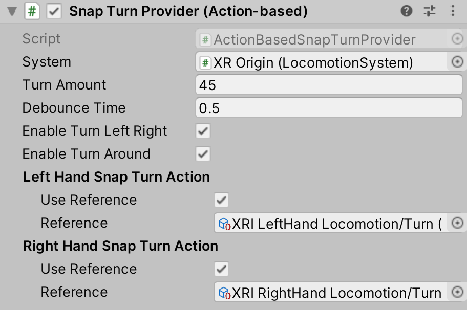

# Snap Turn Provider (Action-based)

A locomotion provider that allows the user to rotate their rig using a 2D axis input from an input system action.

| **Property** | **Description** |
|---|---|
| **System** | The [LocomotionSystem](locomotion-system.md) that this `LocomotionProvider` communicates with for exclusive access to an XR Origin. If one is not provided, the behavior will attempt to locate one during its Awake call. |
| **Turn Amount** | The number of degrees clockwise Unity rotates the rig when snap turning clockwise. |
| **Debounce Time** | The amount of time that Unity waits before starting another snap turn. |
| **Enable Turn Left Right** | Controls whether to enable left and right snap turns. |
| **Enable Turn Around** | Controls whether to enable 180° snap turns. |
| **Delay Time** | The time (in seconds) to delay the first turn after receiving initial input for the turn. Subsequent turns while holding down input are delayed by the **Debounce Time**, not the delay time. This delay can be used, for example, as time to set a tunneling vignette effect as a VR comfort option. |
| **Left Hand Snap Turn Action** | |
| &emsp;Use Reference | Enable to reference an action externally defined using the accompanying field. |
| &emsp;Reference | The Input System Action that Unity uses to read Snap Turn data sent from the left hand controller. Must be a `InputActionType.Value` `Vector2Control` Control. |
| **Right Hand Snap Turn Action** | |
| &emsp;Use Reference | Enable to reference an action externally defined using the accompanying field. |
| &emsp;Reference | The Input System Action that Unity uses to read Snap Turn data sent from the right hand controller. Must be a `InputActionType.Value` `Vector2Control` Control. |