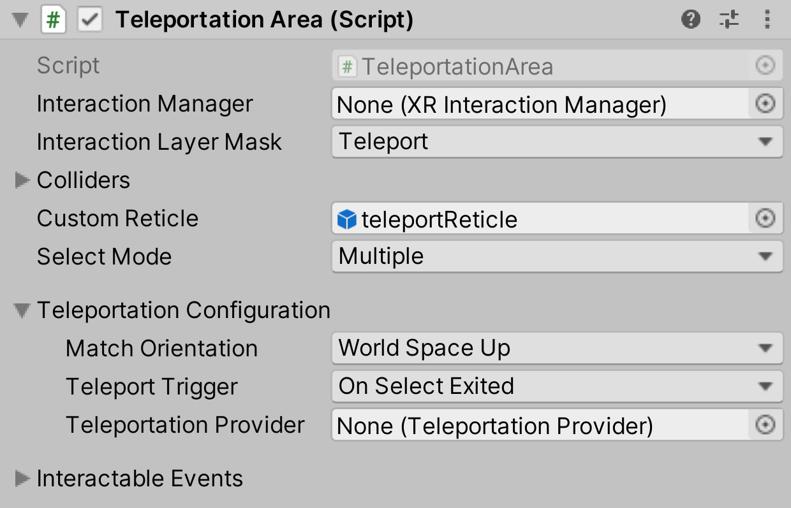

# Teleportation Area

An area is a teleportation destination which teleports the user to their pointed location on a surface.

| **Property** | **Description** |
|---|---|
| **Interaction Manager** | The [XRInteractionManager](xr-interaction-manager.md) that this Interactable will communicate with (will find one if **None**). |
| **Interaction Layer Mask** | Allows interaction with Interactors whose [Interaction Layer Mask](interaction-layers.md) overlaps with any Layer in this Interaction Layer Mask. |
| **Colliders** | Colliders to use for interaction with this Interactable (if empty, will use any child Colliders). |
| **Custom Reticle** | The reticle that appears at the end of the line when valid. |
| **Select Mode** | Indicates the selection policy of an Interactable. This controls how many Interactors can select this Interactable. The value is only read by the Interaction Manager when a selection attempt is made, so changing this value from **Multiple** to **Single** will not cause selections to be exited. |
| &emsp;Single | Set **Select Mode** to **Single** to prevent additional simultaneous selections from more than one Interactor at a time. |
| &emsp;Multiple | Set **Select Mode** to **Multiple** to allow simultaneous selections on the Interactable from multiple Interactors. |
| **Teleport Anchor Transform** | The `Transform` that represents the teleportation destination. |
| **Match Orientation** | How to orient the rig after teleportation. |
| &emsp;World Space Up | Set **Match Orientation** to **World Space Up** to stay oriented according to the world space up vector. |
| &emsp;Target Up | Set **Match Orientation** to **Target Up** to orient according to the target `TeleportAnchor` Transform's up vector. |
| &emsp;Target Up And Forward | Set **Match Orientation** to **Target Up And Forward** to orient according to the target `BaseTeleportationInteractable` Transform's rotation.|
| &emsp;None | Set **Match Orientation** to **None** to maintain the same orientation before and after teleporting. |
|**Match Directional Input**|Specifies whether or not to rotate the rig to match the forward direction of the attach transform of the selecting interactor. This option is only available when **Match Orientation** is set to **World Space Up** or **Target Up**.|
| **Teleport Trigger** | Specifies when the teleportation triggers. |
| &emsp;OnSelectEntered | Set **Teleport Trigger** to **OnSelectEntered** to teleport when the Interactable is selected. |
| &emsp;OnSelectExited | Set **Teleport Trigger** to **OnSelectEntered** to teleport when the Interactable is no longer selected after having been selected. |
| &emsp;OnActivated | Set **Teleport Trigger** to **OnActivated** to teleport when the Interactable is activated. Not to be confused with the active state of a GameObject, an activate event in this context refers to a contextual command action, such as toggling a flashlight on and off. |
| &emsp;OnDeactivated | Set **Teleport Trigger** to **OnActivated** to teleport when the Interactable is deactivated. Not to be confused with the active state of a GameObject, an activate event in this context refers to a contextual command action, such as toggling a flashlight on and off. |
| **Teleportation Provider** | The teleportation provider that this teleportation interactable communicates teleport requests to. If no teleportation provider is configured, will attempt to find a teleportation provider. |
| **Filter Selection By Hit Normal** | When enabled, this teleportation interactable will only be selectable by a ray interactor if its current hit normal is aligned with this object's up vector. |
| **Up Normal Tolerance Degrees** | Sets the tolerance in degrees from this object's up vector for a hit normal to be considered aligned with the up vector. Only used and displayed when **Filter Selection By Hit Normal** is enabled. |
| **Interactable Events** | For other events, see the [Interactable Events](interactable-events.md) page. |
| **Teleporting** | Gets or sets the event that Unity calls when queuing to teleport via `TeleportationProvider`. The `TeleportingEventArgs` passed to each listener is only valid while the event is invoked, do not hold a reference to it. |