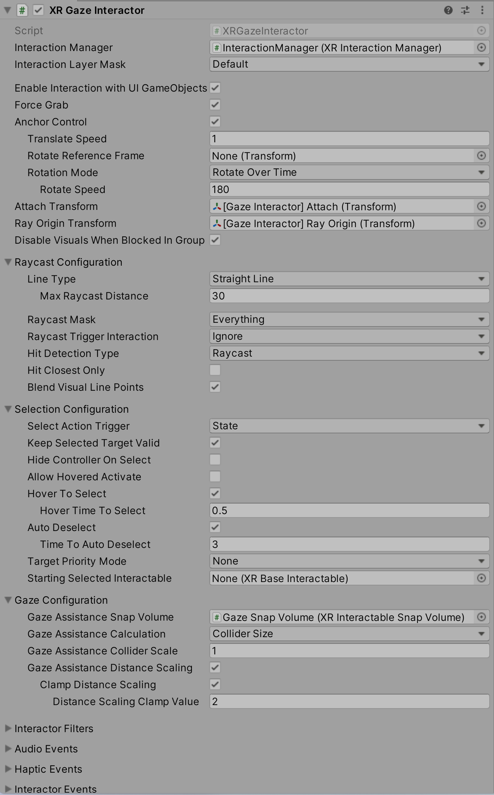

# XR Gaze Interactor

Interactor used for interacting with Interactables via gaze. This is handled via ray casts that update the current set of valid targets for this interactor. This interactor will only interact with `XRBaseInteractable` (XRI implementations [XR Simple Interactable](xr-simple-interactable.md) and [XR Grab Interactable](xr-grab-interactable.md)) that have enabled **Allow Gaze Interaction**. This interactor also supports a **Gaze Assistance** feature that can be enabled on an interactable. Interactables have additional properties that allow you to specify how gaze functionality effects each Interactable on an individual level. 

| **Property** | **Description** |
|---|---|
| **Gaze Assistance Snap Volume** | (Optional) The [XRInteractableSnapVolume](xr-interactable-snap-volume.md) that this interactor will position on a valid target for gaze assistance. If this is left empty, one will be created. |
| **Gaze Assistance Calculation** | Defines how this interactor will size and scale the **Gaze Assistance Snap |
| &emsp;Fixed Size | Uses a fixed size for the **Gaze Assistance Snap Volume**. |
| &emsp;Collider Size | Uses the size of the interactable collider it hits for the **Gaze Assistance Snap Volume**. |
| **Gaze Assistance Fixed Size** | Fixed size used for the **Gaze Assistance Snap Volume** when **Gaze Assistance Calculation** is **Fixed Size**. |
| **Gaze Assistance Collider Scale** | Scale used for **Gaze Assistance Snap Volume**. |
| **Gaze Assistance Distance Scaling** | Enables the gaze assistance collider to scale based on the distance between the interactor and the targeted interactable. |
| **Clamp Distance Scaling** | Clamps the scale of the gaze assistance collider to the distance scaling clamp value. |
| **Distance Scaling Clamp Value** | The scale the gaze assistance will be clamped to. |

## Fallback

If a valid eye tracking device is not found, gaze can fallback to head tracking to support the desired gaze features. For an example of fall back support for gaze interaction, import the [Starter Assets](samples-starter-assets.md) sample and see the [`GazeInputManager`](samples-starter-assets.md#scripts) script. Add the `GazeInputManager` to a `XRGazeInteractor` GameObject to support gaze fallback.

## Eye tracking permission

Devices like the Quest Pro and HoloLens 2 require applications that access eye tracking data to have the necessary permissions. For HoloLens 2, see the Microsoft documentation on [Gaze Privacy](https://learn.microsoft.com/en-us/windows/apps/design/input/gaze-interactions#privacy). For Quest Pro, use [`Permission.RequestUserPermission`](https://docs.unity3d.com/ScriptReference/Android.Permission.RequestUserPermission.html). Those links provide a starting point to request those permissions and Unity will provide sample code in an upcoming release to help demonstrate permission requesting.

## Quest Pro support

The [Oculus XR Plugin](https://docs.unity3d.com/Manual/com.unity.xr.oculus.html) version `3.2.1` or newer is required for Quest Pro support.

Currently, an additional provider is necessary to support the `XRGazeInteractor` for the Quest Pro. The additional provider needs to update the `XRGazeInteractor` [`Pose`](https://docs.unity3d.com/ScriptReference/Pose.html). The gaze `Pose` data can be accessed through the OVRPlugin in the [Oculus Integration](https://assetstore.unity.com/packages/tools/integration/oculus-integration-82022).

## OpenXR eye tracking bindings

The `XRGazeInteractor` is set up to use the the [OpenXR bindings](https://docs.unity3d.com/Packages/com.unity.xr.openxr@latest/index.html?subfolder=/manual/features/eyegazeinteraction.html) for eye gaze position, rotation, and tracking. If a device that supports eye tracking does not support these bindings, you will need to retrieve the gaze `Pose` data from the device and update the `XRGazeInteractor` Transform with an additional provider.