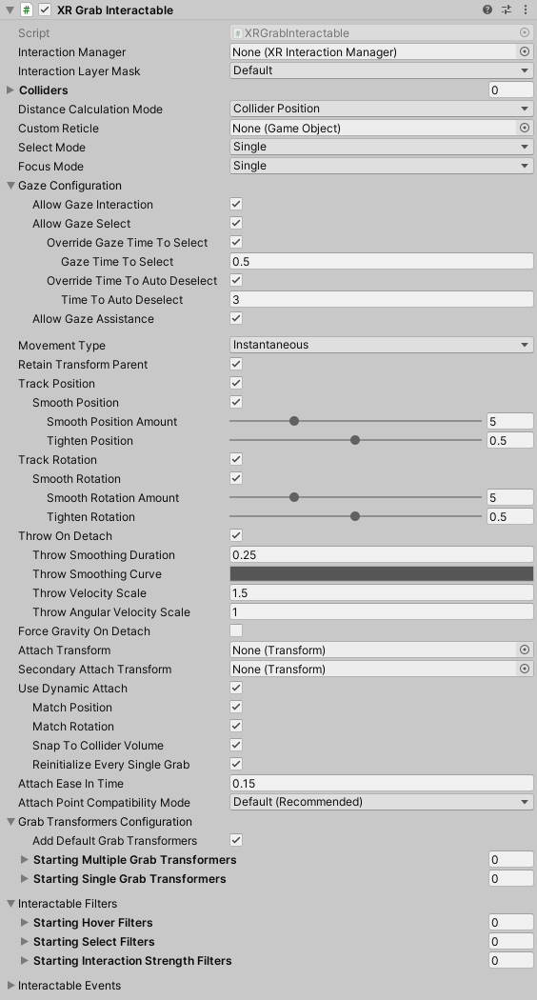

# XR Grab Interactable

Interactable component that allows for basic grab functionality. When this behavior is selected (grabbed) by an Interactor, this behavior will follow it around and inherit velocity when released.

| **Property** | **Description** |
|---|---|
| **Interaction Manager** | The [XRInteractionManager](xr-interaction-manager.md) that this Interactable will communicate with (will find one if **None**). |
| **Interaction Layer Mask** | Allows interaction with Interactors whose [Interaction Layer Mask](interaction-layers.md) overlaps with any Layer in this Interaction Layer Mask. |
| **Colliders** | Colliders to use for interaction with this Interactable (if empty, will use any child Colliders). |
| **Distance Calculation Mode** | Specifies how distance is calculated to Interactors, from fastest to most accurate. If using Mesh Colliders, Collider Volume only works if the mesh is convex. |
| &emsp;Transform Position | Calculates the distance using the Interactable's transform position. This option has low performance cost, but it may have low distance calculation accuracy for some objects. |
| &emsp;Collider Position | Calculates the distance using the Interactable's Colliders list using the shortest distance to each. This option has moderate performance cost and should have moderate distance calculation accuracy for most objects. |
| &emsp;Collider Volume | Calculates the distance using the Interactable's Colliders list using the shortest distance to the closest point of each (either on the surface or inside the Collider). This option has high performance cost but high distance calculation accuracy. |
| **Custom Reticle** | The reticle that appears at the end of the line when valid. |
| **Select Mode** | Indicates the selection policy of an Interactable. This controls how many Interactors can select this Interactable. The value is only read by the Interaction Manager when a selection attempt is made, so changing this value from **Multiple** to **Single** will not cause selections to be exited. |
| &emsp;Single | Set **Select Mode** to **Single** to prevent additional simultaneous selections from more than one Interactor at a time. |
| &emsp;Multiple | Set **Select Mode** to **Multiple** to allow simultaneous selections on the Interactable from multiple Interactors. |
| **Focus Mode** | Specifies the [focus](architecture.md#states) policy of this interactable. |
| &emsp;None | Set **Focus Mode** to **None** to disable the foucs state for an interactable. |
| &emsp;Single | Set **Focus Mode** to **Single** to allow interactors of a single [interaction group](architecture.md#interaction-groups) to focus this interactable. |
| &emsp;Multiple | Set **Focus Mode** to **Multiple** to allow interactors of multiple [interaction groups](architecture.md#interaction-groups) to focus this interactable. |
| **Allow Gaze Interaction** | Enable for basic interaction events from an [XRGazeInteractor](xr-gaze-interactor.md) and other gaze features. |
| **Allow Gaze Select** | Enable selection from an [XRGazeInteractor](xr-gaze-interactor.md). |
| **Override Gaze Time To Select** | Enables this Interactable to override the hover to select time on an [XRGazeInteractor](xr-gaze-interactor.md). |
| **Gaze Time To Select** | Number of seconds an [XRGazeInteractor](xr-gaze-interactor.md) must hover this interactable to select it if **Hover To Select** is enabled on the gaze Interactor. |
| **Override Time To Auto Deselect** | Enables this Interactable to override the auto deselect time on an [XRGazeInteractor](xr-gaze-interactor.md). |
| **Time To Auto Deselect** | Number of seconds this Interactable will be selected by an [XRGazeInteractor](xr-gaze-interactor.md) before being automatically deselected if **Auto Deselect** is enabled on the gaze Interactor. |
| **Allow Gaze Assistance** | If enabled, an [XRGazeInteractor](xr-gaze-interactor.md) will place an [XRInteractableSnapVolume](xr-interactable-snap-volume.md) at this interactable to allow a properly configured [XRRayInteractor](xr-ray-interactor.md) to snap to this interactable. See the [XR Interactable Snap Volume](xr-interactable-snap-volume.md) or [XR Ray Interactor](xr-ray-interactor.md) pages for further information about correctly configuring an `XRRayInteractor` to support an `XRInteractableSnapVolume`. |
| **Movement Type** | Specifies how this object moves when selected, either through setting the velocity of the `Rigidbody`, moving the kinematic `Rigidbody` during Fixed Update, or by directly updating the `Transform` each frame. |
| &emsp;Velocity Tracking | Set **Movement Type** to Velocity Tracking to move the Interactable object by setting the velocity and angular velocity of the Rigidbody. Use this if you don't want the object to be able to move through other Colliders without a Rigidbody as it follows the Interactor, however with the tradeoff that it can appear to lag behind and not move as smoothly as Instantaneous. |
| &emsp;Kinematic | Set **Movement Type** to Kinematic to move the Interactable object by moving the kinematic Rigidbody towards the target position and orientation. Use this if you want to keep the visual representation synchronized to match its Physics state, and if you want to allow the object to be able to move through other Colliders without a Rigidbody as it follows the Interactor. |
| &emsp;Instantaneous | Set **Movement Type** to Instantaneous to move the Interactable object by setting the position and rotation of the Transform every frame. Use this if you want the visual representation to be updated each frame, minimizing latency, however with the tradeoff that it will be able to move through other Colliders without a Rigidbody as it follows the Interactor. |
| **Retain Transform Parent** | Enable to have Unity set the parent of this object back to its original parent this object was a child of after this object is dropped. |
| **Track Position** | Enable to have this object follow the position of the Interactor when selected. |
| **Smooth Position** | Enable to have Unity apply smoothing while following the position of the Interactor when selected. |
| **Smooth Position Amount** | Scale factor for how much smoothing is applied while following the position of the Interactor when selected. The larger the value, the closer this object will remain to the position of the Interactor. |
| **Tighten Position** | Reduces the maximum follow position difference when using smoothing. Fractional amount of how close the smoothed position should remain to the position of the Interactor when using smoothing. The value ranges from 0 meaning no bias in the smoothed follow distance, to 1 meaning effectively no smoothing at all. |
| **Velocity Damping** | Scale factor of how much to dampen the existing linear velocity when tracking the position of the Interactor. The smaller the value, the longer it takes for the velocity to decay. Only applies when **Movement Type** is in Velocity Tracking mode. |
| **Velocity Scale** | Scale factor Unity applies to the tracked linear velocity while updating the `Rigidbody` when tracking the position of the Interactor. Only applies when **Movement Type** is in Velocity Tracking mode. |
| **Track Rotation** | Enable to have this object follow the rotation of the Interactor when selected. |
| **Smooth Rotation** | Apply smoothing while following the rotation of the Interactor when selected. |
| **Smooth Rotation Amount** | Scale factor for how much smoothing is applied while following the rotation of the Interactor when selected. The larger the value, the closer this object will remain to the rotation of the Interactor. |
| **Tighten Rotation** | Reduces the maximum follow rotation difference when using smoothing. Fractional amount of how close the smoothed rotation should remain to the rotation of the Interactor when using smoothing. The value ranges from 0 meaning no bias in the smoothed follow rotation, to 1 meaning effectively no smoothing at all. |
| **Track Scale** | Enable to have this object follow the scale of the Interactor when selected. |
| **Smooth Scale** | Apply smoothing while following the scale of the Interactor when selected. |
| **Smooth Scale Amount** | Scale factor for how much smoothing is applied while following the scale of the interactable when selected. The larger the value, the closer this object will remain to the scale of the Interactor. |
| **Tighten Scale** | Reduces the maximum follow scale difference when using smoothing. Fractional amount of how close the smoothed scale should remain to the scale of the Interactor when using smoothing. The value ranges from 0 meaning no bias in the smoothed follow scale, to 1 meaning effectively no smoothing at all. |
| **Angular Velocity Damping** | Scale factor of how much Unity dampens the existing angular velocity when tracking the rotation of the Interactor. The smaller the value, the longer it takes for the angular velocity to decay. Only applies when **Movement Type** is in _VelocityTracking_ mode. |
| **Angular Velocity Scale** | Scale factor Unity applies to the tracked angular velocity while updating the `Rigidbody` when tracking the rotation of the Interactor. Only applies when **Movement Type** is in Velocity Tracking mode. |
| **Throw On Detach** | Enable to have this object inherit the velocity of the Interactor when released. This is not supported for a kinematic Rigidbody. |
| **Throw Smoothing Duration** | This value represents the time over which collected samples are used for velocity calculation (up to a max of 20 previous frames, which is dependent on both Smoothing Duration and framerate). As an example, if this value is set to 0.25, position and velocity values will be averaged over the past 0.25 seconds. Each of those values is weighted (multiplied) by the Throw Smoothing Curve as well. |
| **Throw Smoothing Curve** | The curve used to weight velocity smoothing upon throwing (most recent frames to the right). By default this curve is flat with a 1.0 value so all smoothing values are treated equally across the smoothing duration. |
| **Throw Velocity Scale** | Scale factor Unity applies to this object's linear velocity inherited from the Interactor when released. |
| **Throw Angular Velocity Scale** | Scale factor Unity applies to this object's angular velocity inherited from the Interactor when released. |
| **Force Gravity On Detach** | Forces this object to have gravity when released (will still use pre-grab value if this is `false` / unchecked). |
| **Attach Transform** | The attachment point Unity uses on this Interactable (will use this object's position if none set). |
| **Secondary Attach Transform** | A second attachment point to use on this Interactable for two-handed interaction. (Unity uses the second interactor's attach transform if you don't set this property). |
| **Use Dynamic Attach** | Enable to make the effective attachment point based on the pose of the Interactor when the selection is made. |
| **Match Position** | Match the position of the Interactor's attachment point when initializing the grab. This will override the position of Attach Transform. |
| **Match Rotation** | Match the rotation of the Interactor's attachment point when initializing the grab. This will override the rotation of Attach Transform. |
| **Snap To Collider Volume** | Adjust the dynamic attachment point to keep it on or inside the Colliders that make up this object. |
| **Reinitialize Every Single Grab** | Re-initialize the dynamic attachment pose when changing from multiple grabs back to a single grab. Use this if you want to keep the current pose of the object after releasing a second hand rather than reverting back to the attach pose from the original grab. |
| **Attach Ease In Time** | Time in seconds Unity eases in the attach when selected (a value of 0 indicates no easing). |
| **Attach Point Compatibility Mode** | Controls the method used when calculating the target position of the object. Use `AttachPointCompatibilityMode.Default` for consistent attach points between all `XRBaseInteractable.MovementType` values. Marked for deprecation, this property will be removed in a future version. This is a backwards compatibility option in order to keep the old, incorrect method of calculating the attach point. Projects that already accounted for the difference can use the Legacy option to maintain the same attach positioning from older versions without needing to modify the **Attach Transform** position. |
| **Add Default Grab Transformers** | Whether Unity will add the default set of grab transformers if either the Single or Multiple Grab Transformers lists are empty. |
| **Starting Multiple Grab Transformers** | The grab transformers that this Interactable automatically links at startup (optional, may be empty). Used for multi-interactor selection. After startup, this property is not used. Useful when there is more than one Grab Transformer that should be processed and you need to specify the order. |
| **Starting Single Grab Transformers** | The grab transformers that this Interactable automatically links at startup (optional, may be empty). Used for single-interactor selection. After startup, this property is not used. Useful when there is more than one Grab Transformer that should be processed and you need to specify the order. |
| **Multiple Grab Transformers** | (Play mode only) The grab transformers used when there are multiple interactors selecting this object. |
| **Single Grab Transformers** | (Play mode only) The grab transformers used when there is a single interactor selecting this object. |
| **Interactable Filter** | Assign [IXRHoverFilter(xref:UnityEngine.XR.Interaction.Toolkit.Filtering.IXRHoverFilter), [IXRSelectFilter(xref:UnityEngine.XR.Interaction.Toolkit.Filtering.IXRSelectFilter), and [IXRInteractionStrengthFilter(xref:UnityEngine.XR.Interaction.Toolkit.Filtering.IXRInteractionStrengthFilter) objects to an Interactable.|
| **Interactable Events** | Assign event handlers to events dispatched by an Interactable. Refer to the [Interactable Events](interactable-events.md) page for more information. |

## Grab transformers

This XR Grab Interactable behavior is responsible for applying the position, rotation, and local scale calculated by one or more [IXRGrabTransformer](xref:UnityEngine.XR.Interaction.Toolkit.Transformers.IXRGrabTransformer) implementations. The (xref:UnityEngine.XR.Interaction.Toolkit.Transformers.XRGeneralTransformer) grab transformer is automatically added by Unity (when **Add Default Grab Transformers** is enabled), but this functionality can be disabled to manually set the grab transformers used by this behavior, allowing you to customize how this component determines where the object should move and rotate to. This default grab transformer also comes with a set of configurable options to allow axis constraints for translation, two handed rotation, and two handed scaling (which is disabled by default).

Grab transformer components can be added to the GameObject to link them with the XR Grab Interactable. They can be found in the **Component** &gt; **XR** &gt; **Transformers** menu. You can then add references to those components explicitly to **Starting Single Grab Transformers** or **Starting Multiple Grab Transformers** if you have more than one and need to specify the order in which they execute, or if you need to override which list the grab transformer is automatically added to.