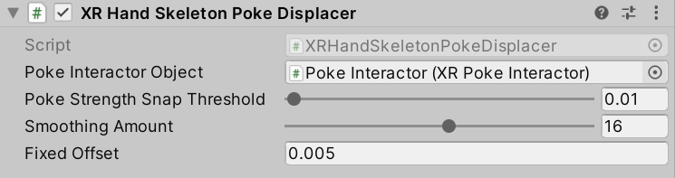

# XR Hand Skeleton Poke Displacer

Class used to displace the root pose of a hand skeleton based on a poke interaction to enable freezing the poke pose in place when pressing poke buttons or UI elements. It will help prevent the hand mesh visual from moving through buttons and UI that can be poked.

This component requires the [XR Hands package](https://docs.unity3d.com/Packages/com.unity.xr.hands@latest) version 1.3.0 or newer to be installed in your project.

This component is typically added to the Left and Right Hand Interaction Visual GameObjects that has the XR Hand Skeleton Driver component, and references the XR Poke Interactor for that hand.

| **Property** | **Description** |
|---|---|
| **Poke Interactor Object** | Poke interactor reference used to get poke data. |
| **Poke Strength Snap Threshold** | Threshold poke interaction strength must be above to snap the poke pose to the current pose. |
| **Smoothing Amount** | Smoothing to apply to the offset root. If smoothing amount is 0, no smoothing will be applied. |
| **Fixed Offset** | Additional offset subtracted along the poke interaction axis to apply to the root pose when poking. Default value accounts for the width of the finger mesh. |
