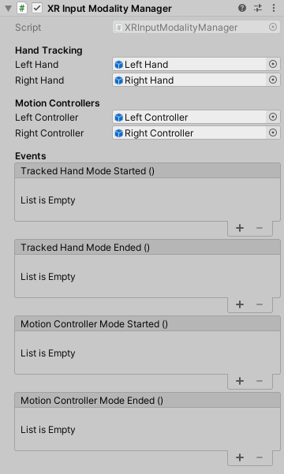

# XR Input Modality Manager

Manages swapping between hands and controllers at runtime based on whether hands and controllers are tracked.

If hands begin tracking, this component will switch to the hand group of interactors. If the player wakes the motion controllers by grabbing them, this component will switch to the motion controller group of interactors. Additionally, if a controller has never been tracked, this component will wait to activate that GameObject until it is tracked.

Some of the properties and events requires the [XR Hands package](https://docs.unity3d.com/Packages/com.unity.xr.hands@latest) to be installed in your project.

| **Property** | **Description** |
|---|---|
| **Left Hand** | GameObject representing the left hand group of interactors. Will toggle on when using hand tracking and off when using motion controllers. |
| **Right Hand** | GameObject representing the right hand group of interactors. Will toggle on when using hand tracking and off when using motion controllers. |
| **Left Controller** | GameObject representing the left motion controller group of interactors. Will toggle on when using motion controllers and off when using hand tracking. |
| **Right Controller** | GameObject representing the left motion controller group of interactors. Will toggle on when using motion controllers and off when using hand tracking. |
| **Tracked Hand Mode Started** | Calls the methods in its invocation list when hand tracking mode is started. This event does not fire again for the other hand if the first already started this mode. |
| **Tracked Hand Mode Ended** | Calls the methods in its invocation list when both hands have stopped hand tracking mode. |
| **Motion Controller Mode Started** | Calls the methods in its invocation list when motion controller mode is started. This event does not fire again for the other hand if the first already started this mode. |
| **Motion Controller Mode Ended** | Calls the methods in its invocation list when both hands have stopped motion controller mode. |
