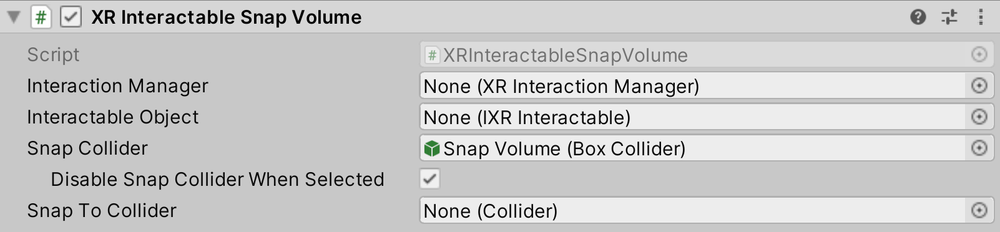

# XR Interactable Snap Volume

Component that enables an [XR Ray Interactor](xr-ray-interactor.md) to visually snap to an associated interactable. This component requires a collider that is a trigger. 

This behavior automatically registers itself with the [XR Interaction Manager](xr-interaction-manager.md) to create an association between the **Snap Collider** and the **Interactable Object**. This component should typically be added to a child GameObject of an interactable.

|**Property**|**Description**|
|---|---|
|**Interaction Manager**|The XR Interaction Manager that this snap volume will communicate with (will find one if None).|
|**Interactable Object**|(Optional) The interactable associated with this snap volume. If this is left empty, this component will look for an interactable up the hierarchy.|
|**Snap Collider**|The trigger collider to associate with the interactable when it is hit/collided. Rays will snap from this to the Snap To Collider.|
|**Disable Snap Collider When Selected**|Automatically disable or enable the Snap Collider when the interactable is selected or deselected.|
|**Snap To Collider**|(Optional) The collider that will be used to find the closest point to snap to. If this is left empty, then the Transform position of the associated **Interactable** will be used as the snap point.|

## Snapping point

This XR Interactable Snap Volume will attempt to get the closest point on the **Snap To Collider**. If the **Snap To Collider** is `null`, it will fall back to the Transform position of the **Interactable Object**. If the **Interactable Object** is `null`, it will finally fallback to the Transform position of this XR Interactable Snap Volume.

## Configuring XR Ray Interactor

See [Supporting XR Interactable Snap Volume](xr-ray-interactor.md#supporting-xr-interactable-snap-volume) in the XR Ray Interactor documentation for configuration steps to allow an XR Ray Interactor to snap to an XR Interactable Snap Volume.

## Configuring with Teleportation Anchors

Teleport Interactors and [Teleportation Anchors](teleportation-anchor.md) are configured to use selection events to perform teleportation. When configuring an XR Interactable Snap Volume with a Teleportation Anchor, **Disable Snap Collider When Selected** should be unchecked and set to `false`. This will keep the **Snap Collider** enabled and allow the teleport interactor ray to snap to the Teleportation Anchor until the teleportation is complete.