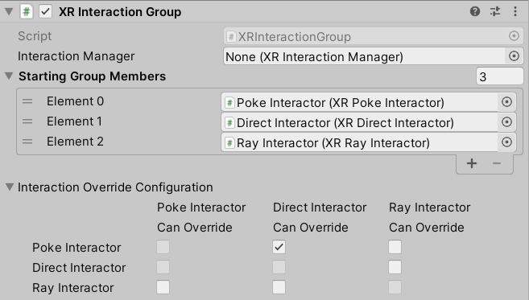

# XR Interaction Group

An Interaction Group is a mediator for Interactors. A Group contains multiple member Interactors, sorted by priority, and only allows one Interactor in the Group to interact (hover or select) at a time. Groups first prioritize continuous selection - so if a member Interactor was interacting the previous frame and can start or continue selection in the current frame, then that Interactor will be chosen for interaction even if a higher priority Interactor tries to interact.

You can configure interaction overrides for each member. An override Group member is able to ignore priority and block the interaction of the active member if it is able to select any of the interactables the active member is interacting with. When this happens, the override member is chosen as the single member for interaction. Priority is still respected when multiple members try to override at the same time. As an example of how overrides could be used, you might want Poke interaction to normally take priority so that Direct hover doesn't prevent it, but you might still want to let a user grab (Direct select) an interactable that is being poked.

An Interaction Group can also contain other Groups in its sorted list of members. A Group within a Group is treated like a single Interactor when it comes to how the containing Group prioritizes interactions. The Interactor chosen for interaction within a Group is bubbled up to the next containing Group, until it is ultimately either chosen for interaction in the top-level Group or skipped over just like other Interactors.

The configuration of **Starting Group Members** and their overrides cannot be edited during play mode after the Group has had `Awake` called.

| **Property** | **Description** |
|---|---|
| **Interaction Manager** | The [XRInteractionManager](xr-interaction-manager.md) that this Interaction Group will communicate with (will find one if **None**). |
| **Starting Group Members** | Ordered list of Interactors or Interaction Groups that are registered with the Group on `Awake`. |
| **Interaction Override Configuration** | Configuration for each Group Member of which other Members are able to override its interaction when they attempt to select any of its hovered or selected interactables, despite the difference in priority order. Each checkbox indicates whether the Member corresponding to its column can override the Member corresponding to its row. |