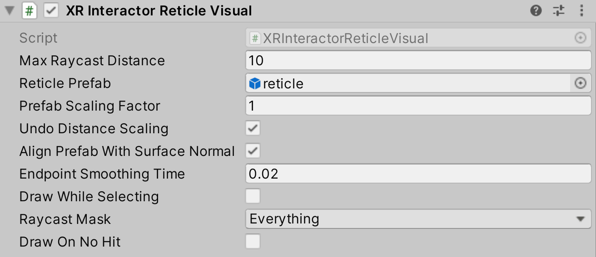

# XR Interactor Reticle Visual

Interactor helper object that draws a targeting **Reticle Prefab** over a ray casted point in front of the Interactor.

> [!NOTE]
> When `Align Prefab with Surface Normal` is enabled, the y-axis of the `Reticle Prefab` will be aligned with the surface normal, and the z-axis of the `Reticle Prefab` will be aligned with the XR Origin `transform.up` or the forward direction of the Interactor if the surface is horizontal. When creating reticle prefabs that align with surface normals, take this into account to ensure your reticle is properly aligned.

| **Property** | **Description** |
|---|---|
| **Max Raycast Distance** | The max distance to ray cast from this Interactor. |
| **Reticle Prefab** | Prefab which Unity draws over ray cast destination. |
| **Prefab Scaling Factor** | Amount to scale Prefab (before applying distance scaling). |
| **Undo Distance Scaling** | Enable to have Unity undo the apparent scale of the Prefab by distance. |
| **Align Prefab with Surface Normal** | Enable to have Unity align the Prefab to the ray cast surface normal. |
| **Endpoint Smoothing Time** | Smoothing time for endpoint. |
| **Draw While Selecting** | Enable to have Unity draw the **Reticle Prefab** while selecting an Interactable. |
| **Raycast Mask** | Layer mask for ray cast. |