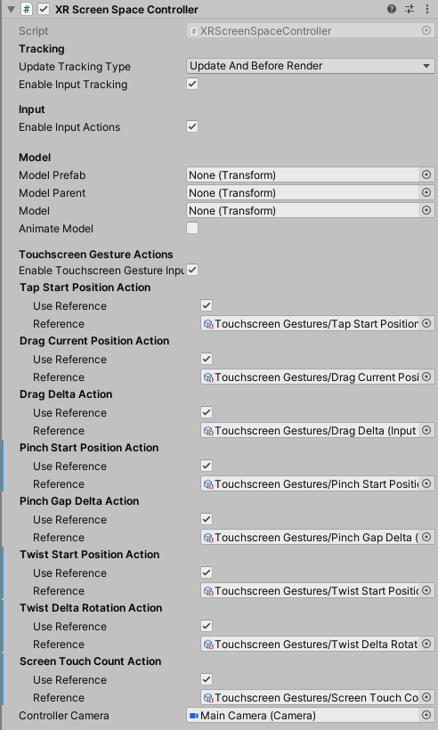

# XR Screen Space Controller
The XR Screen Space Controller component interprets screen presses and gestures by using actions from the  Input System and converting them into XR Interaction states, such as Select. It applies the current press position on the screen to move the transform of the GameObject.

This behavior requires that the Input System is enabled in the **Active Input Handling** setting in **Edit > Project Settings > Player** for input values to be read. Each input action must also be enabled before you can read the current value of that action. Input actions referenced from an Input Action Asset are not enabled by default. To enable the input actions for this component, use the `InputActionManager` component and add the related Input Action Asset.

| **Property** | **Description** |
|---|---|
| **Update Tracking Type** | The time within the frame that the controller samples tracking input. |
| &emsp;Update | Set **Update Tracking Type** to **Update** to sample tracking input only during the `MonoBehaviour` `Update` step. |
| &emsp;Before Render | Set **Update Tracking Type** to **Before Render** to sample tracking input only during the step immediately before rendering. |
| &emsp;Update And Before Render | Set **Update Tracking Type** to **Update And Before Render** to sample tracking input during both of the timings within a frame above. |
| **Enable Input Tracking** | Whether input pose tracking is enabled for the controller. When enabled, Unity reads the current tracking pose input of the controller device each frame. You can disable this in order to drive the controller state manually instead of from reading current inputs, such as when playing back recorded pose inputs. |
| **Model Prefab** | The prefab of a controller model to show for this controller that this behavior automatically instantiates. This behavior automatically instantiates an instance of the prefab as a child of `modelParent` (see below) upon startup unless `model` (see further below) is already set, in which case this value is ignored. |
| **Model Parent** | The transform that this behavior uses as the parent for the model prefab when it is instantiated. Automatically instantiated and set in `Awake` if not already set. Setting this will not automatically destroy the previous object. |
| **Model** | The instance of the controller model in the scene. You can set this to an existing object instead of using `modelPrefab` (see above). If set, it should reference a child GameObject of this behavior so it will update with the controller pose. |
| **Animate Model** | Whether to animate the model in response to interaction events. When enabled, activates a named animation trigger upon selecting or deselecting. |
| **Tap Start Position Action** | |
| &emsp;Use Reference | Enable to reference an action externally defined using the accompanying field. |
| &emsp;Reference | The Input System action to use for representing screen tap position data. Must be a `Vector2Control` Control. |
| **Drag Current Position Action** | |
| &emsp;Use Reference | Enable to reference an action externally defined using the accompanying field. |
| &emsp;Reference | The Input System action to use for representing screen drag position data. Must be a `Vector2Control` Control. |
| **Drag Delta Action** | |
| &emsp;Use Reference | Enable to reference an action externally defined using the accompanying field. |
| &emsp;Reference | The Input System action to use for representing screen drag delta data. Must be a `Vector2Control` Control. |
| **Pinch Start Position Action** | |
| &emsp;Use Reference | Enable to reference an action externally defined using the accompanying field. |
| &emsp;Reference | The Input System action to use for representing screen pinch start position data. Must be a `Vector2Control` Control. |
| **Pinch Gap Action** | |
| &emsp;Use Reference | Enable to reference an action externally defined using the accompanying field. |
| &emsp;Reference | The Input System action to use for representing screen pinch gap data. Must be an `AxisControl` Control. |
| **Pinch Gap Delta Action** | |
| &emsp;Use Reference | Enable to reference an action externally defined using the accompanying field. |
| &emsp;Reference | The Input System action to use for representing screen pinch gap delta data. Must be an `AxisControl` Control. |
| **Twist Start Position Action** | |
| &emsp;Use Reference | Enable to reference an action externally defined using the accompanying field. |
| &emsp;Reference | The Input System action to use for representing screen twist start position data. Must be a `Vector2Control` Control.  |
| **Twist Rotation Delta Action** | |
| &emsp;Use Reference | Enable to reference an action externally defined using the accompanying field. |
| &emsp;Reference | The Input System action to use for representing screen twist rotation delta data. Must be an `AxisControl` Control. |
| **Screen Touch Count** | |
| &emsp;Use Reference | Enable to reference an action externally defined using the accompanying field. |
| &emsp;Reference | The Input System action to use for getting the number of current touches on a screen. Must be an `IntegerControl` Control. |