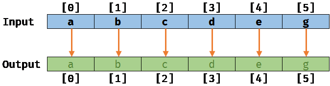
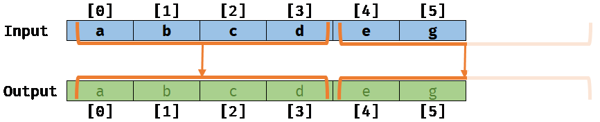
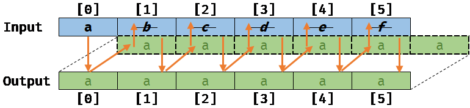
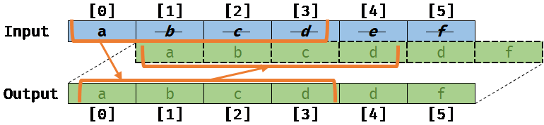

# Memory aliasing

Memory aliasing is a way to tell Burst how your code uses data. This can improve and optimize the performance of your application.

Memory aliasing happens when locations in the memory overlap each other. The following documentation outlines the difference between memory aliasing, and no memory aliasing.  

The following example shows a job that copies data from an input array to an output array:

```c#
[BurstCompile]
private struct CopyJob : IJob
{
    [ReadOnly]
    public NativeArray<float> Input;

    [WriteOnly]
    public NativeArray<float> Output;

    public void Execute()
    {
        for (int i = 0; i < Input.Length; i++)
        {
            Output[i] = Input[i];
        }
    }
}
```
## No memory aliasing

If the arrays `Input` and `Output` don't overlap, which means that their respective memory location doesn't overlap, the code returns the following result after running this job on a sample input/output:

</br>_Memory with no aliasing_

If Burst is [noalias](aliasing-noalias.md) aware, it can work at the scalar level to optimize the previous scalar loop. It does this through a process called vectorizing, where it rewrites the loop to process elements in a small batch. For example, Burst could work at vector level in 4 by 4 elements: 

<br/>_Memory with no aliasing vectorized_

## Memory aliasing

If the `Output` array overlaps the `Input` array by one element (for example `Output[0]` points to `Input[1]`), then this means that the memory is aliasing. This gives the following result when you run `CopyJob` without the auto vectorizer:

<br>_Memory with aliasing_

If [Burst isn't aware of the memory aliasing](aliasing-noalias.md), it tries to auto vectorize the loop, which results in the following:

<br/>_Memory with aliasing and invalid vectorized code_

The result of this code is invalid and might lead to bugs if Burst can't identify them.

## Generated code

In the `CopyJob` example, there is an `x64` assembly targeted at `AVX2` in its loop. The instruction `vmovups` moves 8 floats, so a single auto vectorized loop moves 4 × 8 floats, which equals 32 floats copied per loop iteration, instead of just one:

```x86asm
.LBB0_4:
    vmovups ymm0, ymmword ptr [rcx - 96]
    vmovups ymm1, ymmword ptr [rcx - 64]
    vmovups ymm2, ymmword ptr [rcx - 32]
    vmovups ymm3, ymmword ptr [rcx]
    vmovups ymmword ptr [rdx - 96], ymm0
    vmovups ymmword ptr [rdx - 64], ymm1
    vmovups ymmword ptr [rdx - 32], ymm2
    vmovups ymmword ptr [rdx], ymm3
    sub     rdx, -128
    sub     rcx, -128
    add     rsi, -32
    jne     .LBB0_4
    test    r10d, r10d
    je      .LBB0_8
```

The following example shows the same Burst compiled loop, but Burst's aliasing is artificially disabled: 

```x86asm
.LBB0_2:
    mov     r8, qword ptr [rcx]
    mov     rdx, qword ptr [rcx + 16]
    cdqe
    mov     edx, dword ptr [rdx + 4*rax]
    mov     dword ptr [r8 + 4*rax], edx
    inc     eax
    cmp     eax, dword ptr [rcx + 8]
    jl      .LBB0_2
```

The result is entirely scalar and runs approximately 32 times slower than the highly optimized, vectorized variant that the original alias analysis produces.

## Function cloning

For function calls where Burst knows about the aliasing between parameters to the function, Burst can infer the aliasing. It can then propagate this onto the called function to improve optimization:

```c#
[MethodImpl(MethodImplOptions.NoInlining)]
int Bar(ref int a, ref int b)
{
    a = 42;
    b = 13;
    return a;
}

int Foo()
{
    var a = 53;
    var b = -2;

    return Bar(ref a, ref b);
}
```

The assembly for `Bar` would be:

```x86asm
mov     dword ptr [rcx], 42
mov     dword ptr [rdx], 13
mov     eax, dword ptr [rcx]
ret
```

This is because Burst doesn't know the aliasing of `a` and `b` within the `Bar` function. This is in line with what other compiler technologies do with this code snippet.

Burst is smarter than this though. Through a process of function cloning, Burst creates a copy of `Bar` where it knows that the aliasing properties of `a` and `b` don't alias. It then replaces the original call to `Bar` with a call to the copy. This results in the following assembly:

```x86asm
mov     dword ptr [rcx], 42
mov     dword ptr [rdx], 13
mov     eax, 42
ret
```

In this scenario, Burst doesn't perform the second load from `a`.

## Aliasing checks

Because aliasing is key to Burst's ability to optimize for performance, there are some aliasing intrinsics:

- [`Unity.Burst.CompilerServices.Aliasing.ExpectAliased`](xref:Unity.Burst.CompilerServices.Aliasing.ExpectAliased*) expects that the two pointers do alias, and generates a compiler error if not.
- [`Unity.Burst.CompilerServices.Aliasing.ExpectNotAliased`](xref:Unity.Burst.CompilerServices.Aliasing.ExpectNotAliased*) expects that the two pointers don't alias, and generates a compiler error if not.

An example:

```c#
using static Unity.Burst.CompilerServices.Aliasing;

[BurstCompile]
private struct CopyJob : IJob
{
    [ReadOnly]
    public NativeArray<float> Input;

    [WriteOnly]
    public NativeArray<float> Output;

    public unsafe void Execute()
    {
        // NativeContainer attributed structs (like NativeArray) cannot alias with each other in a job struct!
        ExpectNotAliased(Input.getUnsafePtr(), Output.getUnsafePtr());

        // NativeContainer structs cannot appear in other NativeContainer structs.
        ExpectNotAliased(in Input, in Output);
        ExpectNotAliased(in Input, Input.getUnsafePtr());
        ExpectNotAliased(in Input, Output.getUnsafePtr());
        ExpectNotAliased(in Output, Input.getUnsafePtr());
        ExpectNotAliased(in Output, Output.getUnsafePtr());

        // But things definitely alias with themselves!
        ExpectAliased(in Input, in Input);
        ExpectAliased(Input.getUnsafePtr(), Input.getUnsafePtr());
        ExpectAliased(in Output, in Output);
        ExpectAliased(Output.getUnsafePtr(), Output.getUnsafePtr());
    }
}
```

These checks only run when optimizations are enabled, because proper aliasing deduction is intrinsically linked to the optimizer's ability to see through functions via inlining.
