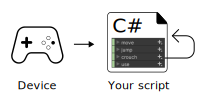
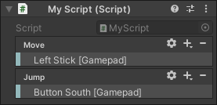

# Workflow Overview - Using Embedded Actions



You can use the **InputAction class** in your script to define actions in your script. This adds a layer of abstraction between your actual action code or methods, and the [bindings](ActionBindings.html) to specific device controls.

This means that instead of directly reading device states, you do not specify explicitly which controls (such as a gamepad trigger or stick) should do what in your code. Instead you create [Actions](Actions.html), [bind](ActionBindings.html) them to [controls](Controls.html), and respond to the states or values from your Actions in your code.

When you make a public [InputAction](../api/UnityEngine.InputSystem.InputAction.html) field in a MonoBehaviour script, it displays in the inspector as a configurable field. The configurable field UI allows you to create a binding for the action. For example, here are two Actions defined using the InputAction class in a script:

```
using UnityEngine;
using UnityEngine.InputSystem;

public class ExampleScript : MonoBehaviour
{
    public InputAction move;
    public InputAction jump;
}
```

In the image below, you can see the actions displayed in the inspector. In this example they have been configured so they are bound to Gamepad controls.



The InputAction class provides a way to bind interactions from a device’s controls to named actions in the inspector. When you bind actions to controls from a device in the inspector, you can then design your script to respond when the actions are performed without hard-coding references to specific devices in your script. This layer of abstraction provides you with the flexibility to modify or add multiple bindings without needing to change your code.

To read values from your Actions, you must first **enable** the action, and then either repeatedly poll the action in your game loop, or add event handlers to the action. You must also **disable** the action when you no longer want the input to trigger event handlers.

So, use actions such as those shown above in the small code sample, you would use a script like this:

```
using UnityEngine;
using UnityEngine.InputSystem;

// Using embedded actions with callbacks or reading values each frame.

public class ExampleScript : MonoBehaviour
{
    // these embedded actions are configurable in the inspector:
    public InputAction moveAction;
    public InputAction jumpAction;

    public void Awake()
    {
        // assign a callback for the "jump" action.
        jumpAction.performed += ctx => { OnJump(ctx); };
    }

    public void Update()
    {
        // read the value for the "move" action each frame.
        Vector2 moveAmount = moveAction.ReadValue<Vector2>();
    }

    public void OnJump(InputAction.CallbackContext context)
    {
        // jump code goes here.
    }

    // the actions must be enabled and disabled
    // when the GameObject is enabled or disabled

    public void OnEnable()
    {
        moveAction.Enable();
        jumpAction.Enable();
    }

    public void OnDisable()
    {
        moveAction.Disable();
        jumpAction.Disable();
    }
}
```

See [Actions](Actions.html) for more information about both these techniques.

You can find an example of this workflow in the sample projects included with the input system package. To find it, in the Project window, look in **Assets > Samples > SimpleDemo** and open the scene: **SimpleDemo_UsingActions**.

Using InputActions also makes it easier to implement a system to allow the user to remap their own controls at run time.

Using embedded actions like this is more flexible than [directly reading device states](Workflow-Direct.html), but less flexible than using an [actions asset](Workflow-ActionsAsset.html).
