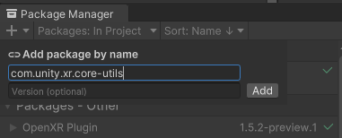

# About XR Core Utilities

The XR Core Utilities package contains a variety of classes and extension methods which are commonly used and shared between multiple XR packages. Some particularly useful utilities include:

- [Geometry Utilities](xref:Unity.XR.CoreUtils.GeometryUtils)
  - Point of closest approach
  - Closest edge of a polygon
  - Check if point inside of polygon
  - Compute 2D convex hull
- [Collection pool](xref:Unity.XR.CoreUtils.CollectionPool`2)
- [Object pool](xref:Unity.XR.CoreUtils.ObjectPool`1)
- [Math Utilities](xref:Unity.XR.CoreUtils.MathUtility)
  - Optimized approximately equal functions
  - Clamp
  - Axis aligned check
  - Shortest angle distance
- [Bounds extensions](xref:Unity.XR.CoreUtils.BoundsExtensions)
  - Contains completely
- [Quaternion extensions](xref:Unity.XR.CoreUtils.QuaternionExtensions)
  - Constrain yaw
- [Editor GUI](xref:Unity.XR.CoreUtils.Editor.EditorUtils)
  - Flags Property Drawer
- [Scriptable Settings (serialized project settings)](xref:Unity.XR.CoreUtils.Editor.ScriptableSettingsProvider`1)
- [XROrigin](xref:xr-core-utils-xr-origin)
- [Project validation](xref:xr-core-utils-project-validation)
- [Building blocks](xref:xr-core-utils-building-blocks)
- [Capability Profile](xref:xr-core-utils-capability-profile)

Refer to the [Script Reference](../../../api/index.md) for a complete list of utility classes.

## Install XR Core Utilities

The XR Core Utilities package is automatically installed when you add other packages to your project that depend on it, such as [AR Foundation](https://docs.unity3d.com/Packages/com.unity.xr.arfoundation@latest) or the [XR Interaction Toolkit](https://docs.unity3d.com/Packages/com.unity.xr.interaction.toolkit@latest).

To install this package separately:

1. Open the project that you plan to use.
2. Click the following link: [com.unity.xr.core-utils](com.unity3d.kharma:upmpackage/com.unity.xr.core-utils).

   The Unity Package Manager window opens with the package name entered in the **Add package by name** dialog.

   

3. (Optional) Enter the version number to install. If left blank, Unity chooses the "best" version -- typically the latest, release version for the current Unity Editor.
4. Click **Add**.

> [!NOTE]
> Computer configuration issues can prevent package links from opening directly in the Unity Editor. If this happens, follow the instructions in [Adding a registry package by name](xref:upm-ui-quick), using the package name: `com.unity.xr.core-utils`.

For an overview of installing and managing packages in Unity, see [The Package Manager](https://learn.unity.com/tutorial/the-package-manager#) tutorial.

For a detailed description of how to use the Package Manager, see the [Package Manager](https://docs.unity3d.com/Packages/com.unity.package-manager-ui@latest/index.html) in the Unity Manual.

## Use XR Core Utilities

This contains entirely C# code. Refer to the [API documentation](../../../api/index.md) for details.

## Troubleshoot the Input System
There is an issue with missing dependencies in version 1.0.2 of `com.unity.inputsystem`. This issue appears in versions 2019.4, 2020.3 and 2021.1 of the Unity Editor. Upgrading to version 1.1.1 of the input system package fixes these missing dependencies.

## Technical details

### Requirements
This version of the XR Core Utilities package is compatible with the following versions of the Unity Editor:
 - 2019.4+
