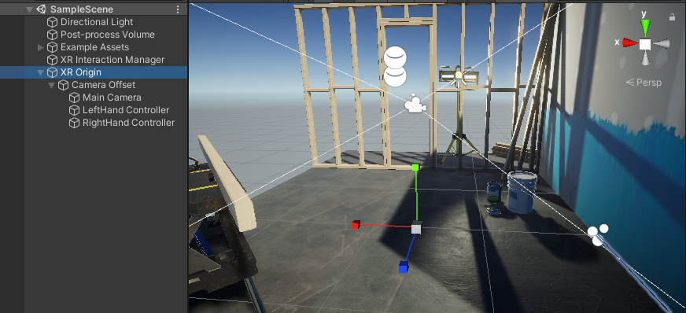

# XR Origin 

The XR Origin serves as the center of tracking space in an XR scene.

 *An XR Origin configuration in a VR scene*

An XR Origin configuration is made up of a set of GameObjects and components that work together to transform data from the XR tracking subsystems into world space. For example, the [TrackedPoseDriver](https://docs.unity3d.com/Packages/com.unity.inputsystem@latest?subfolder=/api/UnityEngine.InputSystem.XR.TrackedPoseDriver.html) component on the Main Camera GameObject moves the Camera relative to the XR Origin using the tracking data for the user's headset or hand-held device. See [XR Origin components and properties](xref:xr-core-utils-xr-origin-reference) for more information about how the XR Origin is structured.

XR devices provide tracking data in real-world units relative to a point chosen by the XR system at initialization. Unity aligns the XR Origin GameObject in a scene with this initial point. The starting position of the XR Origin in the scene is also the default starting position of the Camera.

GameObjects representing tracked entities, such as the user's headset or hand-held device, are children of the XR Origin GameObject in the scene hierarchy. This means that changes in position and rotation based on tracking updates are relative to the XR Origin. As the user moves in the real world, these child GameObjects move relative to the XR Origin in the scene. The XR Origin doesn't move on its own. However, you can move the XR Origin with a script to allow the user to teleport or move via controller input.  

> [!NOTE]
> If the user or system resets their HMD view, Unity resets the tracking data so that the GameObjects representing tracked objects move back to their initial positions and orientations relative to the XR Origin object. The XR Origin itself does not move when the HMD view is reset. 

The following topics discuss how to use the XR Origin in different types of XR applications and describe the child GameObjects and components of the XR Origin and their properties:

| **Topic** | **Description** |
| :-------- | :-------------- |
| [Add the XR Origin to a scene](xref:xr-core-utils-xr-origin-setup) | How to add the XR Origin to a scene for different types of XR applications. |
| [XR Origin component](xref:xr-core-utils-xr-origin-reference) | Describes the XR Origin component and the child GameObjects and components used by the various XR Origin configurations | 
