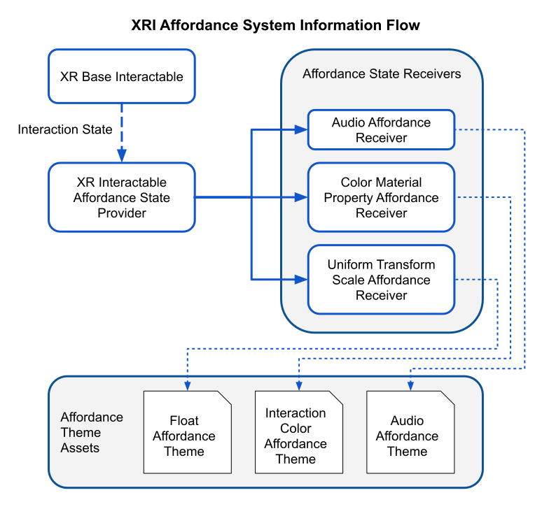
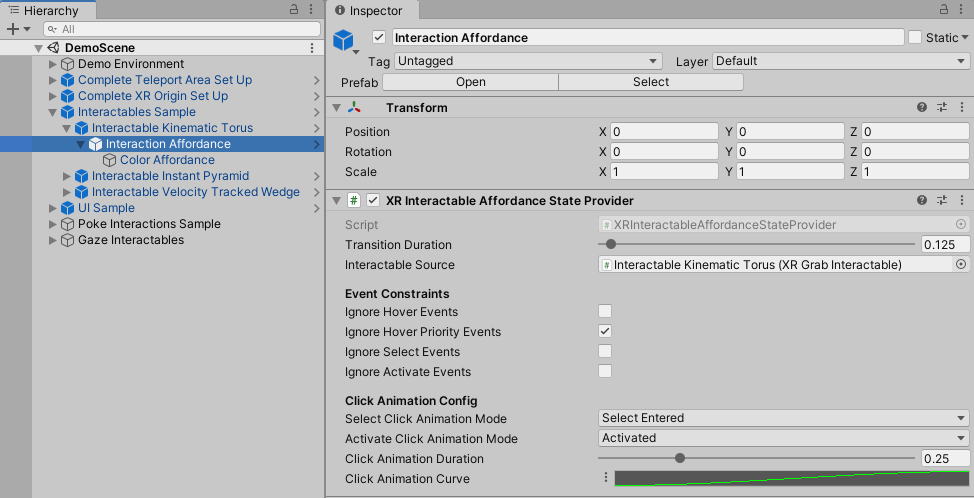
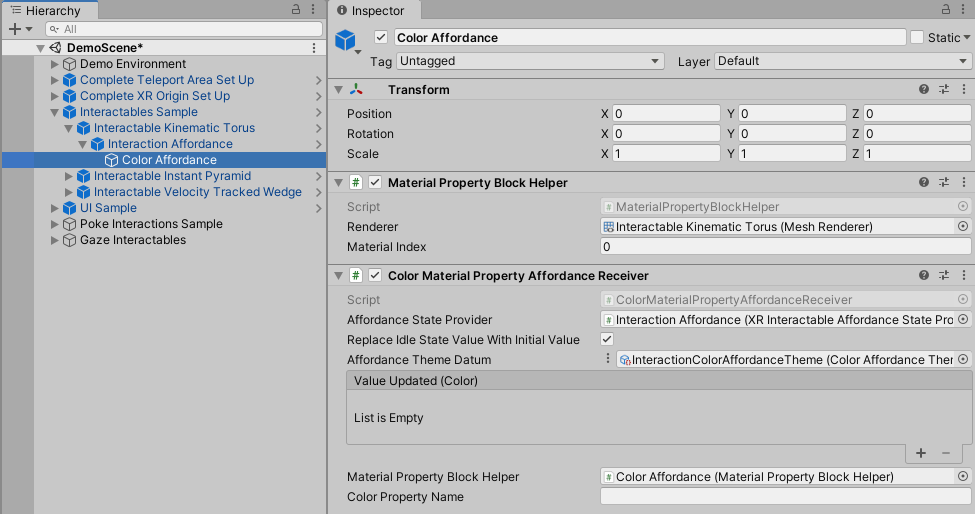
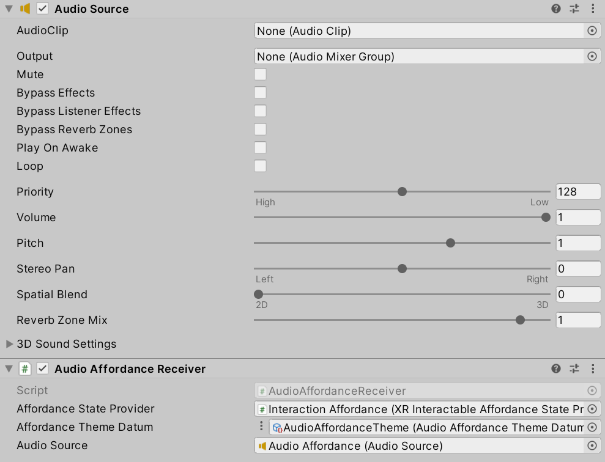
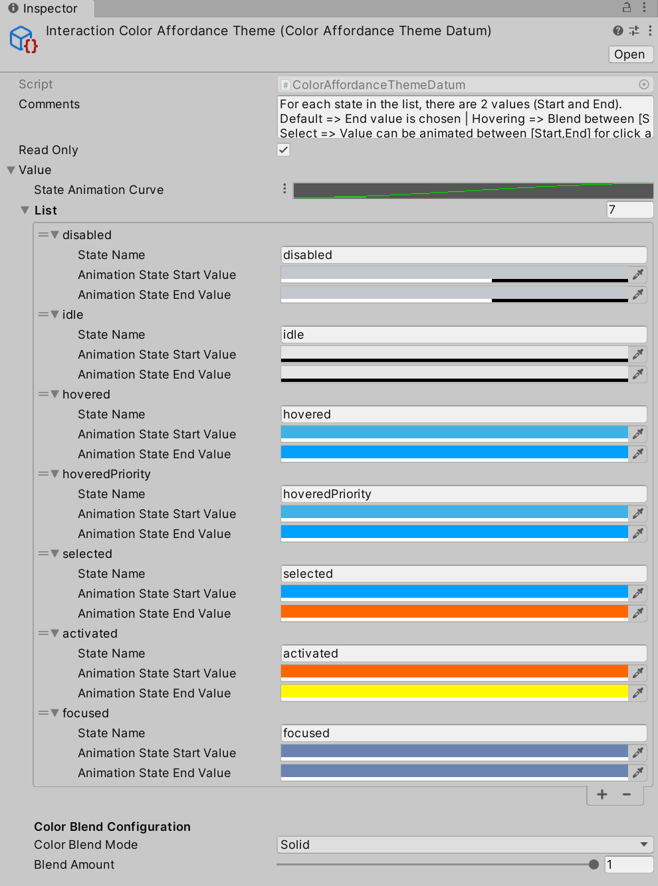

# Affordance system

The XR Interaction Toolkit package provides an affordance system which enables users to create visual and auditory feedback to [interaction states](architecture.md#states). The general flow of information starts by adding an `Affordance State Provider` to the scene (typically an interactable) and pointing it to the interactable we want to monitor the interaction state of. Once it reads the current interaction state of the interactable, it then fires off a more generalized affordance state event to any subscribers, or affordance receivers. The receivers then act on the state change event and trigger the affordance effect, whether it is a material color change, transform scale, or switching out and playing an audio clip. The receivers get their configuration from a referenced `Affordance Theme` but may also be configured locally on the component itself. We recommend using theme assets to help accelerate your development process and improve consistency across your creations. You can refer to the diagram below to help visualize how everything is connected together.

## Affordance state providers

The [XR Interactable Affordance State Provider](xr-interactable-affordance-state-provider.md) connects to an interactable component and reads the interaction state as it changes (Hover, Select, or Activate) to determine and provide the appropriate [Affordance State](xref:UnityEngine.XR.Interaction.Toolkit.AffordanceSystem.State.AffordanceStateShortcuts) to any affordance receivers subscribed to this particular provider. It is also possible to update an affordance state directly from a script without the need for checking the state of an interactable, such as through a network synchronization script. Writing a custom provider is also possible, extended the possibilities to use the affordance system for non-interactable objects as well.

The [XR Interactor Affordance State Provider](xr-interactor-affordance-state-provider.md) connects to an interactor component and reads the interaction state as it changes (Hover, Select, or Activate) to determine and provide the appropriate [Affordance State](xref:UnityEngine.XR.Interaction.Toolkit.AffordanceSystem.State.AffordanceStateShortcuts) to any affordance receivers subscribed to this particular provider. Futhermore, if tied to an [XR Ray Interactor](xr-ray-interactor.md), the ray's collision with a UGUI canvas will trigger the hover state, while the associated select input paired with a hovered canvas will also trigger the select state. Much like the interactable variant of the affordance state provider, it is also possible to update the state without checking an interactor, though if using the Ray Interactor UGUI state polling, the custom state will be overwritten. It also possible to extend this class with a custom provider.

Note that if you are using click animations for Selected or Activated states, affordance transitions won't be propagated until after the animation is completed.

## Affordance receivers

Affordance receivers are components that receive `Affordance State` change events and then perform specific effects using the referenced theme or configuration. Many affordance receivers handle animating tweens to achieve specific visual effects. There are various affordance receiver components for different primitive data types, such as `Color` or `Vector3` or `Float`. Custom affordance receivers can also be built to achieve a variety of effects depending on the properties you wish to enhance on or around a given object.

## Affordance themes

Themes are a convenient way to encapsulate configuration for a specific type of `Affordance Receiver`. This makes it easy to create themes for any of the affordance data types and drive a uniform look and feel for the project. It also allows you to tweak settings in one place and not have to worry about updating each GameObject or prefab with those changes. Under the hood, an `Affordance Theme` is merely a [ScriptableObject](https://docs.unity3d.com/Manual/class-ScriptableObject.html) designed to use the newer [Datum](https://docs.unity3d.com/Packages/com.unity.xr.core-utils@2.2/api/Unity.XR.CoreUtils.Datums.Datum-1.html) architecture along with some editor code to make them easier to visualize and configure.

The theme contains a list of affordance states and the values that should be blended during interactions. The Audio Affordance Theme contains Audio Clip references for when the state is either entered (**State Entered**) or exited (**State Exited**), and Unity will play them using [`AudioSource.PlayOneShot`](https://docs.unity3d.com/ScriptReference/AudioSource.PlayOneShot.html). The other Affordance Theme types (Color, Float, Vector2, Vector3, and Vector4) contains that typed value that is interpolated between two values: the start value (**Animation State Start Value**) and the target value (**Animation State End Value**). Above the list of states is the State Animation Curve. When each animation is triggered by the Affordance Receiver, it will use this curve to determine the value. 0 on the curve corresponds to the Start Value and 1 corresponds to the End Value. This animation curve can also be driven by the interaction strength or a custom script to provide even more flexibility in the way you want your effects to look and feel.

The theme assets are created by using the **Assets** &gt; **Create** &gt; **Affordance Theme** menu.

## How to set up your project using the affordance system

The [Starter Assets](samples-starter-assets.md) sample contains a few different uses of various affordance effects to help understand how they are intended to be used. However, if you are starting from scratch, you can use the following steps to get started with the affordance system.

### Add an XR Interactable Affordance State Provider

Pick an existing XR Interactable in your scene and create an empty child object (**Assets** &gt; **Create Empty**). Click on the newly created GameObject to bring up the Inspector. Click on **Add Component** and then navigate to **Affordance System** &gt; **XR Interactable Affordance State Provider**. Under the new component editor, locate the **Interactable Source** property and drag the parent XR Interactable object into the property. Feel free to rename the object to something meaningful like Interaction Affordance. The result will look something like the following:

### Add an Affordance Receiver

From here we will be able to add affordance receivers to add effects to the interactable object based on its state. You can add the next components to the same GameObject as before or create another empty child GameObject. If you created a new child object, click on it to bring it up in the Inspector. Next, click on **Add Component** and navigate to **Affordance System** &gt; **Rendering** &gt; **Color Material Property Affordance Receiver**. This will add an additional Material Property Block Helper component which should be automatically assigned in the **Material Property Block Helper** property of the Color Material Property Affordance Receiver component. Next, drag the GameObject from the last section into the **Affordance State Provider** property on the Color Material Property Affordance Receiver component and the appropriate mesh renderer into the **Renderer** property on the Material Property Block Helper component. Last, check the box labeled **Replace Idle State Value With Initial Value** to ensure the original color of the material is used when the state returns to idle. The result will look similar to the image below.

### Audio Affordance Receiver

It is possible to add audio effects when transitioning between affordance states using the Audio Affordance Receiver.
Like other affordance receivers, you simply add a theme and connect the affordance state provider reference, but unlike other themes, audio has one shot clips that play when transitioning between states. Because target values are not smoothly blended like with other receivers, the Audio Affordance Receiver has extra considerations on which states are being entered and exited, to avoid playing clips that shouldn't be played.

In practice, when moving from hover to select, select is considered a "modifier" to hover. This means that if releasing select, when holding an object for instance, the hover entered sound effect won't play again if the object previously select is still hovered on release. Similarly, when triggering the activated state from select, the select exited sound effect won't play, as it is considered a "modifier" to activated.

Finally, as mentioned in the Affordance State Provider section, if you are using click animations for Selected or Activated states, repeated activation of activated trigger, faster than the click animation duration, won't trigger affordance audio clips until after the animation is completed. Feel free to disable activated click animations if this is a concern.

### Adding a theme

Next we will create and setup the theme asset. In the Project window, navigate to a folder you wish to store your themes in. Open the **Assets** menu and navigate to **Create** &gt; **Affordance Theme** &gt; **Color Affordance Theme** to create the new [ScriptableObject](https://docs.unity3d.com/Manual/class-ScriptableObject.html) asset. Click on the newly created theme to bring up the Inspector window. By default, all colors will be set to black and transparent. Feel free to set the colors to match the aesthetic you are looking for. Below is an image of a fully configured theme included with the Starter Assets.

Once the theme is configured to your liking, navigate back to the Color Material Property Affordance Receiver component created in the last section. Drag the Color Affordance Theme asset into the **Affordance Theme Datum** property. You are now ready to test it all out. Feel free to explore the other Affordance Receiver types to add helpful effects to your Interactables to help your players more easily discover them.