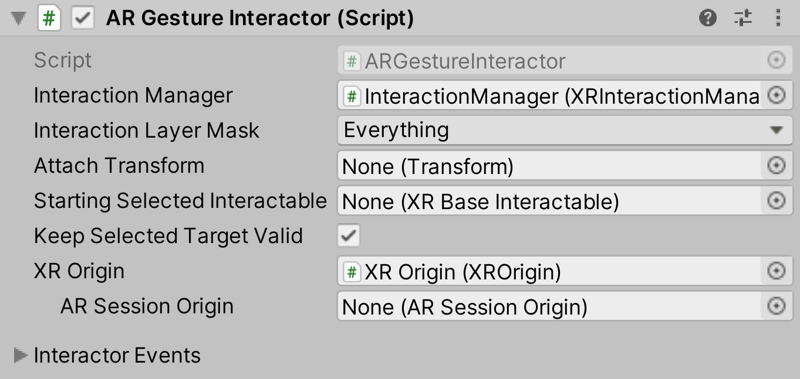

# AR Gesture Interactor

The `ARGestureInteractor` allows the user to manipulate virtual objects (select, translate, rotate, scale, and elevate) through gestures (tap, drag, twist, and pinch).

To make use of this, add an `ARGestureInteractor` to your scene and an `ARBaseGestureInteractable` to any of your virtual objects.

| **Property** | **Description** |
|---|---|
| **Interaction Manager** | The [XRInteractionManager](xr-interaction-manager.md) that this Interactor will communicate with (will find one if **None**). |
| **Interaction Layer Mask** | Allows interaction with Interactables whose [Interaction Layer Mask](interaction-layers.md) overlaps with any Layer in this Interaction Layer Mask. |
| **Attach Transform** | The `Transform` that is used as the attach point for Interactables. Automatically instantiated and set in `Awake` if **None**. Setting this will not automatically destroy the previous object. |
| **Disable Visuals When Blocked In Group** | Whether to disable visuals when this Interactor is part of an [Interaction Group](xr-interaction-group.md) and is incapable of interacting due to active interaction by another Interactor in the Group. |
| **Starting Selected Interactable** | The Interactable that this Interactor automatically selects at startup (optional, may be **None**). |
| **Keep Selected Target Valid** | Whether to keep selecting an Interactable after initially selecting it even when it is no longer a valid target. Enable to make the `XRInteractionManager` retain the selection even if the Interactable is not contained within the list of valid targets. Disable to make the Interaction Manager clear the selection if it isn't within the list of valid targets. A common use for disabling this is for XR Ray Interactors used for teleportation to make the teleportation Interactable no longer selected when not currently pointing at it. |
| **XR Origin** | The `XROrigin` that this Interactor will use (such as to get the `Camera` or to transform from Session space). Will find one if **None**. |
| **AR Session Origin** | This is deprecated. Use the above **XR Origin** instead. |
| **Exclude UI Touches** | Enable to exclude touches that are over UI. Used to make screen space canvas elements block touches from hitting planes behind it. |
| **Interactor Events** | See the [Interactor Events](interactor-events.md) page. |