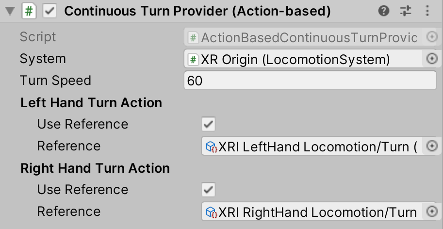

# Continuous Turn Provider (Action-based)

Locomotion provider that allows the user to smoothly rotate their rig continuously over time using a specified input action.

| **Property** | **Description** |
|---|---|
| **System** | The [LocomotionSystem](locomotion-system.md) that this `LocomotionProvider` communicates with for exclusive access to an XR Origin. If one is not provided, the behavior will attempt to locate one during its Awake call. |
| **Turn Speed** | The number of degrees/second clockwise to rotate when turning clockwise. |
| **Left Hand Turn Action** | |
| &emsp;Use Reference | Enable to reference an action externally defined using the accompanying field. |
| &emsp;Reference | The Input System Action that Unity uses to read Turn data from the left hand controller. Must be a `InputActionType.Value` `Vector2Control` Control. |
| **Right Hand Turn Action** | |
| &emsp;Use Reference | Enable to reference an action externally defined using the accompanying field. |
| &emsp;Reference | The Input System Action that Unity uses to read Turn data from the right hand controller. Must be a `InputActionType.Value` `Vector2Control` Control. |