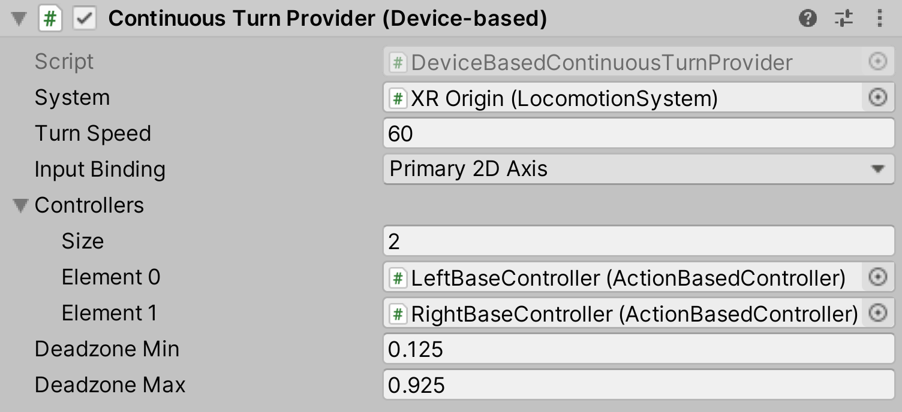

# Continuous Turn Provider (Device-based)

Locomotion provider that allows the user to smoothly rotate their rig continuously over time using a specified 2D axis input.

| **Property** | **Description** |
|---|---|
| **System** | The [LocomotionSystem](locomotion-system.md) that this `LocomotionProvider` communicates with for exclusive access to an XR Origin. If one is not provided, the behavior will attempt to locate one during its Awake call. |
| **Turn Speed** | The number of degrees/second clockwise to rotate when turning clockwise. |
| **Input Binding** | The 2D Input Axis on the controller devices that will be used to trigger a turn. |
| &emsp;Primary 2D Axis | Use the primary touchpad or joystick on a device. |
| &emsp;Secondary 2D Axis | Use the secondary touchpad or joystick on a device. |
| **Controllers** | The XRControllers that allow turning. An XRController must be enabled in order to turn. |
| **Deadzone Min** | Value below which input values will be clamped. After clamping, values will be renormalized to [0, 1] between min and max. |
| **Deadzone Max** | Value above which input values will be clamped. After clamping, values will be renormalized to [0, 1] between min and max. |