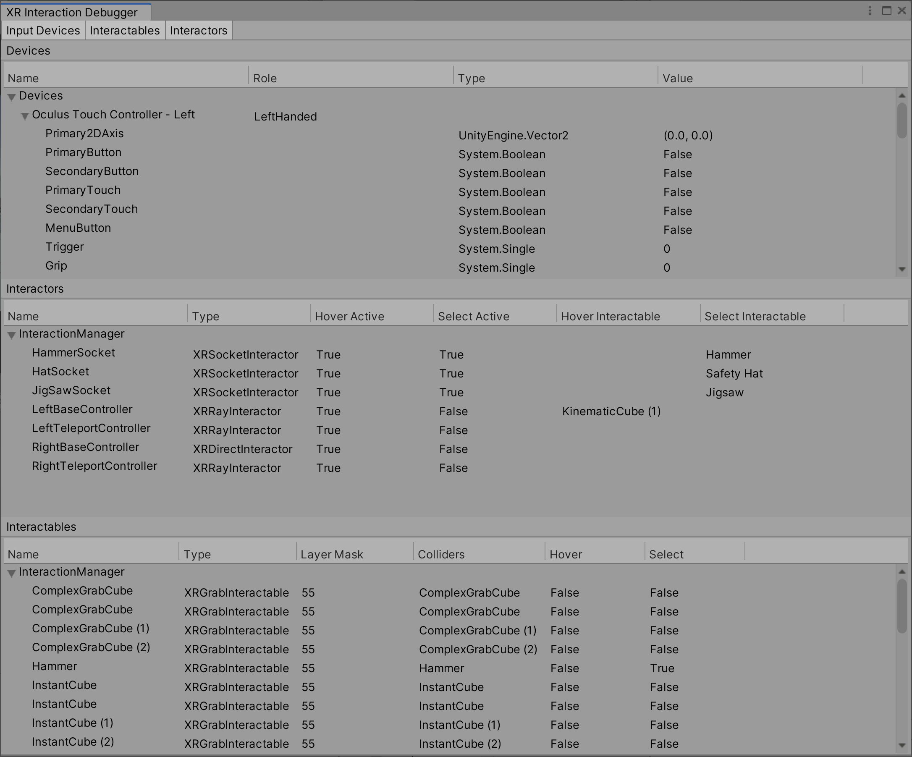
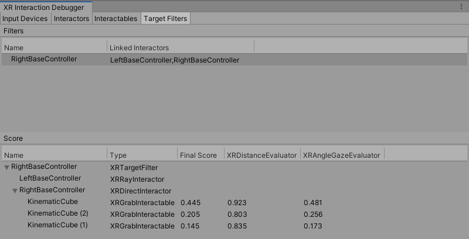

# Debugger window

The XR Interaction Toolkit Debugger window displays a top-down view of all the Input Devices, Interactables, and Interactors in a scene. It also displays their relationship to each other and their parent Interaction Managers. To open this window, go to **Window &gt; Analysis &gt; XR Interaction Debugger** from Unity's main menu.

You must be in Play mode to use this window.

## Input devices

The Input Devices tab displays all valid input devices that are registered through the [XR Module](https://docs.unity3d.com/Manual/com.unity.modules.xr.html) (that is, those created by an [`XRInputSubsystem`](https://docs.unity3d.com/ScriptReference/XR.XRInputSubsystem.html)). It currently doesn't display input devices that are only registered with the Input System package, such as the simulated devices created by the [XR Device Simulator](xr-device-simulator-overview.md). Additionally, the tracked hand devices created by the [XR Hands package](https://docs.unity3d.com/2023.1/Documentation/Manual/com.unity.xr.hands.html) are only registered with the Input System package and do not currently appear in this window.

## Target filters

The Target Filters tab displays all active and enabled `XRTargetFilters` in the scene. It also displays the Interactors and `XRTargetFilters` that are linked at the moment.

You can select an `XRTargetFilter` in the Filters tree to inspect its Evaluators' scores in the Score tree. The Score tree displays the final and weighted scores for an Interactable in a Valid Target list. The Interactors are shown as the parent of their respective Valid Target list.

