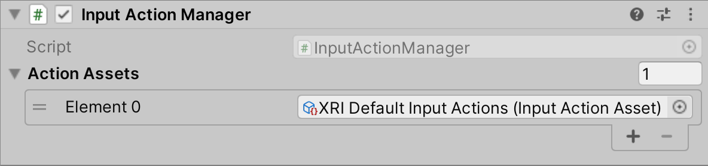
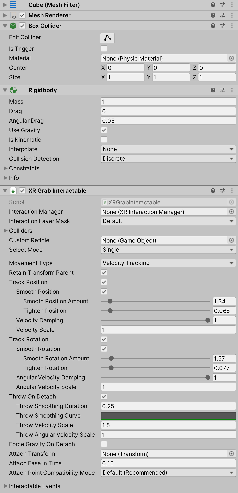

# General setup

This section will walk you through the steps to create an XR Origin camera rig for a head-mounted device and create the basic building blocks of XR interactivity.

These steps will guide you through setup to use the action-based behaviors, which is the recommended path.

## Action-based vs Device-based behaviors

Several behaviors, such as the [Snap Turn Provider](locomotion.md#snap-turn-provider), have two variants: an Action-based behavior and a Device-based behavior. Action-based behaviors use [Actions](https://docs.unity3d.com/Packages/com.unity.inputsystem@1.7/manual/Actions.html) to indirectly read input from one or more controls. Device-based behaviors use [`InputDevice.TryGetFeatureValue`](https://docs.unity3d.com/ScriptReference/XR.InputDevice.TryGetFeatureValue.html) to read input directly from an [`InputDevice`](https://docs.unity3d.com/ScriptReference/XR.InputDevice.html) from a specific control configured on the behavior itself.

It is recommended that you use the Action-based variant instead of the Device-based variant to take advantage of the benefits that the Input System package provides. For example, it separates the logical inputs from the physical inputs, and users can create and switch between customized action maps, bind multiple cross-platform controller inputs to a single semantic action, and use event callbacks of input actions. Some features of the XR Interaction Toolkit package, such as the XR Device Simulator, are only supported when using input actions.

## Import starter assets

See the [Starter Assets](samples-starter-assets.md) sample for steps to import assets to streamline setup of behaviors. That sample contains a default set of input actions and presets which will be used in this guide.

## Create the XR Interaction Manager

Create the XR Interaction Manager using **GameObject &gt; XR &gt; Interaction Manager**. The component on this GameObject will allow the interactors and interactables in your scenes to interact with each other.

## Create the XR Origin camera rig for tracked devices

Create the XR Origin camera rig using **GameObject &gt; XR &gt; XR Origin (VR)**. This will also automatically create a new Main Camera GameObject tagged as "MainCamera" as a child of a new Camera Offset GameObject. The GameObject with the Camera is assigned as the value of **Camera GameObject** on XR Origin. If you already had a Camera tagged "MainCamera" in your scene, Unity may warn about there being another Camera tagged "MainCamera" in your scene. You will typically only need one Main Camera, so you should delete the original Camera at this time. For more information about the Main Camera, see [`Camera.main`](https://docs.unity3d.com/ScriptReference/Camera-main.html).

> [!TIP]
> If you already have components that are referencing the original Camera GameObject, you may want to keep the original Camera instead. Drag the original Camera in the Hierarchy window to be a child GameObject of Camera Offset then reset the Transform by clicking the **More menu (&#8942;)** in the Inspector window next to Transform and select **Reset**. Then use the **More menu (&#8942;)** to **Copy Component** and **Paste Component As New** to move each additional component from the new Camera GameObject to your old Camera GameObject. Finally delete the new Camera GameObject and update **Camera GameObject** on XR Origin to your Camera.

The [XR Origin](https://docs.unity3d.com/Packages/com.unity.xr.core-utils@2.2/manual/xr-origin.html) component on this GameObject transforms trackable devices like the head-mounted display and controllers to their final position in the Unity scene. This is the GameObject that is moved around the environment to achieve locomotion rather than applying movement directly to the Main Camera itself.

The Camera Offset child GameObject that is created is automatically assigned as the value of **Camera Floor Offset Object** on XR Origin. This GameObject's position is updated automatically by Unity depending on the **Tracking Origin Mode** value on XR Origin.

For this guide, leave the **Tracking Origin Mode** set to **Not Specified**.

> [!NOTE]
> When the mode is **Device**, the XR runtime will generally report the position of tracked devices relative to a fixed position in space, such as the initial position of the HMD when started. Set the **Camera Y Offset** on XR Origin to the height you want the Main Camera to be above ground when in that mode. When the mode is **Floor**, the XR runtime will generally report the position of tracked devices relative to the player's real floor. Unity will automatically clear the height of the Camera Offset when in this mode since it is not necessary to artificially raise the tracking origin up. Set the mode to **Not Specified** to use the default mode of the XR runtime.

To have the position and rotation of the XR HMD update the Main Camera Transform, a Tracked Pose Driver (Input System) component is added. This component is configured to set the **Position Input** binding to `<XRHMD>/centerEyePosition` and the **Rotation Input** binding to `<XRHMD>/centerEyeRotation`.

## Configure XR Controller and Interactor

An Interactor component controls how a GameObject interacts with Interactable components in the scene. There are multiple types of Interactors, one of which is an [XR Ray Interactor](xr-ray-interactor.md), a component that uses [ray casting](https://docs.unity3d.com/ScriptReference/Physics.Raycast.html) in order to find valid Interactable objects in the scene.

To read input from an XR input device, the Interactor requires an XR Controller component.

Select the foldout arrows to expand the hierarchy of the XR Origin, then select the **Left Controller** GameObject. This GameObject has an [XR Controller (Action-based)](xr-controller-action-based.md) component. If you do not see the **Reference** set for each action, click the Preset selector (the slider icon) at the top-right of the component in the Inspector window and select **XRI Default Left Controller**. If you do not see any presets, make sure to [import starter assets](#import-starter-assets). Do the same with the **Right Controller** GameObject and select the **XRI Default Right Controller** preset.

The table below describes the actions on the XR Controller that should be bound to an XR input device:

|Action|Required for|
|---|---|
|**Position, Rotation, and Select**|Basic interaction|
|**Tracking State**|Knowing if Position and/or Rotation inputs are valid|
|**Activate**|Activating a selected object|
|**UI Press**|Interacting with UI canvas elements|
|**Haptic Device**|Identifying the device to send haptic impulses to|
|**Rotate and Translate Anchor**|Manipulating a selected object at a distance|

The [XR Controller (Action-based)](xr-controller-action-based.md) component has some input action reference properties which are optional and do not need to be assigned. Refer to the property table in the documentation or refer to the tooltips in the Inspector window for more information.

The Controller and Interactor have limited support for haptic feedback. To enable haptic feedback for an XR Controller (Action-based), specify a **Haptic Device Action** with a binding path to an active control, such as `<XRController>{LeftHand}/*`. To enable haptic feedback for an [XR Controller (Device-based)](xr-controller-device-based.md), specify a **Controller Node** that supports haptic feedback, such as **Left Hand**. The Interactor can then specify intensities and durations of haptic feedback to play back on select and hover events, which is configured under Haptic Events in the Inspector window.

The **Enable Interaction with UI GameObjects** option controls whether this XR Ray Interactor can interact with Unity UI elements in a world space canvas in the scene. See [UI Setup](ui-setup.md) for more information and steps for enabling UI interactivity.

## Enable actions for action-based behaviors

Actions must be enabled before they react to input. See [Using Actions](https://docs.unity3d.com/Packages/com.unity.inputsystem@1.7/manual/Actions.html#using-actions) in the Input System documentation for details about this process. Action-based behaviors in this package have properties of type [`InputActionProperty`](https://docs.unity3d.com/Packages/com.unity.inputsystem@1.7/api/UnityEngine.InputSystem.InputActionProperty.html) which can either store an Action directly, or indirectly by referencing an Action contained in an Input Action Asset. Action-based behaviors automatically enable and disable the Actions that are directly defined (that is, not a reference) during their own `OnEnable` and `OnDisable` events. Action-based behaviors don't automatically enable or disable the Actions that are indirectly defined (that is, a reference) to allow the enabled state to be managed externally.

The Input Action Manager component can be used to automatically enable or disable the Actions defined in an Input Action Asset during its own `OnEnable` and `OnDisable` events.

If you created the XR Origin using **GameObject &gt; XR &gt; XR Origin (VR)**, you will already have an Input Action Manager attached to the **XR Origin**, if not, use **GameObject &gt; Create Empty** and rename the GameObject Input Action Manager. Use **Component &gt; Input &gt; Input Action Manager** to add the component to the GameObject you created.

If you have imported the **Starter Assets** sample package, the **XRI Default Input Actions** should already be set in the **Action Assets** configuration for the component. If **Starter Assets** are not available or you are creating this object manually, select **Add (+)** or set **Size** to **1** in the Inspector window to add an element to the **Action Assets** list. Select the element's object picker (circle icon) and choose **XRI Default Input Actions**.

If you later create additional Input Action Assets, add them to the **Action Assets** list to enable all its actions also.

> [!NOTE]
> For Input Actions to read from input devices correctly while running in the Unity Editor, the Game view may need to have focus depending on the current project settings. If you find that your input, such as button presses on the controllers, are not working, ensure the Game view has focus by clicking it with your mouse. See [Background and focus change behavior](https://docs.unity3d.com/Packages/com.unity.inputsystem@1.7/manual/Devices.html#background-and-focus-change-behavior) to learn how to adjust settings to not require focus in the Game view.

## Create an Interactable for the player to grab

Interactable components define how the user can interact with objects in a scene. To create a basic 3D cube that can be grabbed, use **GameObject &gt; XR &gt; Grab Interactable**.

For this example, create a plane for the cube to rest on so it does not fall out of reach. Use **GameObject &gt; 3D Object &gt; Plane**, then click on the Cube and click and drag the Transform gizmo to position it above the Plane GameObject.

In the screenshot below, the GameObject with the XR Grab Interactable supports grabbing, moving, dropping, and throwing with smoothed tracking.

> [!TIP]
> Interactables added through the **GameObject &gt; XR** menu use a Box Collider to detect interaction, but other types of Collider components such as a convex Mesh Collider can provide better hit detection at the cost of performance.

To configure an existing GameObject to make it an interactable object to allow the user to grab it, select it in your scene and add these components:
- Add **Component &gt; XR &gt; XR Grab Interactable**
- Add **Component &gt; Physics &gt; Box Collider**

## Enable an XR provider

Open **Edit &gt; Project Settings &gt; XR Plug-in Management**. If you do not yet have the package installed, click **Install XR Plugin Management** in that window. Select one or more of the plug-in providers for the device(s) you wish to target, such as [Oculus](https://docs.unity3d.com/Packages/com.unity.xr.oculus@latest/) or [Open XR](https://docs.unity3d.com/Packages/com.unity.xr.openxr@latest/). Open XR will require additional configuration, see its package documentation for those steps.
