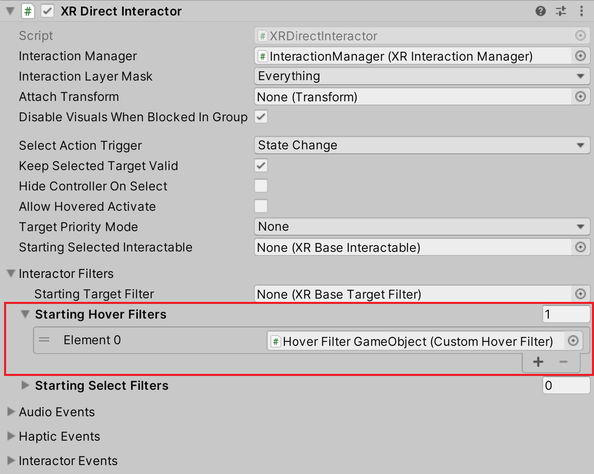
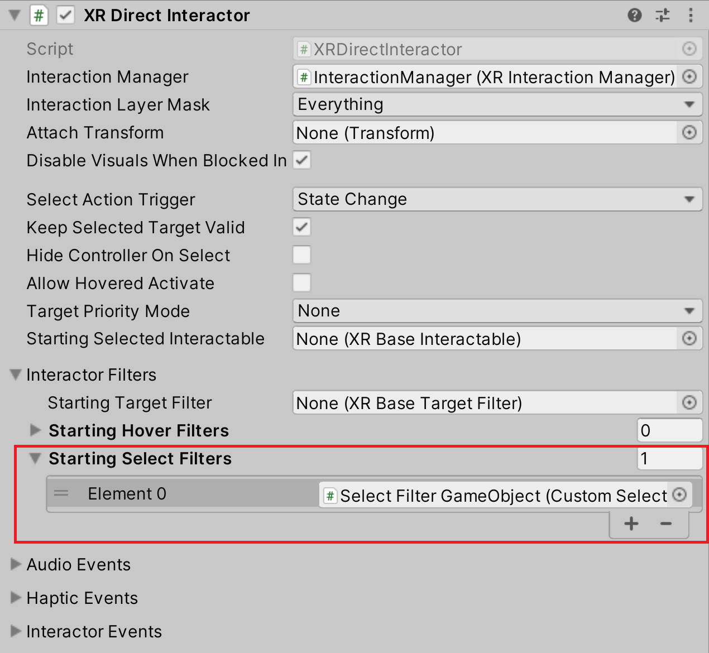

# Interaction filters

Interaction filters are used to add additional checks to an Interactor and Interactable interaction after the base class validations are passed. 

The interaction filters also include an implementation of a filter delegate that forwards the filter processing to a delegate. This enables users to add additional filter logic without needing to create new classes.

The current interaction filters supported in XRI  are:

- [Hover filter](#hover-filter)
- [Select filter](#select-filter)
- [Interaction strength filter](#interaction-strength-filter)

## Hover filter

[`IXRHoverFilter`](xref:UnityEngine.XR.Interaction.Toolkit.Filtering.IXRHoverFilter) is an interface that allows additional filter processing between an [`IXRHoverInteractor`](xref:UnityEngine.XR.Interaction.Toolkit.IXRHoverInteractor) and an [`IXRHoverInteractable`](xref:UnityEngine.XR.Interaction.Toolkit.IXRHoverInteractable).

### Usage

An `IXRHoverFilter` can be added to the following objects to extend its hover validation:

|Object|Usage|
|---|---|
|**[`XRInteractionManager`](xref:UnityEngine.XR.Interaction.Toolkit.XRInteractionManager)**|A hover filter added to the Interaction Manager is used to validate all hover interactions globally in the manager.|
|**[`XRBaseInteractor`](xref:UnityEngine.XR.Interaction.Toolkit.XRBaseInteractor)**|A hover filter added to an Interactor is used to validate the hover interactions in the Interactor.|
|**[`XRBaseInteractable`](xref:UnityEngine.XR.Interaction.Toolkit.XRBaseInteractable)**|A hover filter added to an Interactable is used to validate the hover interactions in the Interactable.|

### Interface definition

|Property|Description|
|---|---|
|**bool `canProcess`**|Whether this hover filter can process interactions. Hover filters that can process interactions receive calls to `IXRHoverFilter.Process`; hover filters that cannot process do not call `IXRHoverFilter.Process`. It's recommended to return `isActiveAndEnabled` when implementing this interface in a `MonoBehaviour`.|

|Method|Description|
|---|---|
|**bool `Process(IXRHoverInteractor interactor, IXRHoverInteractable interactable)`**|Called by the host object (`XRInteractionManager`, `XRBaseInteractor` or `XRBaseInteractable`) to verify if the hover interaction between the given Interactor and Interactable can be performed. Returns `true` when the given Interactor can hover the given Interactable. Otherwise, returns `false`.|

### Setup

Add the implementation of `IXRHoverFilter` component to a GameObject and add it to the `Starting Hover Filters` property of an `XRInteractionManager`, `XRBaseInteractor`, or `XRBaseInteractable`. Filters in the `Starting Hover Filters` list will automatically be linked and applied to their respective host object.



Multiple hover filters can be added to a single Interaction Manager, Interactor, or Interactable.

### Example

```c#
using UnityEngine;
using UnityEngine.XR.Interaction.Toolkit;
using UnityEngine.XR.Interaction.Toolkit.Filtering;

public class CustomHoverFilter : MonoBehaviour, IXRHoverFilter
{
    public bool canProcess => isActiveAndEnabled;

    public bool Process(IXRHoverInteractor interactor, IXRHoverInteractable interactable)
    {
        bool canHover = true;
        // Do any additional validation checks on the interactor and interactable.
        return canHover;
    }
}
```

## Select filter

[`IXRSelectFilter`](xref:UnityEngine.XR.Interaction.Toolkit.Filtering.IXRSelectFilter) is an interface that allows additional filter processing between an [`IXRSelectInteractor`](xref:UnityEngine.XR.Interaction.Toolkit.IXRSelectInteractor) and an [`IXRSelectInteractable`](xref:UnityEngine.XR.Interaction.Toolkit.IXRSelectInteractable).

### Usage

An `IXRSelectFilter` can be added following objects to extend its select validation:

|Object|Usage|
|---|---|
|**[`XRInteractionManager`](xref:UnityEngine.XR.Interaction.Toolkit.XRInteractionManager)**|A select filter added to the Interaction Manager is used to validate all select interactions globally in the manager.|
|**[`XRBaseInteractor`](xref:UnityEngine.XR.Interaction.Toolkit.XRBaseInteractor)**|A select filter added to an Interactor is used to validate the select interactions in the Interactor.|
|**[`XRBaseInteractable`](xref:UnityEngine.XR.Interaction.Toolkit.XRBaseInteractable)**|A select filter added to an Interactable is used to validate the select interactions in the Interactable.|

### Interface definition

|Property|Description|
|---|---|
|**bool `canProcess`**|Whether this select filter can process interactions. Select filters that can process interactions receive calls to `IXRSelectFilter.Process`. Select filters that cannot process do not call `IXRSelectFilter.Process`. It's recommended to return `isActiveAndEnabled` when implementing this interface in a `MonoBehaviour`.|

|Method|Description|
|---|---|
|**bool `Process(IXRSelectInteractor interactor, IXRSelectInteractable interactable)`**|Called by the host object (`XRInteractionManager`, `XRBaseInteractor` or `XRBaseInteractable`) to verify if the select interaction between the given Interactor and Interactable can be performed. Returns `true` when the given Interactor can select the given Interactable. Otherwise, returns `false`.|

### Setup

Add the implementation of `IXRSelectFilter` component to a GameObject and add it to the `Starting Select Filters` property of an `XRInteractionManager`, `XRBaseInteractor`, or `XRBaseInteractable`. Filters in the `Starting Select Filters` list will automatically be linked and applied to their respective host object.



Multiple select filters can be added to a single Interaction Manager, Interactor, or Interactable.


### Example

```c#
using UnityEngine;
using UnityEngine.XR.Interaction.Toolkit;
using UnityEngine.XR.Interaction.Toolkit.Filtering;

public class CustomSelectFilter : MonoBehaviour, IXRSelectFilter
{
    public bool canProcess => isActiveAndEnabled;

    public bool Process(IXRSelectInteractor interactor, IXRSelectInteractable interactable)
    {
        bool canSelect = true;
        // Do additional validation checks on the interactor and interactable.
        return canSelect;
    }
}
```

## Interaction strength filter

[`IXRInteractionStrengthFilter`](xerf:UnityEngine.XR.Interaction.Toolkit.Filtering.IXRInteractionStrengthFilter) is an interface used to adjust or set the interaction strength between an [`IXRInteractor`](xref:UnityEngine.XR.Interaction.Toolkit.IXRInteractor) and [`IXRInteractable`](xref:UnityEngine.XR.Interaction.Toolkit.IXRInteractable).

### Usage

An `IXRInteractionStrengthFilter` can be added following objects to extend its interaction strength computation:

|Object|Usage|
|---|---|
|**[`XRBaseInteractable`](xref:UnityEngine.XR.Interaction.Toolkit.XRBaseInteractable)**| An interaction strength filter added to an Interactable is used to modify the interaction strength in the Interactable for a hovering or selecting Interactor.|

### Interface definition

|Property|Description|
|---|---|
|**bool `canProcess`**|Whether this interaction strength filter can process interactions. Interaction strength filters that can process interactions receive calls to `IXRInteractionStrengthFilter.Process`. Interaction strength filters that cannot process do not receive calls to `IXRInteractionStrengthFilter.Process`. It's recommended to return `isActiveAndEnabled` when implementing this interface in a `MonoBehaviour`.|

|Method|Description|
|---|---|
|**float `Process(IXRInteractor interactor, IXRInteractable interactable, float interactionStrength)`**|Called by the host object (`XRBaseInteractable`) to calculate the interaction strength between the given Interactor and Interactable. Returns the modified interaction strength that is the result of passing the interaction strength through the filter.|

### Setup

Add the implementation of `IXRInteractionStrengthFilter` component to a GameObject and add it to the `Starting Interaction Strength Filters` property of an `XRBaseInteractable`. Filters in the `Starting Interaction Strength Filters` list will automatically be linked and applied to their respective host object.


Multiple interaction strength filters can be added to a single Interactable.

### Example

```c#
using UnityEngine;
using UnityEngine.XR.Interaction.Toolkit;
using UnityEngine.XR.Interaction.Toolkit.Filtering;

public class CustomInteractionStrengthFilter : MonoBehaviour, IXRInteractionStrengthFilter
{
    public bool canProcess => isActiveAndEnabled;

    public float Process(IXRInteractor interactor, IXRInteractable interactable, float interactionStrength)
    {
        float modifiedInteractionStrength = interactionStrength;
        // Do any modification the interaction strength value based on the interactor and the interactable.
        return modifiedInteractionStrength;
    }
}
```

## Delegates

`IXRHoverFilter`, `IXRSelectFilter`, `IXRInteractionStrength` each contain an implementation of a filter delegate that forwards the filter processing to a delegate. This enables users to add additional filter logic without needing to create new classes.

With filter delegates you provide a callback function that runs as the filter's `Process` method. Filter delegates also provide access to a `canProcess` property as well.

### Example

```c#
using UnityEngine.XR.Interaction.Toolkit;
using UnityEngine.XR.Interaction.Toolkit.Filtering;

public class FilterDelegateExampleInteractable : XRBaseInteractable
{
    // Call this method to add the custom filters
    void SetupFilters()
    {
        var hoverFilterDelegate = new XRHoverFilterDelegate((interactor, interactable) =>
        {
            bool canHover = false;
            // Do any additional validation checks on the interactor and interactable.
            return canHover;
        });

        var selectFilterDelegate = new XRSelectFilterDelegate((interactor, interactable) =>
        {
            bool canSelect = false;
            // Do any additional validation checks on the interactor and interactable.
            return canSelect;
        });

        var interactionStrengthFilterDelegate = new XRInteractionStrengthFilterDelegate((interactor, interactable, interactionStrength) =>
        {
            float modifiedInteractionStrength = interactionStrength;
            // Do any modification the interaction strength value based on the interactor and the interactable.
            return modifiedInteractionStrength;
        });

        // Filter delegates can modify the filter's canProcess property. Example:
        hoverFilterDelegate.canProcess = false;

        // Link the filter by adding the filter delegate to the filters list to ensure it is processed
        hoverFilters.Add(hoverFilterDelegate);
        selectFilters.Add(selectFilterDelegate);
        interactionStrengthFilters.Add(interactionStrengthFilterDelegate);
    }
}
```
