# Locomotion

The XR Interaction Toolkit package provides a set of locomotion primitives that offer the means to move around in a scene during an XR experience. These components include:
- An XR Origin that represents the center of the tracking space for the user's headset, controllers, hands, and other trackable devices or objects in the XR space
- A Locomotion System that controls access to the XR Origin
- A Teleportation Provider and Teleportation Interactables
- A Snap Turn Provider that rotates the user by fixed angles
- A Continuous Turn Provider that smoothly rotates the user over time
- A Continuous Move Provider that smoothly moves the user over time
- A Grab Move Provider that moves the user counter to controller movement
- A Two Handed Grab Move Provider that can move, rotate, and scale the user counter to controller movement
- A Climb Provider that moves the user while they are selecting a Climb Interactable

This documentation outlines how to use and extend these components.

## Glossary

| **Term** | **Meaning** |
|---|---|
| **XR Origin** | The component that implements the generic concept of a camera rig. It also provides options of tracking origin modes to configure the reference frame for positions reported by the XR device. It has properties to specify an Origin GameObject, a Camera Floor Offset GameObject, and a Camera. |
| **Origin** | By default, the Origin is the GameObject that the XR Origin component is attached to, and the term is generally used interchangeably with XR Origin. This is the GameObject that the application will manipulate via locomotion. |
| **Camera Floor Offset GameObject** | The GameObject to move the Camera to the desired height off the floor depending on the tracking origin mode. |
| **Camera** | The GameObject that contains a Camera component. This is usually the main camera that renders what the user sees. It is the head of XR rigs. |
| **Floor mode** | A floor-relative tracking origin mode. Input devices will be tracked relative to a location on the user's floor. |
| **Device mode** | A device-relative tracking origin mode. Input devices will be tracked relative to the first known location. The Camera is moved to the height set by the Camera Y Offset value by moving the Camera Floor Offset GameObject. |
| **Locomotion System** | The component that controls which Locomotion Provider can move the user. |
| **Locomotion Provider** | The base class for various locomotion implementations, such as teleportation and turning. |
| **Teleportation** | A type of locomotion that teleports the user from one position to another position. |
| **Snap Turn** | A type of locomotion that rotates the user by a fixed angle. |
| **Continuous Turn** | A type of locomotion that smoothly rotates the user by an amount over time. |
| **Continuous Move** | A type of locomotion that smoothly moves the user by an amount over time. |
| **Grab Move** | A type of locomotion that moves the user counter to controller movement, as if the user is grabbing the world around them. |
| **Climb** | A type of locomotion that moves the user counter to Interactor movement while the user is selecting a Climb Interactable. |
| **Action-based** | The recommended type of input based on referencing the [Actions](https://docs.unity3d.com/Packages/com.unity.inputsystem@1.7/manual/Actions.html) and their controller bindings in the Input System. |
| **Device-based** | An alternative type of input based on reading inputs from a [`InputDevice`]([`InputDevice.TryGetFeatureValue`](https://docs.unity3d.com/ScriptReference/XR.InputDevice.TryGetFeatureValue.html)). |

## Set up a basic scene for snap turn and teleportation

Before you follow the steps below, to streamline setup of Action-based behaviors, it is recommended that you install the [Starter Assets]samples-starter-assets.md) sample and follow the steps for [Configuring Preset Manager defaults](samples-starter-assets.md#configuring-preset-manager-defaults) to reduce the burden of configuring the Actions when using Action-based behaviors. Using Action-based behaviors is recommended; for more information, see [Action-based vs Device-based behaviors](general-setup.md#action-based-vs-device-based-behaviors).

### 1. Set up the XR Origin and input actions

Follow the steps in General setup to [Create the XR Origin camera rig for tracked devices](general-setup.md#create-the-xr-origin-camera-rig-for-tracked-devices).

The Origin has two child GameObjects, **Left Controller** and **Right Controller**, each having an [XR Controller](xr-controller-action-based.md) component to represent the two motion controllers.

For Action-based controllers, the Actions that you assign should use either the **XR Controller (LeftHand)** or **XR Controller (RightHand)** binding paths. For Device-based controllers, the **Controller Node** is set to **Left Hand** and **Right Hand** automatically.

For Action-based setup, make sure to add the **Input Action Manager** component, for example, to the Interaction Manager GameObject. If you installed the Starter Assets sample as recommended, you can add the **XRI Default Input Actions** from the Samples folder to the **Action Assets** field of Input Action Manager. This will enable Action-based inputs with the provided defaults. Alternatively, you can create and use your customized Input Actions and controller bindings.

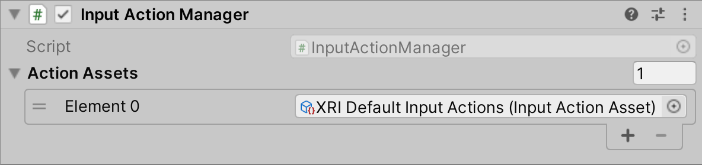

### 2. Add snap turn and teleportation capabilities

On the **XR Origin** GameObject, add a **Locomotion System**, a **Snap Turn Provider**, and a **Teleportation Provider**.

To set up snap turn, you need to configure the [Snap Turn Provider](#snap-turn-provider) in the Inspector.

For Action-based, set **Left Hand Snap Turn Action** and/or **Right Hand Snap Turn Action** to Vector 2 Control Type Actions with bindings for your desired inputs.

For Device-based, set the **Controllers** list to contain one or both **XR Controller** GameObjects created in the previous step in order for their inputs to trigger a snap turn. For a controller with a joystick, the **Turn Input Source** field should be **Primary 2D Axis**.

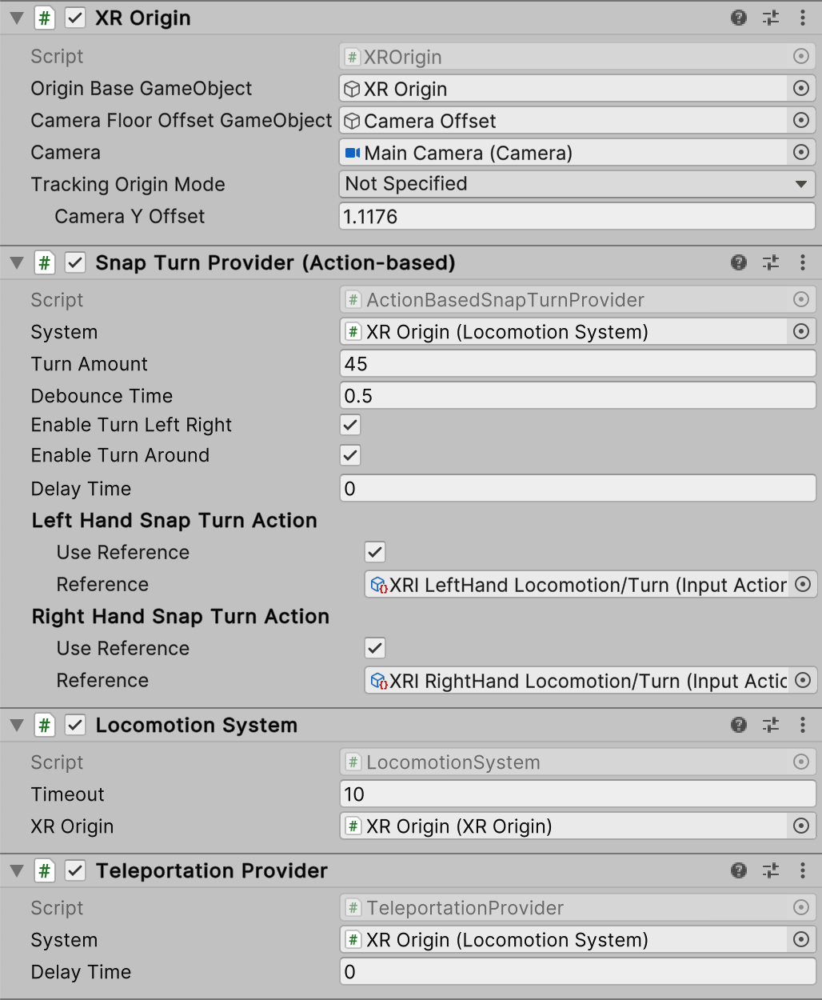

### 3. Create teleportation interactables

From Unity's main menu, click **GameObject &gt; XR &gt; Teleportation Area** or **GameObject &gt; XR &gt; Teleportation Anchor** to create a plane that can be teleported to. a Teleportation Area teleports users to their pointed location on its child collider, whereas a Teleportation Anchor specifies a pre-determined position and/or rotation in addition to the Teleportation Area.

If you followed steps 1-3, you should have a basic scene with the ability to perform snap turn and teleportation with your controllers. The following steps provide additional details on changing the visuals of the **XR Ray Interactor**.

### 4. Configure line type

The [XR Ray Interactor](xr-ray-interactor.md) was added by default to the **Left Controller** and **Right Controller** GameObjects when creating the XR Origin from the menu. Under its **Raycast Configuration** includes three default options of **Line Type** that can be used to select interactables:

* **Straight Line**
* **Projectile Curve**
* **Bezier Curve**

These options are described below.

#### Straight Line

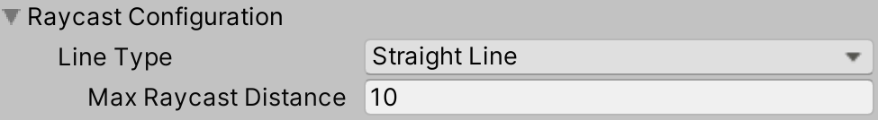

If you select the **Straight Line** option, the XR Ray Interactor performs a single ray cast into the scene with a ray length set by the **Max Raycast Distance** property. The image above shows the configuration options.

| **Property** | **Description** |
|---|---|
| **Max Raycast Distance** | The distance to be ray cast into the scene. |

#### Projectile Curve

If you select the **Projectile Curve** option, the XR Ray Interactor samples the trajectory of a projectile to generate a projectile curve. You can use the angle of the Controller to control the distance of the landing point. When you lift your Controller, the landing point first goes further away, then comes closer if you keep lifting the Controller.

The **Projectile Curve** option is recommended for use in teleportation scenarios.

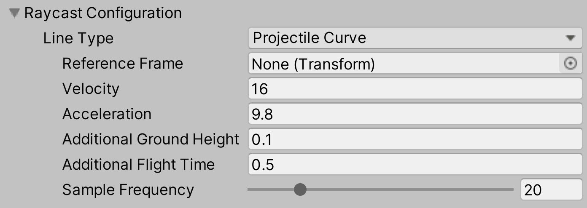

| **Property** | **Description** |
|---|---|
| **Reference Frame** | The reference frame of the projectile. If you don't set this, the XR Ray Interactor attempts to use the local XR Origin, which makes the curve always go up then down in the tracking space. If the XR Origin doesn't exist, the curve rotates with the Controller. |
| **Velocity** | Initial velocity of the projectile. Increase this value to make the curve reach further. |
| **Acceleration** | Gravity of the projectile in the reference frame. |
| **Additional FlightTime** | Additional flight time after the projectile lands. Increase this value to make the endpoint drop lower in height. |
| **Sample Frequency** | The number of sample points of the curve. Higher numbers offer better quality. |

#### Bezier Curve

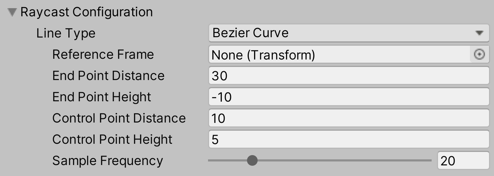

In addition to its start point, the **Bezier Curve** uses a control point and an end point. The start point is the position of the **Attach Transform** of the **XR Ray Interactor**. Both the **Projectile Curve** and the **Bezier Curve** use the reference frame of the Origin unless otherwise set by the user.

| **Property** | **Description** |
|---|---|
| **End Point Distance** | Define how far away the end point is from the start point. Increase the value to increase the distance. |
| **End Point Height** | Define how high the end point is in relation to the start point. Increase this value to increase the height. |
| **Control Point Distance** | Define how far away the peak of the curve is from the start point. Increase this value to increase the distance. |
| **Control Point Height** | Define how high the peak of the curve is in relation to the start point. Increase this value to increase the height. |
| **Sample Frequency** | Define the number of sample points the curve has. Higher numbers offer better quality. |

### 5. Set line visual

The XR Interactor Line Visual provides additional options to customize the appearance of the XR Ray Interactor for teleportation and other interactions. It requires the [Line Renderer](https://docs.unity3d.com/Manual/class-LineRenderer.html) component and uses line points from the XR Ray Interactor.

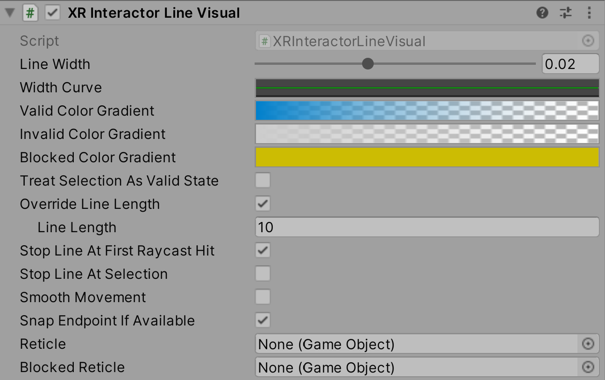

| **Property** | **Description** |
|---|---|
| **Line Width** | The width of the line, in centimeters. |
| **Width Curve** | The relative width of the line from start to end. |
| **Valid Color Gradient** | When the line hits any collider of a valid target, it changes to this color gradient. |
| **Invalid Color Gradient** | When the line hits an invalid target, it changes to this color gradient. |
| **Override Line Length** | If you enable this option, the line visual can have a different length from the underlying ray cast. |
| **Line Length** | If the **Override Line Length** option is enabled, this field sets the rendered length of the line. This length can't be longer than the ray cast distance. |
| **Smooth Movement** | If enabled, the rendered line is delayed from and smoothly follows the ray cast line. |
| **Reticle** | The GameObject to visualize the destination of Teleportation. |

## Architecture

The Locomotion System is responsible for managing one XR Origin. The XR Origin handles the user's position in Unity world space. The Locomotion System can restrict access to the XR Origin while Locomotion Providers are moving it.

For example, at the request of the Teleportation Provider, the Locomotion System locks the XR Origin while in a Teleport action. This ensures that the user can't do another action, such as snap turning or teleporting again, while the current action is active.

After the Teleport has finished, the Teleportation Provider relinquishes the exclusive lock on the system and allows other Locomotion Providers to influence the XR Origin.

Locomotion Providers can modify the XR Origin without taking exclusive access if necessary. However, before you give a Locomotion Provider non-exclusive access to the XR Origin, you should always check to see if the Locomotion System is busy before it makes any changes to the XR Origin.

The overall flow of a Locomotion request is as follows:

1. The Locomotion Provider checks to see if the Locomotion System is currently busy.
2. If not, the Locomotion Provider requests exclusive access to the Locomotion System.
3. If the request is successful, the Locomotion Provider moves the XR Origin.
4. When the Locomotion Provider has finished modifying the user's position and/or rotation, the Locomotion Provider relinquishes exclusive access to the Locomotion System.

If the Locomotion System is busy, or the Locomotion Provider is unable to gain exclusive access to the Locomotion System, the Locomotion Provider shouldn't modify the Locomotion System's XR Origin.

### XR Origin

The Locomotion System uses the XR Origin as the anchor for the user.

Before detailing the options on the XR Origin component, it's important to understand the recommended hierarchy of GameObjects to support the interactions.

The image below shows the XR Origin component.

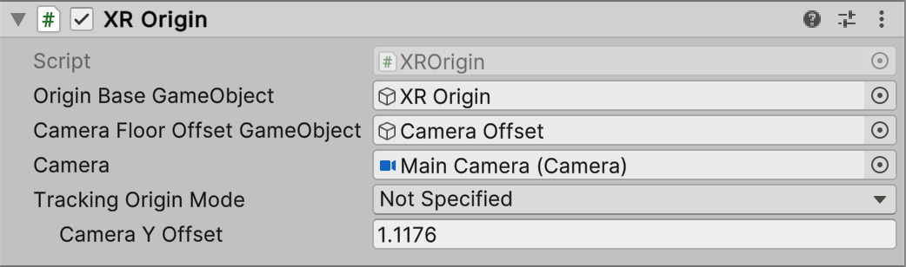

| **Property** | **Description** |
|---|---|
|**Origin Base Game Object**|Indicates which GameObject acts as the Transform from tracking space into world space. In the recommended hierarchy, this is the XR Origin GameObject.|
|**Camera Floor Offset GameObject**|Sets which GameObject has a vertical offset applied if the device tracking origin doesn't contain the user's height.|
|**Camera**|Indicates which GameObject holds the user's Camera. This is important because the user's Camera might not be at the origin of the tracking volume. In the suggested hierarchy, this is the Main Camera GameObject.|
|**Tracking Origin Mode**|Sets the desired tracking origin used by the application.|
|**Camera Y Offset**| The number of world space units by which the GameObject specified by the **Camera Floor Offset GameObject** is moved up vertically if the device tracking origin doesn't contain the user's height.|

### Locomotion System

The Locomotion System is a MonoBehaviour that acts as the arbitrator for Locomotion Provider access to an XR Origin.

The following is an image of the Locomotion System component:

| **Property** | **Description** |
|---|---|
|**Timeout**|Controls the maximum amount of time a single Locomotion Provider can keep exclusive access of the Locomotion System. By default, the value is set to 10 seconds.|
|**XR Origin**|Selects which XR Origin this Locomotion System will control. You can have as many Locomotion Systems and XR Origins in your scene as necessary. By default, it will find the object of type XR Origin in the scene.|

As a best practice, the Locomotion System should be located on the XR Origin GameObject. For more information, see the recommended hierarchy setup for interaction.

### Locomotion Providers

Locomotion Providers implement different types of locomotion. The package supplies multiple Locomotion Providers: the [Teleportation Provider](#teleportation-provider), the [Snap Turn Provider](#snap-turn-provider), the [Continuous Turn Provider](#continuous-turn-provider), the [Continuous Move Provider](#continuous-move-provider), [Grab Move Providers](#grab-move-providers), and the [Climb Provider](#climb-provider), all of which implement the `LocomotionProvider` abstract class. These are discussed in more detail in the sections below.

The `LocomotionProvider` class provides a simple interface to request and relinquish exclusive access to the configured [LocomotionSystem](locomotion-system.md). If no `LocomotionSystem` class is configured, the Locomotion Provider attempts to find a Locomotion System in the current scene(s).

To request exclusive access to the Locomotion System, use the `BeginLocomotion` method. To relinquish access to the Locomotion System, use the `EndLocomotion` method. The implementation of Locomotion Provider must call these methods as appropriate, and relinquish its access when it has finished interacting with the Locomotion System.

Use the `CanBeginLocomotion` method to check if the Locomotion System is currently in exclusive mode before attempting to call `BeginLocomotion` to acquire it.

The `LocomotionProvider` abstract class also providers two events:
* `startLocomotion` is invoked on a successful call to `BeginLocomotion`.
* `endLocomotion` is invoked on a successful call to `EndLocomotion`.

### Teleportation

The package provides a simple implementation of teleportation that also demonstrates how to implement complex locomotion scenarios using the `LocomotionProvider` and [LocomotionSystem](locomotion-system.md) interfaces.

The Teleportation Provider inherits from the `LocomotionProvider` abstract class. The Teleportation Provider is responsible for moving the Origin to the desired location on the user's request.

This implementation has two types of teleportation destinations: a Teleportation Area and a Teleportation Anchor. These are discussed in more detail below. In short:

- Teleportation Areas allow the user to choose a location on a surface that they wish to teleport to.

- Teleportation Anchors teleport the user to a pre-determined specific position and/or rotation that they specify. Technically, it functions like the Teleportation Area but has the additional anchor functionality.

Both types of teleportation destinations are implemented on top of the XR Interaction system using the `BaseTeleportationInteractable` as the starting point for shared code.

The XR Interaction system also provides various line rendering options. For more information, see documentation for the [XR Interactor Line Visual](xr-interactor-line-visual.md) and the [XR Interactor Reticle Visual](xr-interactor-reticle-visual.md).

#### Teleportation Provider

The Teleportation Provider Component implements the `LocomotionProvider` abstract class. You can have as many instances of the Teleportation Provider Component in your scene as you need. However, in most cases, a single instance is enough. As a best practice, place this instance on the XR Origin GameObject.

The following image shows the Teleportation Provider MonoBehaviour.

The **System** field should reference the Locomotion System MonoBehaviour that you want the teleportation provider to interact with. If you don't specify a Locomotion System, the provider attempts to find one in the current scene.

#### Teleportation Area Interactable

The Teleportation Area Interactable is a specialization of the `BaseTeleportInteractable` class. It allows the user to select any location on the surface as their destination.

The Teleportation Area Interactable is intended to be used by the XR Ray Interactor or any of its specializations. It uses the intersection point of the ray and the area's collision volume to determine the location that the user wants to teleport to. It can also optionally match the user's rotation to the forward direction of the attach transform of the selecting Interactor. The Teleportation Area Interactable has a specialized implementation of the `GenerateTeleportRequest` method, which generates a teleportation request that is queued with the Teleportation Provider.

The following image shows an example of a portion of the Teleportation Area Interactable as it appears in the Inspector:

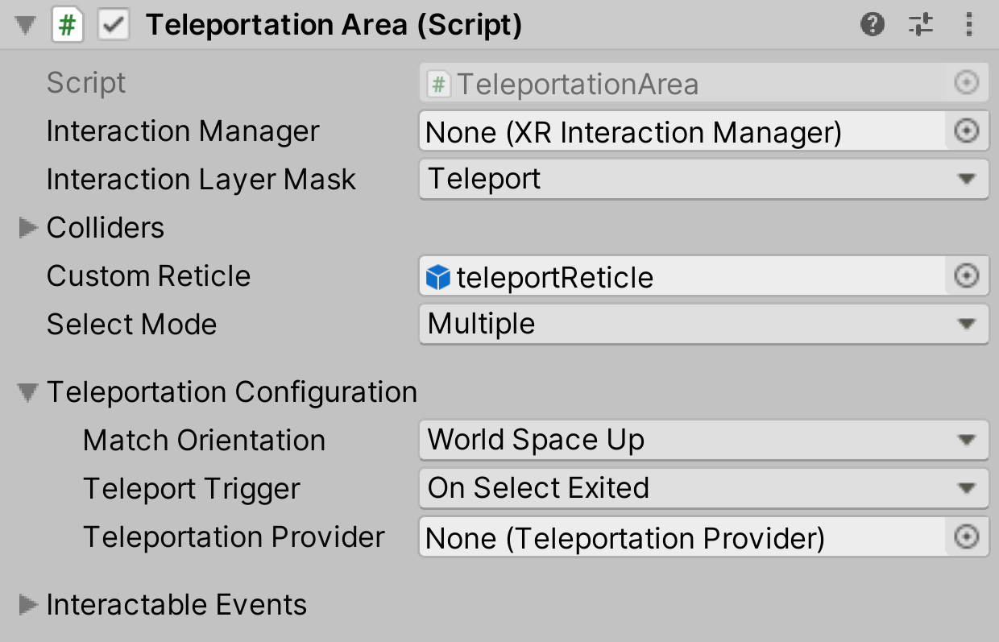

The properties on the Teleportation Area Interactable are similar to other Interactables. The table below only covers the elements that support teleportation.

|**Property**|**Description**|
|---|---|
|**Match Orientation**|Specifies how to orient the Origin after teleportation. You can choose from the following options: <ul><li>**World Space Up** to stay oriented according to the world space up vector.</li><li>**Target Up** to orient according to the target `BaseTeleportationInteractable` Transform's up vector.</li><li>**Target Up And Forward** to orient according to the target `BaseTeleportationInteractable` Transform's rotation.</li><li>**None** to maintain the same orientation before and after teleporting.</li></ul>|
|**Match Directional Input**|Specifies whether or not to rotate the Origin to match the forward direction of the attach transform of the selecting interactor. This option is only available when **Match Orientation** is set to **World Space Up** or **Target Up**.|
|**Teleport Trigger**|Specifies whether the teleportation triggers when the user enters or exits the selection.|
|**Teleportation Provider**|Indicates which Teleportation Provider this Interactable communicates with. If a Teleportation Provider is not configured, the Interactable attempts to find a Teleportation Provider in the current scene(s).|
|**Filter Selection By Hit Normal**|When enabled, this teleportation interactable will only be selectable by a ray interactor if its current hit normal is aligned with this object's up vector. |
|**Up Normal Tolerance Degrees**|Sets the tolerance in degrees from this object's up vector for a hit normal to be considered aligned with the up vector. Only used and displayed when **Filter Selection By Hit Normal** is enabled. |

**Match Orientation** is used to specify how the rotation of the XR Origin changes when teleporting.
- If your application does not rotate the Origin in any way, and you always want the Origin's up vector to match World Space's Up vector, use the **World Space Up** option.
- If you want the user to be able to stand on a ceiling, wall, or other tilted surface, and have them rotate to match so that the ceiling or wall feels like their new floor, select **Target Up** instead. The Origin will match the up vector of the Transform that the Teleportation Area component is attached to.
- If you want to point the user in a very specific direction when they arrive at a target, select **Target Up And Forward**. This will match the Origin's rotation to the exact rotation of the Transform that a Teleportation Area is attached to.
- If you do not want a teleport to change the rotation in any way, and you want the user to retain the same rotation before and after a teleport, select **None**.  If your entire application is oriented at a 45 degree angle, for instance, you can rotate the Origin's root Transform and set all teleport targets to `MatchOrientation.None`.

#### Teleportation Anchor Interactable

The Teleportation Anchor is a specialization of the `BaseTeleportInteractable` class that allows the user to teleport to an anchor location by selecting the anchor or an area around it.

The Teleportation Anchor Interactable is intended to be used by the XR Ray Interactor or any of its specializations. It uses the intersection point of the ray and the area's collision volume to determine the location that the user wants to teleport to. It can also optionally match the user's rotation to the forward direction of the attach transform of the selecting Interactor. The Teleportation Anchor Interactable has a specialized implementation of the `GenerateTeleportRequest` method, which generates a teleportation request that is queued with the Teleportation Provider.

The following image shows an example of a portion of the Teleportation Anchor Interactable as it appears in the Inspector:

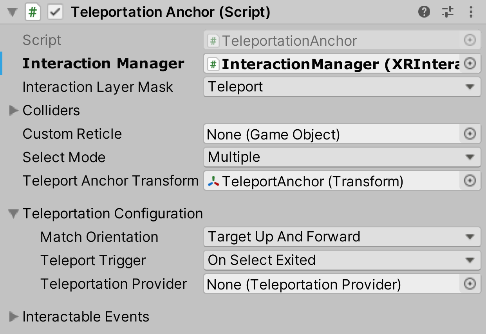

The properties on the **Teleportation Anchor** Interactable are similar to the **Teleportation Area** Interactable. This documentation only covers new elements.

The **Teleport Anchor Transform** field defines the transform that the Origin teleports to when the user teleports to this anchor. It uses both the position and the rotation of the anchor, depending on which **Match Orientation** is selected.

### Snap Turn Provider

The package provides an example implementation of a Snap Turn Provider. A snap turn means the Origin rotates by a fixed amount when the application receives a configured input (for example, a joystick is moved to the left, or a D-pad is pressed to the right).

It is recommended that you use the Action-based variant instead of the Device-based variant to take advantage of the benefits that the Input System package provides.

#### Action-based

The following image shows an example of the Snap Turn Provider (Action-based).

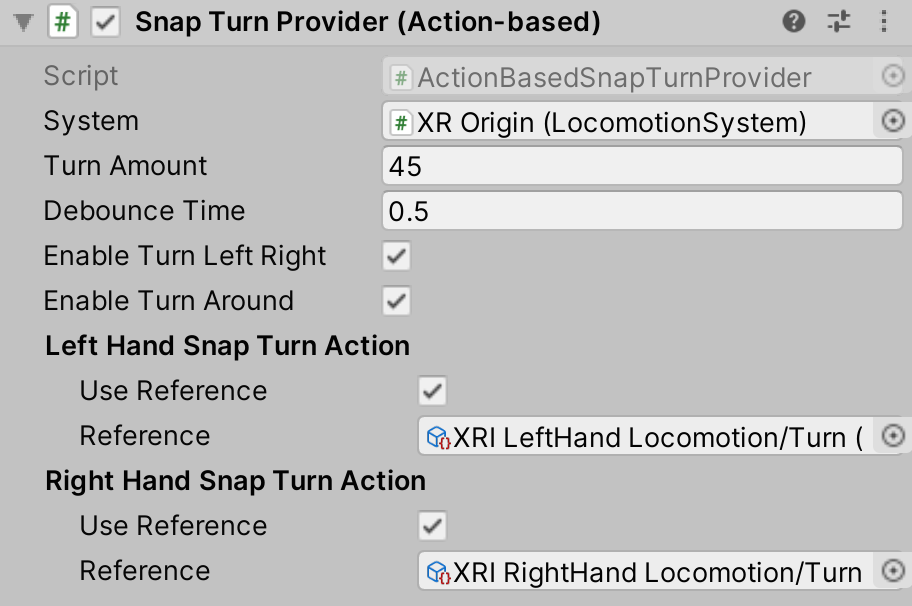

|**Property**|**Description**|
|---|---|
|**System**|The Locomotion System that this locomotion provider will communicate with for exclusive access to an XR Origin. If one is not provided, the system will attempt to locate one during its `Awake` call.|
|**Turn Amount**|Specify by how many degrees the Origin will rotate around the Y axis during each snap turn.|
|**Debounce Time**|Specify how much time must pass after a successful snap turn before the user can trigger a second snap turn.|
|**Enable Turn Left Right**|Controls whether to enable left and right snap turns.|
|**Enable Turn Around**|Controls whether to enable 180° snap turns.|
|**Left Hand Snap Turn Action**|The Action that will be used to read input from the left hand controller.|
|**Right Hand Snap Turn Action**|The Action that will be used to read input from the right hand controller.|

#### Device-based

The following image shows an example of the Snap Turn Provider (Device-based).

|**Property**|**Description**|
|---|---|
|**System**|The Locomotion System that this locomotion provider communicates with for exclusive access to an XR Origin. If none is provided, the behavior will attempt to locate one during its `Awake` call.|
|**Turn Input Source**|The 2D Input Axis on the controller devices that will be used to trigger a snap turn.|
|**Controllers**|Each element in the controllers list is a reference to an XR Controller that provides device inputs to trigger snap turning.|
|**Turn Amount**|Specify by how many degrees the Origin will rotate around the Y axis during each snap turn.|
|**Dead Zone**| The controller needs to move more than the amount you specify in this field to be able to trigger a snap turn.|
|**Enable Turn Left & Right**|Controls whether to enable left and right snap turns.|
|**Enable Turn Around**|Controls whether to enable 180° snap turns.|
|**Activation Timeout**|Specify how much time must pass after a successful snap turn before the user can trigger a second snap turn.|

### Continuous Turn Provider

The package provides an example implementation of a Continuous Turn Provider. Continuous turning, as opposed to snap turning by discrete angles, smoothly rotates the Origin by an amount over time when the application receives a configured input (for example, a joystick is tilted to the right).

It is recommended that you use the Action-based variant instead of the Device-based variant to take advantage of the benefits that the Input System package provides.

#### Action-based

The following image shows an example of the Continuous Turn Provider (Action-based).

|**Property**|**Description**|
|---|---|
|**System**|The Locomotion System that this locomotion provider will communicate with for exclusive access to an XR Origin. If one is not provided, the system will attempt to locate one during its `Awake` call.|
|**Turn Speed**|The number of degrees/second clockwise to rotate when turning clockwise.|
|**Left Hand Turn Action**|The Action used to read input from the left hand controller.|
|**Right Hand Turn Action**|The Action used to read input from the right hand controller.|

#### Device-based

The following image shows an example of the Continuous Turn Provider (Device-based).

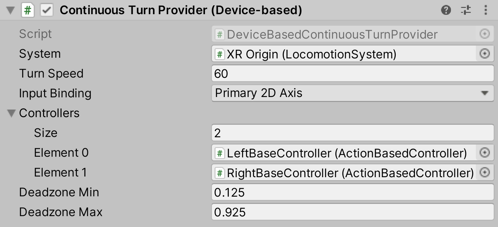

|**Property**|**Description**|
|---|---|
|**System**|The Locomotion System that this locomotion provider will communicate with for exclusive access to an XR Origin. If one is not provided, the system will attempt to locate one during its `Awake` call.|
|**Turn Speed**|The number of degrees/second clockwise to rotate when turning clockwise.|
|**Input Binding**|The 2D Input Axis on the controller devices that will be used to trigger turning.|
|**Controllers**|Each element in the controllers list is a reference to an XR Controller that provides device inputs to trigger turning.|
|**Deadzone Min**|Value below which input values will be clamped. After clamping, values will be renormalized to [0, 1] between min and max.|
|**Deadzone Max**|Value above which input values will be clamped. After clamping, values will be renormalized to [0, 1] between min and max.|

### Continuous Move Provider

The package provides an example implementation of a Continuous Move Provider. Continuous moving, as opposed to teleporting, smoothly translates the Origin by an amount over time when the application receives a configured input (for example, a joystick is tilted forward).

The **Forward Source** can be used to define which direction the Origin should move when, for example, pushing forward on a joystick. By default, it will use the Camera Object, meaning the user will move forward in the direction they are facing. An example of how this property can be used is to set it to a Transform that tracks the pose of a motion controller to allow the user to move forward in the direction they are holding the controller.

If a [Character Controller](https://docs.unity3d.com/Manual/class-CharacterController.html) is present on the Origin, this Continuous Move Provider will move the Origin using [`CharacterController.Move`](https://docs.unity3d.com/ScriptReference/CharacterController.Move.html) rather than directly translating the Transform of the Origin.

It is recommended that you use the Action-based variant instead of the Device-based variant to take advantage of the benefits that the Input System package provides.

#### Action-based

The following image shows an example of the Continuous Move Provider (Action-based).

|**Property**|**Description**|
|---|---|
|**System**|The Locomotion System that this locomotion provider will communicate with for exclusive access to an XR Origin. If one is not provided, the system will attempt to locate one during its `Awake` call.|
|**Move Speed**|The speed, in units per second, to move forward.|
|**Enable Strafe**|Controls whether to enable strafing (sideways movement).|
|**Enable Fly**|Controls whether to enable flying (unconstrained movement). This overrides **Use Gravity**.|
|**Use Gravity**|Controls whether gravity affects this provider when a Character Controller is used. This only applies when **Enable Fly** is disabled.|
|**Gravity Application Mode**|Controls when gravity begins to take effect.|
|**Forward Source**|The source Transform to define the forward direction.|
|**Left Hand Move Action**|The Action that will be used to read input from the left hand controller.|
|**Right Hand Move Action**|The Action that will be used to read input from the right hand controller.|

#### Device-based

The following image shows an example of the Continuous Move Provider (Device-based).

|**Property**|**Description**|
|---|---|
|**System**|The Locomotion System that this locomotion provider will communicate with for exclusive access to an XR Origin. If one is not provided, the system will attempt to locate one during its `Awake` call.|
|**Move Speed**|The speed, in units per second, to move forward.|
|**Enable Strafe**|Controls whether to enable strafing (sideways movement).|
|**Enable Fly**|Controls whether to enable flying (unconstrained movement). This overrides **Use Gravity**.|
|**Use Gravity**|Controls whether gravity affects this provider when a Character Controller is used. This only applies when **Enable Fly** is disabled.|
|**Gravity Application Mode**|Controls when gravity begins to take effect.|
|**Forward Source**|The source Transform to define the forward direction.|
|**Input Binding**|The 2D Input Axis on the controller devices that will be used to trigger moving.|
|**Controllers**|Each element in the controllers list is a reference to an XR Controller that provides device inputs to trigger moving.|
|**Deadzone Min**|Value below which input values will be clamped. After clamping, values will be renormalized to [0, 1] between min and max.|
|**Deadzone Max**|Value above which input values will be clamped. After clamping, values will be renormalized to [0, 1] between min and max.|

### Grab Move Providers

The package provides example implementations of a Grab Move Provider and a Two Handed Grab Move Provider. A grab movement translates the Origin counter to controller movement while a button input is held. This allows the user to move as if grabbing the whole world around them.

If a [Character Controller](https://docs.unity3d.com/Manual/class-CharacterController.html) is present on the Origin, the Grab Move Provider or Two Handed Grab Move Provider will move the Origin using [`CharacterController.Move`](https://docs.unity3d.com/ScriptReference/CharacterController.Move.html) rather than directly translating the Transform of the Origin.

#### Grab Move Provider

A Grab Move Provider allows for grab movement with one hand.

The following image shows an example of the Grab Move Provider.

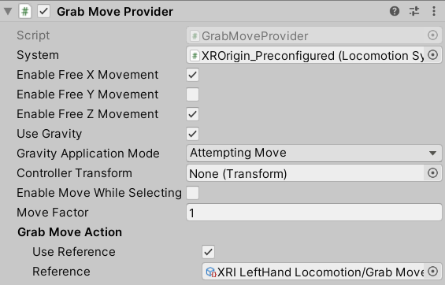

|**Property**|**Description**|
|---|---|
|**System**|The Locomotion System that this locomotion provider will communicate with for exclusive access to an XR Origin. If one is not provided, the system will attempt to locate one during its `Awake` call.|
|**Enable Free X Movement**|Controls whether to enable unconstrained movement along the x-axis.|
|**Enable Free Y Movement**|Controls whether to enable unconstrained movement along the y-axis.|
|**Enable Free Z Movement**|Controls whether to enable unconstrained movement along the z-axis.|
|**Use Gravity**|Controls whether gravity applies to constrained axes when a `CharacterController` is used.|
|**Gravity Application Mode**|Controls when gravity begins to take effect.|
|**Controller Transform**|The controller Transform that will drive grab movement with its local position. Will use this GameObject's Transform if not set.|
|**Enable Move While Selecting**|Controls whether to allow grab movement while the controller is selecting an interactable.|
|**Move Factor**|The ratio of actual movement distance to controller movement distance.|
|**Grab Move Action**|The Action that will be used to perform grab movement while held.|

#### Two Handed Grab Move Provider

A Two Handed Grab Move Provider allows for grab movement with both hands by using two Grab Move Providers. In addition to performing translation, this provider is able to rotate and scale the Origin counter to hand movements. It uses the vector from the left hand to the right hand to determine yaw rotation and uniform scale.

When a Two Handed Grab Move Provider is used, either of its Grab Move Providers will only perform locomotion by itself if the other single-handed provider is not trying to perform locomotion. This means that when both grab move inputs are held, the Two Handed Grab Move Provider is the Locomotion Provider performing translation of the Origin.

The following image shows an example of the Two Handed Grab Move Provider.

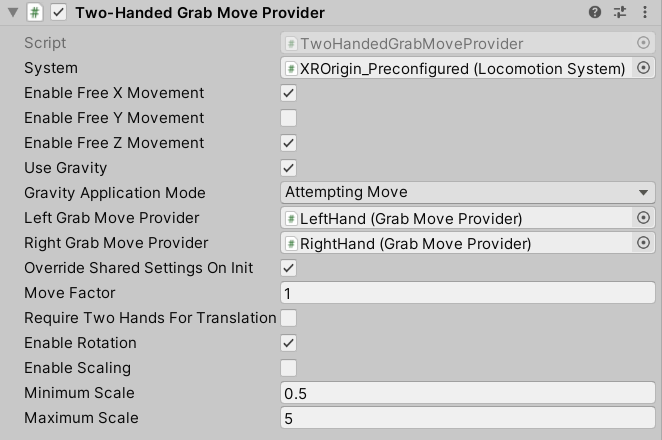

|**Property**|**Description**|
|---|---|
|**System**|The Locomotion System that this locomotion provider will communicate with for exclusive access to an XR Origin. If one is not provided, the system will attempt to locate one during its `Awake` call.|
|**Enable Free X Movement**|Controls whether to enable unconstrained movement along the x-axis.|
|**Enable Free Y Movement**|Controls whether to enable unconstrained movement along the y-axis.|
|**Enable Free Z Movement**|Controls whether to enable unconstrained movement along the z-axis.|
|**Use Gravity**|Controls whether gravity applies to constrained axes when a `CharacterController` is used.|
|**Gravity Application Mode**|Controls when gravity begins to take effect.|
|**Left Grab Move Provider**|The left hand grab move instance which will be used as one half of two-handed locomotion.|
|**Right Grab Move Provider**|The right hand grab move instance which will be used as one half of two-handed locomotion.|
|**Override Shared Settings On Init**|Controls whether to override the settings for individual handed providers with this provider's settings on initialization.|
|**Move Factor**|The ratio of actual movement distance to controller movement distance.|
|**Require Two Hands For Translation**|Controls whether translation requires both grab move inputs to be active.|
|**Enable Rotation**|Controls whether to enable yaw rotation of the user.|
|**Enable Scaling**|Controls whether to enable uniform scaling of the user.|
|**Minimum Scale**|The minimum user scale allowed.|
|**Maximum Scale**|The maximum user scale allowed.|

### Climb Locomotion

The package provides an example implementation of climb locomotion, which allows the user to climb an Interactable. Climb locomotion translates the Origin counter to movement of whichever Interactor is selecting a Climb Interactable. If multiple Interactors are selecting a Climb Interactable, only the most recent selection will drive movement. This type of locomotion is similar to [grab movement](#grab-move-providers) but uses Interactables to restrict locomotion.

Climb locomotion settings can be configured at the Provider level or overridden by the specific Climb Interactable being climbed. Settings can be configured to restrict movement along any of the local axes of the Interactable.

#### Climb Provider

The Climb Provider implements the `LocomotionProvider` abstract class. This is the component that handles the actual movement of the XR Origin. As a best practice, place this instance on the XR Origin GameObject.

The following image shows an example of the Climb Provider.

|**Property**|**Description**|
|---|---|
|**System**|The Locomotion System that this locomotion provider will communicate with for exclusive access to an XR Origin. If one is not provided, the system will attempt to locate one during its `Awake` call.|
|**Climb Settings**|Climb locomotion settings. Can be overridden by the Climb Interactable used for locomotion.|
|&emsp;**Use Asset**|Enable to use a `ClimbSettings` object externally defined in a `ClimbSettingsDatum` asset that can be assigned using the accompanying field.|
|&emsp;**Use Value**|Enable to use a `ClimbSettings` object which comes with default values editable in the component editor.|
|&emsp;Allow Free X Movement|Controls whether to allow unconstrained movement along the Climb Interactable's x-axis.|
|&emsp;Allow Free Y Movement|Controls whether to allow unconstrained movement along the Climb Interactable's y-axis.|
|&emsp;Allow Free Z Movement|Controls whether to allow unconstrained movement along the Climb Interactable's z-axis.|

#### Climb Interactable

The Climb Interactable implements the `XRBaseInteractable` abstract class. This component allows you to make an object **climbable** by using the selection interaction to drive movement. You can optionally restrict movement so that the user is unable to move along certain local axes of the object.

The following image shows an example of the Climb Interactable.

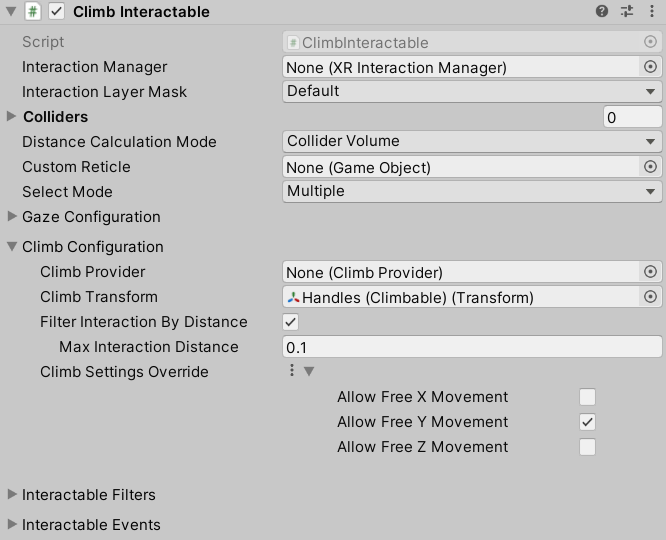

The properties on the Climb Interactable are similar to other Interactables. The table below only covers the elements under the climb configuration.

|**Property**|**Description**|
|---|---|
|**Climb Provider**|The climb provider that performs locomotion while this interactable is selected. If no climb provider is configured, the system will attempt to find one during its `Awake` call.|
|**Climb Transform**|Transform that defines the coordinate space for climb locomotion. Will use this GameObject's Transform by default.|
|**Filter Interaction By Distance**|Controls whether to apply a distance check when validating hover and select interaction.|
|**Max Interaction Distance**|The maximum distance that an interactor can be from this interactable to begin hover or select.|
|**Climb Settings Override**|Optional override of locomotion settings specified in the climb provider. Only applies as an override if set to **Use Value** or if the asset reference is set.|
|&emsp;**Use Asset**|Enable to use a `ClimbSettings` object externally defined in a `ClimbSettingsDatum` asset that can be assigned using the accompanying field.|
|&emsp;**Use Value**|Enable to use a `ClimbSettings` object which comes with default values editable in the component editor.|
|&emsp;Allow Free X Movement|Controls whether to allow unconstrained movement along the Climb Interactable's x-axis.|
|&emsp;Allow Free Y Movement|Controls whether to allow unconstrained movement along the Climb Interactable's y-axis.|
|&emsp;Allow Free Z Movement|Controls whether to allow unconstrained movement along the Climb Interactable's z-axis.|

The Climb Interactable also has a unique default value for the **Select Mode** property defined in `XRBaseInteractable`. **Select Mode** is set to **Multiple**, so that two-handed climbing is enabled by default.

### Character Controller Driver

You can use the Character Controller Driver to drive the height of a Character Controller on the Origin upon locomotion events emitted by, for example, a Continuous Move Provider. This can allow for the capsule collider of the Origin (that is, the user) to be automatically resized when the user crouches down or stands up and tries to move with a joystick. This can be useful, together with other Collider objects, to constrain the user from moving forward unless their head would be lower than an obstacle, for instance.

Use the **Min Height** and **Max Height** properties to clamp the height of the Character Controller that this behavior sets, in order to prevent unwanted extremes. It might be useful to set an upper limit as a quality of life improvement for extremely tall users so the Character Controller can fit through the scene at a typical standing height without forcing the user to lower their head.

The following image shows an example of the Character Controller Driver.

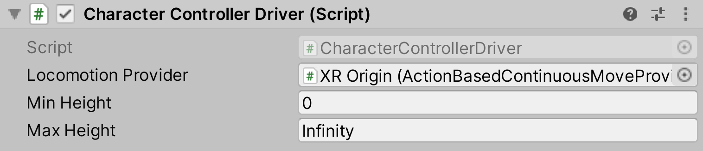

|**Property**|**Description**|
|---|---|
|**Locomotion Provider**|The Locomotion Provider object to listen to.|
|**Min Height**|The minimum height of the character's capsule that this behavior will set.|
|**Max Height**|The maximum height of the character's capsule that this behavior will set.|

## Document revision history

|Date|Reason|
|---|---|
|**May 19, 2023**| Documentation updated to match changes made in `com.unity.xr.core-utils` version 2.2.1.|
|**February 14, 2022**| Documentation updated to match package version 2.0.0.|
|**May 12, 2021**|Documentation updated for changes to tracking origin mode on the XR Origin. Matches package version 1.0.0-pre.4.|
|**January 10, 2020**|Documentation fixes, adds revision history.|
|**October 20, 2020**|Added continuous locomotion and updated for Inspector changes. Matches package version 0.10.0.|
