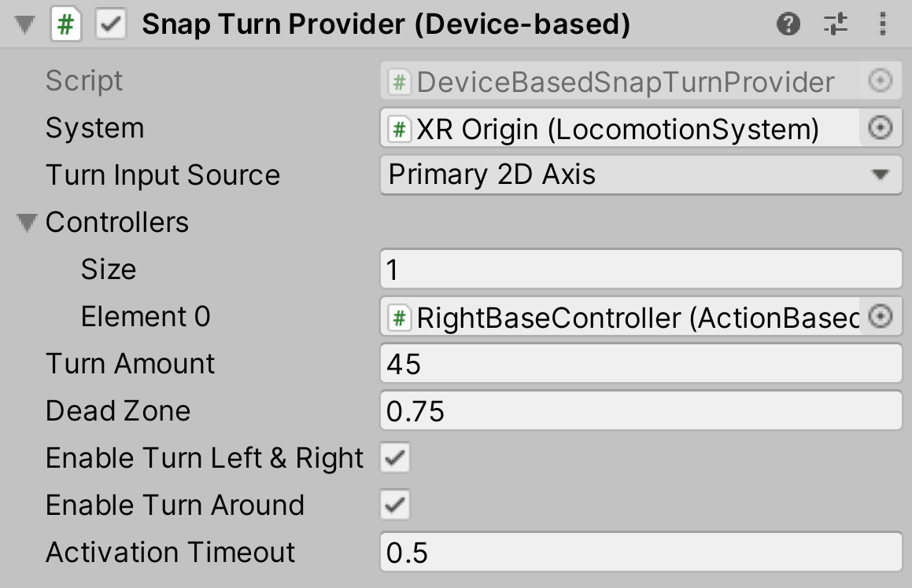

# Snap Turn Provider (Device-based)

A locomotion provider that allows the user to rotate their rig using a specified 2D axis input. The provider can take input from multiple different devices (such as Left and Right hands).

| **Property** | **Description** |
|---|---|
| **System** | The [LocomotionSystem](locomotion-system.md) that this `LocomotionProvider` communicates with for exclusive access to an XR Origin. If one is not provided, the behavior will attempt to locate one during its Awake call. |
| **Turn Input Source** | The 2D Input Axis on the controller devices that will be used to trigger a snap turn: `Primary2DAxis` or `Secondary2DAxis`. |
| **Controllers** | The XRControllers that allow SnapTurn.  An XRController must be enabled in order to Snap Turn. |
| **Turn Amount** | The number of degrees clockwise Unity rotates the rig when snap turning clockwise. |
| **Dead Zone** | The deadzone that the controller movement will have to be above to trigger a snap turn. |
| **Enable Turn Left & Right** | Controls whether to enable left and right snap turns. |
| **Enable Turn Around** | Controls whether to enable 180° snap turns. |
| **Delay Time** | The time (in seconds) to delay the first turn after receiving initial input for the turn. Subsequent turns while holding down input are delayed by the **Debounce Time**, not the delay time. This delay can be used, for example, as time to set a tunneling vignette effect as a VR comfort option. |
| **Activation Timeout** | The amount of time that Unity waits before starting another snap turn. |