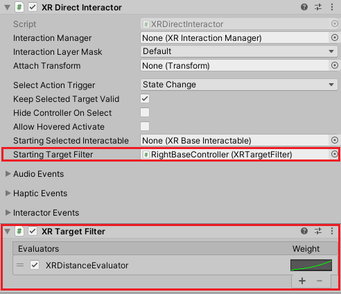
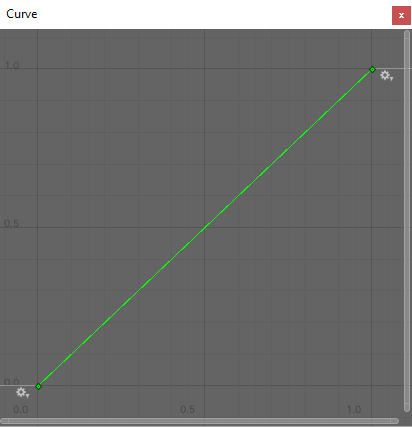
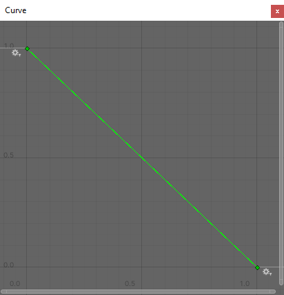

# Target filters

Target Filters are used to extend the logic of how Interactors prioritize and filter the Interactables that they can interact with.

> [!NOTE]
> The Interactor is responsible to create a list (called **Valid Target** list) containing the Interactables that it could potentially hover or select in a frame. The Valid Target list is sorted by priority, and by default the closest Interactables have highest priority.

> [!NOTE]
> Each Interactable can have a different method for distance calculation and this can influence its order in the Valid Target list.

The default criteria to sort the Valid Target list by distance can be extended or overridden with Target Filters. This is usually done with an `XRTargetFilter` component. The rest of this section is about the setup and configuration of an `XRTargetFilter`, please see the [Extending Target Filters](extending-xri.md#extending-target-filters) section for other options.

## XR Target Filter

The `XRTargetFilter` component is a highly configurable component for filtering Interactables in a Valid Target list. It sorts this list using a score calculated by its Evaluator objects.

### Setup

Add the component `XRTargetFilter` to a GameObject and link it to the `Starting Target Filter` property of an Interactor. When the Interactor becomes active in Play mode, it'll link itself to the assigned Filter and forward its logic to prioritize the Valid Target list.

A single `XRTargetFilter` can be linked to multiple different Interactors. 

### Evaluator

An Evaluator is responsible for giving a score for each target Interactable (or candidate) for interaction.

#### Normalized score

The normalized score is a value between `0` and `1` that represents the intention to select a given Interactable. The highest score of `1` represents the intention to select the Interactable and the lowest score of `0` the intention to not select it, any value in between is valid.

Each Evaluator has its own method to calculate the normalized score. For instance, the following are built-in Evaluators and their methods to calculate the normalized score.

|Evaluator|Normalized Score Description|
|---|---|
|**`XRAngleGazeEvaluator`**|Evaluates the angle between the `Gaze Transform`'s forward direction and the vector to the target Interactable. A target Interactable found directly along this forward vector will receive the highest normalized score of `1`.|
|**`XRDistanceEvaluator`**|Evaluates the Interactor distance from the target Interactable. Targets close to the Interactor will receive a higher score and targets far way will receive a lower score.|
|**`XRLastSelectedEvaluator`**|The last selected target Interactable will receive the highest normalized score. In the moment that an Interactable is selected by any of the linked Interactors, it'll have the highest normalized score of `1`. Its normalized score will linearly decrease with time until the score reaches `0` after **Max Time** seconds.|

You can code your own Evaluators, please see the section [Extending evaluators](extending-xri.md#extending-evaluators) for more information.

#### Weighted score

This is the actual score returned by an Evaluator for a given Interactable. The normalized score is used as the x-axis in the **Weight** curve to get the weighted score (the y-axis).

This allows users to give a completely different meaning for an Evaluator without having to rewrite its code. For example, the **Weight** line below will not change the normalized score, in this case the normalized and weighted score are equal.

However, the **Weight** line below gives the opposite meaning for the Evaluator. For example, when this line is used with an `XRDistanceEvaluator`, targets close to the Interactor will receive a lower score and targets far away will receive a higher score.

The weighted score does not need to be normalized. A value of `0` will stop the current Interactable process, resulting in the remaining Evaluators in the list not getting invoked and therefore not contributing to this Interactable's score this frame. A negative weighted score will stop the processing and exclude the Interactable from the Valid Target list.

#### Final score

All the Evaluators weighted scores for a given Interactable are multiplied together to get the Interactable's final score. The final score is then used to sort the Interactable position in the Valid Target list, the Interactable with the highest final score will have the highest priority.

### Evaluators list order

For each Interactable candidate for interaction in the current frame, the Evaluators list is processed in order to calculate the Interactable's final score. 

> [!TIP]
> You might want to keep Evaluators that can exclude Interactables first in the list (the ones that can have a `0` or negative weighted score) since they will stop the current Interactable process and save some unnecessary processing.

### Debugging

During Play mode, the final score and the weighted scores of an Interactable are displayed in the **Target Filters** tab in the [Debugger window](debugger-window.md#target-filters).
