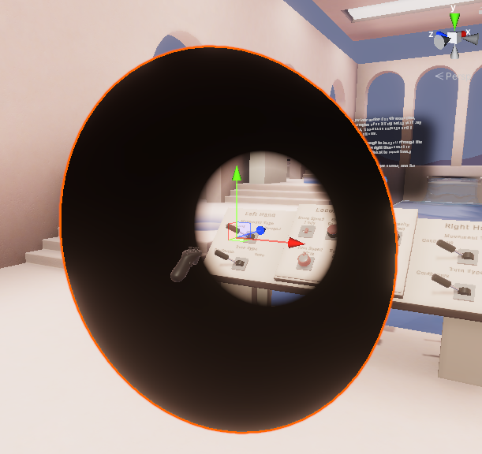
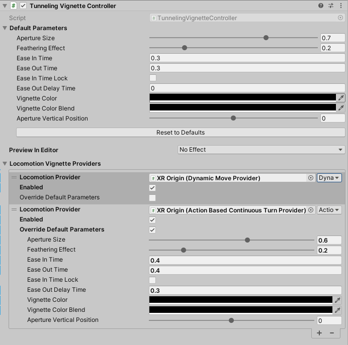

# Tunneling Vignette Controller

The `TunnelingVignetteController` component, combined with the [Tunneling Vignette sample assets](samples-starter-assets.md#tunneling-vignette), provide an out-of-the-box tunneling vignette solution as a comfort mode option intended to mitigate motion sickness in VR. To install the sample assets, use the `Package Manager` to import the `Tunneling Vignette` sample under the `XR Interaction Toolkit` package.

The `TunnelingVignette.prefab` in the sample asset is recommended to be placed as a child GameObject of the Main Camera. It renders a hemisphere that consists of the inner transparent aperture and the black visual cut-off using the provided shader and material. The following image shows the Scene view of the rendered vignette.

The rest of this documentation details the properties and their usages of the `TunnelingVignetteController` component, which is attached to the `TunnelingVignette.prefab` by default. The image below shows the component with move and turn locomotion providers configured in the Inspector.   

| **Property** | **Description** |
|---|---|
| **Preview In Editor** | An option that allows users to select from a list of preset and customized tunneling vignette parameters to preview their effects in the Editor. This feature is editor-only and will be disabled during Play mode.|
| **Default Parameters** | The default parameters of the component to drive the tunneling vignette. Users can override the default parameters, for example, in the `Locomotion Vignette Providers` list, to further customize different effects. Additionally, users can click the `Reset to Defaults` button to reset these parameters values to default values.|
| &emsp;Aperture Size | The aperture size denotes the diameter of the inner transparent circle of the tunneling vignette. When multiple providers trigger the tunneling vignette animation, the one with the smallest aperture size will be used. The range of this value is [0, 1], where 1 represents having no vignette effect.|
| &emsp;Feathering Effect | The degree of smoothly blending the edges between the aperture and full visual cut-off. Set this to a non-zero value to add a gradual transition from the transparent aperture to the black vignette edges.|
| &emsp;Ease In Time | The transition time (in seconds) of easing in the tunneling vignette. Set this to a non-zero value to reduce the potential distraction from instantaneously changing the user's field of view when beginning the vignette.|
| &emsp;Ease Out Time | The transition time (in seconds) of easing out the tunneling vignette. Set this to a non-zero value to reduce the potential distraction from instantaneously changing the user's field of view when ending the vignette.|
| &emsp;Ease In Time Lock | Enable this option if you want the easing-in transition to persist until it is complete. This can be useful for instant changes, such as snap turn and teleportation, to trigger the full tunneling effect without easing out the vignette partway through the easing in process.|
| &emsp;Ease Out Delay Time | The delay time (in seconds) before starting to ease out of the tunneling vignette.|
| &emsp;Vignette Color | The primary color of the visual cut-off part of the vignette.|
| &emsp;Vignette Color Blend| The optional color to add color blending to the visual cut-off area of the vignette.|
| &emsp;Aperture Vertical Position| The vertical position offset of the vignette. Changing this value will change the local y-position of the GameObject that this script is attached to.|
| **Locomotion Vignette Providers** | The list of Locomotion Providers and settings used for triggering the tunneling vignette.|
| &emsp;Locomotion Provider| Assign this field with a `LocomotionProvider` to set it up to trigger the tunneling vignette during locomotion. If the selected `GameObject` contains multiple `LocomotionProvider` components, a dropdown menu will appear next to the object field to specify which component to use. By default, the `LocomotionProvider` classes use their `LocomotionPhase` to trigger the `EaseState` of the tunneling vignette. For customized behaviors that extend the base `LocomotionProvider` class, make sure to set their `LocomotionPhase` accordingly if you want them to trigger the vignette automatically.|
| &emsp;Enable Provider| This option provides a shortcut to enable or disable the selected `LocomotionProvider` to trigger its configured tunneling vignette effects.|
| &emsp;Override Default Parameters| If checked, the `Locomotion Provider` will override the `Default Parameters` of this component. When checked, a list of parameters will fold out allowing you to set customized parameter values for this specific `LocomotionProvider`. This option is exposed for Editor configuration. Users can directly override values in code for an individual provider.|