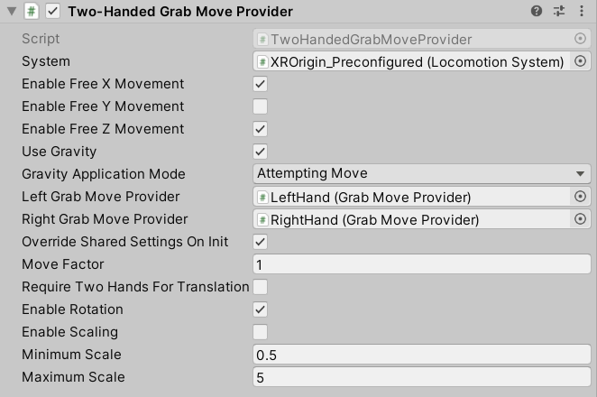

# Two Handed Grab Move Provider

Allows the user to combine two [GrabMoveProvider](grab-move-provider.md) instances for locomotion. This allows the user to translate, scale, and rotate themselves counter to transformations of the line segment between both hands.

| **Property** | **Description** |
|---|---|
| **System** | The [LocomotionSystem](locomotion-system.md) that this `LocomotionProvider` communicates with for exclusive access to an XR Origin. If one is not provided, the behavior will attempt to locate one during its Awake call. |
| **Enable Free X Movement** | Controls whether to enable unconstrained movement along the x-axis. |
| **Enable Free Y Movement** | Controls whether to enable unconstrained movement along the y-axis. |
| **Enable Free Z Movement** | Controls whether to enable unconstrained movement along the z-axis. |
| **Use Gravity** | Controls whether gravity applies to constrained axes when a `CharacterController` is used. |
| **Gravity Application Mode** | Controls when gravity begins to take effect. |
| &emsp;Attempting Move | Use this style when you don't want gravity to apply when the player physically walks away and off a ground surface. Gravity will only begin to move the player back down to the ground when they try to use input to move. |
| &emsp;Immediately | Applies gravity and locomotion every frame, even without move input. Use this style when you want gravity to apply when the player physically walks away and off a ground surface, even when there is no input to move. |
| **Left Grab Move Provider** |The left hand grab move instance which will be used as one half of two-handed locomotion. |
| **Right Grab Move Provider** |The right hand grab move instance which will be used as one half of two-handed locomotion. |
| **Override Shared Settings On Init** |Controls whether to override the settings for individual handed providers with this provider's settings on initialization. |
| **Move Factor** |The ratio of actual movement distance to controller movement distance. |
| **Require Two Hands For Translation** |Controls whether translation requires both grab move inputs to be active. |
| **Enable Rotation** |Controls whether to enable yaw rotation of the user. |
| **Enable Scaling** |Controls whether to enable uniform scaling of the user. |
| **Minimum Scale** |The minimum user scale allowed. |
| **Maximum Scale** |The maximum user scale allowed. |
