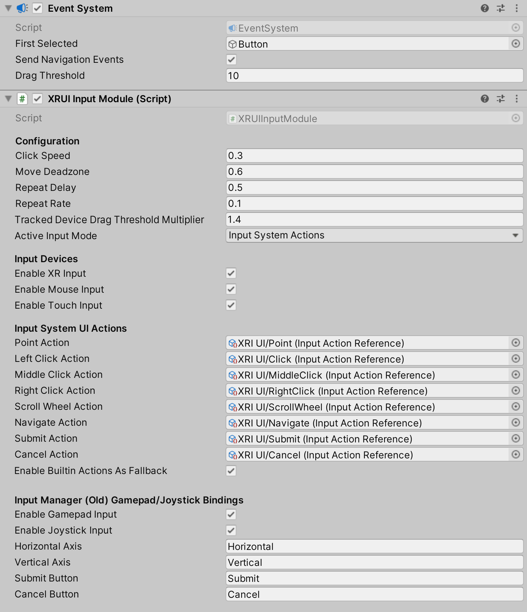
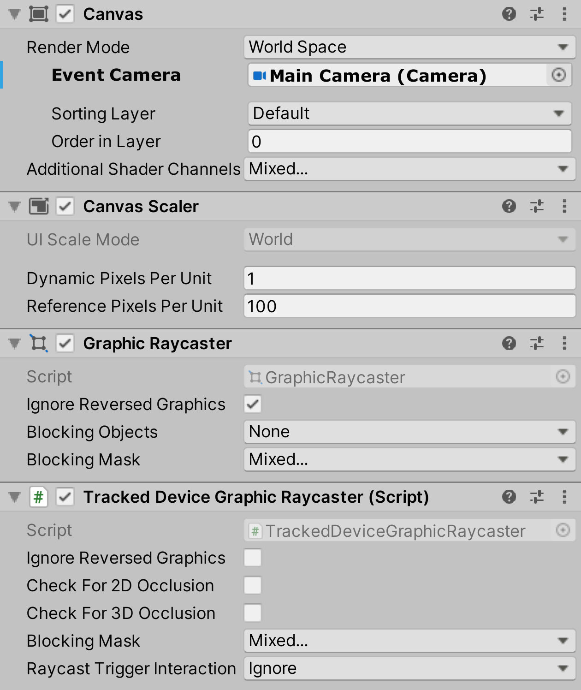

# UI interaction setup

To interact with Unity's built-in UI elements, you need to perform extra steps, particularly if you're dealing with 3D-tracked devices. The XR Interaction Toolkit package provides a number of new components that you can use to convert an XR controller to work seamlessly with the UI, as well as helper menu options that handle basic configuration settings.

## Using the GameObject menu

The XR Interaction Toolkit package comes with menu items that perform basic setup. Use these helpers to create a new UI Canvas. You can access them from the **GameObject &gt; XR** menu.

|Helper|Function|
|---|---|
|**UI Canvas**|Creates a new world-space Canvas that you can add standard UI elements to. If you haven't configured an Event System yet, it also creates and configures a new Event System for XR.|
|**UI EventSystem**|Creates a new Event System for XR, or modifies and selects the existing one in the loaded scenes.|

## Event System

The [Event System](https://docs.unity3d.com/Packages/com.unity.ugui@1.0/manual/EventSystem.html) component acts as a central dispatch for UI events to process input, and update individual active canvases. Additionally, each Event System needs an Input Module to process input. Use the default configuration, pictured below, as a starting point. Only one Input Module can be active at one time. The Tracked Device Physics Raycaster can also be added to a scene so that objects with physics colliders are able to receive Event System events from tracked devices.

## XR UI Input Module

The **XR UI Input Module** is the component that XRI requires to properly interface with the Event System. It works in concert with the [XR Ray Interactor](xr-ray-interactor.md) to ensure XRI interactions with the UI are processed correctly. It also handles input from other non-XR sources (such as gamepad or mouse) if configured to do so. In the component configuration pictured below, the **Input System UI Actions** and **Input Manager** options are displayed. Depending on the **Active Input Handling** setting in **Edit &gt; Project Settings &gt; Player**, one or both of these configuration options may be visible. If you are using the Input System package for handling input you have a few options for setup. We recommend using the `XRI Default Input Actions.inputactions` and `XRI Default XR UI Input Module.preset` file provided with the [Starter Assets](samples-starter-assets.md) sample, which allows for the greatest control and flexibility. Alternatively, you can create an Input Action asset with associated Action Map and Actions and manually assign the **Input System UI Actions** for each of the fields. Finally, you can leave all the **Input System UI Actions** unset (`None`) and turn on the **Enable Builtin Actions As Fallback** checkbox, which will let the default mouse, gamepad, or joystick actions drive the UI with the current Input System devices configured.

> [!NOTE]
> If you have **Active Input Handling** set to **Both**, you will need to make sure to set the **Active Input Mode** on the **XR UI Input Module** to your desired source of input. Keep in mind that there may be minor performance impacts by setting this option to Both.

> [!IMPORTANT]
> If you have an existing Canvas or Event System, you will likely have a **Standalone Input Module** or **Input System UI Input Module** component which will prevent proper input processing. Remove it by clicking the **More menu (&#8942;)** and selecting **Remove Component**. Other UI Input Modules are not compatible with the **XR UI Input Module** and may cause undesired or unexpected behavior. Therefore, only use a single Input Module to handle UI interactions.

## Canvas optimizer

The [Canvas Optimizer](canvas-optimizer.md) is an optional component that will reduce the performance cost of scenes with heavily nested UI elements. It will also disable processing input events on UI canvases that cannot be seen or are too far away.

Add this component to a scene, such as on the EventSystem GameObject, to allow the Canvas Optimizer to automatically find all Canvas components in all loaded scenes to optimize processing.

[!Note]
> If you instantiate a UI element with a Canvas at runtime, you will need to manually register it with the Canvas Optimizer by calling `CanvasOptimizer.RegisterCanvas(Canvas)`.

## Canvas
All UI elements exist in the canvas. In the XR Interaction Toolkit, a user can only interact with canvases that have their **Render Mode** set to **World Space**. The XR Interaction Toolkit package contains a new component (pictured below) called the **Tracked Device Graphic Raycaster**. This component lets you use 3D tracked devices to highlight and select UI elements in that canvas.

## Checking for UI Occlusion
When using the **Tracked Device Graphic Raycaster** with the canvas components, you may run into situations where non-UI objects exist in front of the UI elements. The natural behavior would be for the non-UI object to block access to the UI. To support this behavior, enable **Check For 3D Occlusion** for 3D objects to block the ray from UI behind it. Enable **Check For 2D Occlusion** if you make use of 2D physics and those 2D objects should block the ray in a similar way.

> [!IMPORTANT]
> These occlusion options are turned off by default to save on performance. Be aware that each of these checkboxes performs additional ray casts to find 3D and 2D occlusion objects.

## Known Issues with Input Fields
- When building for UWP (Universal Windows Platform) and using standard UGUI Input Fields, the input field does not receive text input from the software keyboard provided by the Mixed Reality Portal. The TextMeshPro - Input Field component should be used instead, which responds correctly to software keyboard events.
- There is an issue where the software keyboard cannot be closed on Quest platform builds when using an **Input Field** with **Line Type** set to **Multi Line Newline**.