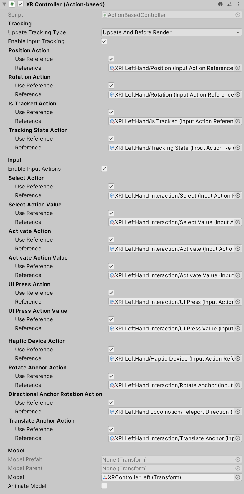

# XR Controller (Action-based)

Interprets feature values on a tracked input controller device using actions from the Input System into XR Interaction states, such as Select. Additionally, it applies the current Pose value of a tracked device to the transform of the GameObject.

This behavior requires that the Input System is enabled in the **Active Input Handling** setting in **Edit > Project Settings > Player** for input values to be read. Each input action must also be enabled before you can read the current value of that action. Input actions referenced from an Input Action Asset are not enabled by default. To enable the input actions for this component, use the `InputActionManager` component and add the related Input Action Asset.

The **Select Action**, **Activate Action**, and **UI Press Action** properties have corresponding **Select Action Value**, **Activate Action Value**, and **UI Press Action Value** properties. The [Action types](https://docs.unity3d.com/Packages/com.unity.inputsystem@1.7/manual/Actions.html#action-types) of these actions are such that the former are usually [`Button`](https://docs.unity3d.com/Packages/com.unity.inputsystem@1.7/api/UnityEngine.InputSystem.InputActionType.html#UnityEngine_InputSystem_InputActionType_Button) type Actions, and the latter are optional [`Value`](https://docs.unity3d.com/Packages/com.unity.inputsystem@1.7/api/UnityEngine.InputSystem.InputActionType.html#UnityEngine_InputSystem_InputActionType_Value) type Actions. Each frame, the component will read whether the **Select Action** is performed to capture whether the select interaction state is active, and also capture the `float` value from the **Select Action Value**. If the **Select Action Value** is not set, the `float` value will be read from the **Select Action** instead. This process is repeated for the Activate and UI Press actions.

> [!NOTE]
> Having two Input Actions allows you as a developer to set the binding path for the **Select Action** to, for example, `<XRController>{LeftHand}/gripPressed` and set the binding for the **Select Value Action** to `<XRController>{LeftHand}/grip`. The threshold for the control being pressed is determined by the platform for `gripPressed` used for Select Action, and the axis amount can be read from `grip`. If you want to control the threshold yourself, you could consolidate both actions into a single Value type **Select Action** with an expected **Axis** control type and a binding path of `grip`, and add a **Press** Interaction where the **Press Point** can then be adjusted.

See the [Starter Assets](samples-starter-assets.md) sample for steps to import assets to streamline setup of this component. That sample contains a default set of input actions and presets which makes configuring this component easier.

| **Property** | **Description** |
|---|---|
| **Update Tracking Type** | The time within the frame that the controller samples tracking input. |
| &emsp;Update | Set **Update Tracking Type** to **Update** to sample tracking input only during the `MonoBehaviour` `Update` step. |
| &emsp;Before Render | Set **Update Tracking Type** to **Before Render** to sample tracking input only during the step immediately before rendering. |
| &emsp;Update And Before Render | Set **Update Tracking Type** to **Update And Before Render** to sample tracking input during both of the timings within a frame above. |
| **Enable Input Tracking** | Whether input pose tracking is enabled for the controller. When enabled, Unity reads the current tracking pose input of the controller device each frame. You can disable this in order to drive the controller state manually instead of from reading current inputs, such as when playing back recorded pose inputs. |
| **Position Action** | |
| &emsp;Use Reference | Enable to reference an action externally defined using the accompanying field. |
| &emsp;Reference | The Input System action to use for Position Tracking for this GameObject. Must be a `Vector3Control` Control. |
| **Rotation Action** | |
| &emsp;Use Reference | Enable to reference an action externally defined using the accompanying field. |
| &emsp;Reference | The Input System action to use for Rotation Tracking for this GameObject. Must be a `QuaternionControl` Control. |
| **Is Tracked Action** | |
| &emsp;Use Reference | Enable to reference an action externally defined using the accompanying field. |
| &emsp;Reference | The Input System action to read the Is Tracked state when updating this GameObject position and rotation; falls back to the tracked device's is tracked state that drives the position or rotation action when not set. Must be an action with a button-like interaction or `ButtonControl` Control. |
| **Tracking State Action** | |
| &emsp;Use Reference | Enable to reference an action externally defined using the accompanying field. |
| &emsp;Reference | The Input System action to read the Tracking State when updating this GameObject position and rotation; falls back to the tracked device's tracking state that drives the position or rotation action when not set. Must be an `IntegerControl` Control. |
| **Enable Input Actions** | Whether input for XR Interaction events is enabled for the controller. When enabled, Unity reads the current input of the controller device each frame. You can disable this in order to drive the controller state manually instead of from reading current inputs, such as when playing back recorded inputs. |
| **Select Action** | |
| &emsp;Use Reference | Enable to reference an action externally defined using the accompanying field. |
| &emsp;Reference | The Input System action to use for selecting an Interactable. Must be an action with a button-like interaction or `ButtonControl` Control. |
| **Select Action Value** | Optional, uses **Select Action** when not set. |
| &emsp;Use Reference | Enable to reference an action externally defined using the accompanying field. |
| &emsp;Reference | The Input System action to read the `float` value of Select Action, if different. Must be an `AxisControl` or `Vector2Control` Control. |
| **Activate Action** | |
| &emsp;Use Reference | Enable to reference an action externally defined using the accompanying field. |
| &emsp;Reference | The Input System action to use for activating a selected Interactable. Must be an action with a button-like interaction or `ButtonControl` Control. |
| **Activate Action Value** | Optional, uses **Activate Action** when not set. |
| &emsp;Use Reference | Enable to reference an action externally defined using the accompanying field. |
| &emsp;Reference | The Input System action to read the `float` value of Activate Action, if different. Must be an `AxisControl` or `Vector2Control` Control. |
| **UI Press Action** | Optional, used by XR Ray Interactor when Enable Interaction with UI GameObjects is enabled. |
| &emsp;Use Reference | Enable to reference an action externally defined using the accompanying field. |
| &emsp;Reference | The Input System action to use for Canvas UI interaction. Must be an action with a button-like interaction or `ButtonControl` Control. |
| **UI Press Action Value** | Optional, uses **UI Press Action** when not set. |
| &emsp;Use Reference | Enable to reference an action externally defined using the accompanying field. |
| &emsp;Reference | The Input System action to read the `float` value of UI Press Action, if different. Must be an `AxisControl` or `Vector2Control` Control. |
| **UI Scroll Action Value** | Optional, used by XR Ray Interactor |
| &emsp;Use Reference | Enable to reference an action externally defined using the accompanying field. |
| &emsp;Reference | The Input System action to read values for Canvas UI scrolling. Must be an `AxisControl` or `Vector2Control` Control. |
| **Haptic Device Action** | |
| &emsp;Use Reference | Enable to reference an action externally defined using the accompanying field. |
| &emsp;Reference | The Input System action to use for identifying the device to send haptic impulses to. Can be any control type that will have an active control driving the action. |
| **Rotate Anchor Action** | Optional, used by XR Ray Interactor when Anchor Control is enabled and Rotation Mode is set to Rotate Over Time. |
| &emsp;Use Reference | Enable to reference an action externally defined using the accompanying field. |
| &emsp;Reference | The Input System action to use for rotating the interactor's attach point over time. Must be a `Vector2Control` Control. Uses the x-axis as the rotation input. |
| **Directional Anchor Rotation Action** | Optional, used by XR Ray Interactor when Anchor Control is enabled and Rotation Mode is set to Match Direction. |
| &emsp;Use Reference | Enable to reference an action externally defined using the accompanying field. |
| &emsp;Reference | The Input System action to use for computing a direction angle to rotate the interactor's attach point to match it. Must be a `Vector2Control` Control. The direction angle is computed as the arctangent function of x/y. |
| **Translate Anchor Action** | Optional, used by XR Ray Interactor when Anchor Control is enabled. |
| &emsp;Use Reference | Enable to reference an action externally defined using the accompanying field. |
| &emsp;Reference | The Input System action to use for translating the interactor's attach point closer or further away from the interactor. Must be a `Vector2Control` Control. Uses the y-axis as the translation input. |
| **Scale Toggle Action** | Optional, used by XR Ray Interactor when Anchor Control is enabled. |
| &emsp;Use Reference | Enable to reference an action externally defined using the accompanying field. |
| &emsp;Reference |  The Input System action to use to enable or disable reading from the Scale Delta Action. Must be a `ButtonControl` Control. The pressed state of the button will toggle the scale state. |
| **Scale Delta Action** | Optional, used by XR Ray Interactor when Anchor Control is enabled. |
| &emsp;Use Reference | Enable to reference an action externally defined using the accompanying field. |
| &emsp;Reference | The Input System action to use for providing a scale delta value to transformers. Must be a `Vector2Control` Control. Uses the y-axis as the scale input. |
| **Model Prefab** | The prefab of a controller model to show for this controller that this behavior automatically instantiates. This behavior automatically instantiates an instance of the prefab as a child of `modelParent` (see below) upon startup unless `model` (see further below) is already set, in which case this value is ignored. |
| **Model Parent** | The transform that this behavior uses as the parent for the model prefab when it is instantiated. Automatically instantiated and set in `Awake` if not already set. Setting this will not automatically destroy the previous object. |
| **Model** | The instance of the controller model in the scene. You can set this to an existing object instead of using `modelPrefab` (see above). If set, it should reference a child GameObject of this behavior so it will update with the controller pose. |
| **Animate Model** | Whether to animate the model in response to interaction events. When enabled, activates a named animation trigger upon selecting or deselecting. |