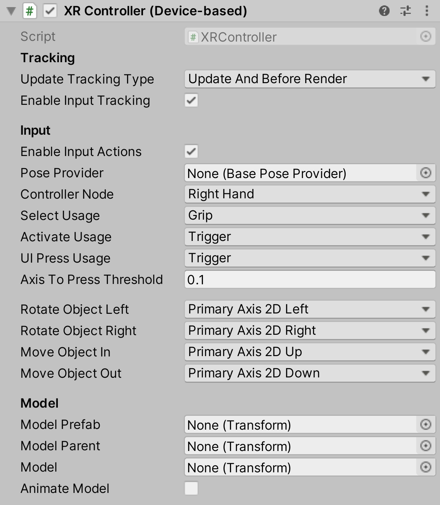

# XR Controller (Device-based)

Interprets feature values on a tracked input controller device from the XR input subsystem into XR Interaction states, such as Select. Additionally, it applies the current Pose value of a tracked device to the transform of the `GameObject`.

It is recommended to use the [action-based controller](xr-controller-action-based.md) instead of this behavior. This behavior does not need as much initial setup as compared to the action-based controller, however input processing is less customizable and [`XRDeviceSimulator`](xr-device-simulator.md) cannot be used to drive this behavior.

| **Property** | **Description** |
|---|---|
| **Update Tracking Type** | The time within the frame that the controller samples tracking input. |
| &emsp;Update | Set **Update Tracking Type** to **Update** to sample tracking input only during the `MonoBehaviour` `Update` step. |
| &emsp;Before Render | Set **Update Tracking Type** to **Before Render** to sample tracking input only during the step immediately before rendering. |
| &emsp;Update And Before Render | Set **Update Tracking Type** to **Update And Before Render** to sample tracking input during both of the timings within a frame above. |
| **Enable Input Tracking** | Whether input pose tracking is enabled for the controller. When enabled, Unity reads the current tracking pose input of the controller device each frame. You can disable this in order to drive the controller state manually instead of from reading current inputs, such as when playing back recorded pose inputs. |
| **Enable Input Actions** | Whether input for XR Interaction events is enabled for the controller. When enabled, Unity reads the current input of the controller device each frame. You can disable this in order to drive the controller state manually instead of from reading current inputs, such as when playing back recorded inputs. |
| **Pose Provider** | Pose provider used to provide tracking data separate from the `XRNode`. |
| **Controller Node** | The `XRNode` for this controller. Used to get the `InputDevice` when reading input from the controller, with calls such as `IsPressed` and `TryGetFeatureValue`. |
| **Select Usage** | The input to use for detecting a select. Refers to input mechanisms on an XR controller. The default select usage is `Grip`. |
| **Activate Usage** | The input to use for detecting activation. Refers to input mechanisms on an XR controller. The default activation usage is `Trigger`. Not to be confused with the active state of a GameObject, an activate event in this context refers to a contextual command action, such as toggling a flashlight on and off. |
| **UI Press Usage** | The input to use for detecting a UI press. Refers to input mechanisms on an XR controller. The default UI press usage is `Trigger`. |
| **Axis To Press Threshold** | The amount that a user needs to press an axis in order to trigger an interaction event. This value is normalized: 0 is not pressed at all, 1 is fully pressed. The default threshold is `0.1`. |
| **Rotate Object Left** | The input to use to rotate an anchor to the Left (counter-clockwise). Refers to input mechanisms on an XR controller. The default is `PrimaryAxis2DLeft`. |
| **Rotate Object Right** | The input to use to rotate an anchor to the Right (clockwise). Refers to input mechanisms on an XR controller. The default is `PrimaryAxis2DRight`. |
| **Move Object In** | The input that will be used to translate the anchor away from the interactor (into the screen / away from the player). Refers to input mechanisms on an XR Controller. The default is `PrimaryAxis2DUp`. |
| **Move Object Out** | The input that will be used to translate the anchor towards the interactor (out of the screen / towards the player). Refers to input mechanisms on an XR Controller. The default is `PrimaryAxis2DDown`. |
| **Directional Anchor Rotation** | The input to use to compute a directional angle to rotate the interactor's attach point to match it. Refers to input mechanisms on an XR Controller. The default is `PrimaryAxis2D`. |
| **Model Prefab** | The prefab of a controller model to show for this controller that this behavior automatically instantiates. This behavior automatically instantiates an instance of the prefab as a child of `modelParent` (see below) upon startup unless `model` (see further below) is already set, in which case this value is ignored. |
| **Model Parent** | The transform that this behavior uses as the parent for the model prefab when it is instantiated. Automatically instantiated and set in `Awake` if not already set. Setting this will not automatically destroy the previous object. |
| **Model** | The instance of the controller model in the scene. You can set this to an existing object instead of using `modelPrefab` (see above). If set, it should reference a child GameObject of this behavior so it will update with the controller pose. |
| **Animate Model** | Whether to animate the model in response to interaction events. When enabled, activates a named animation trigger upon selecting or deselecting. |