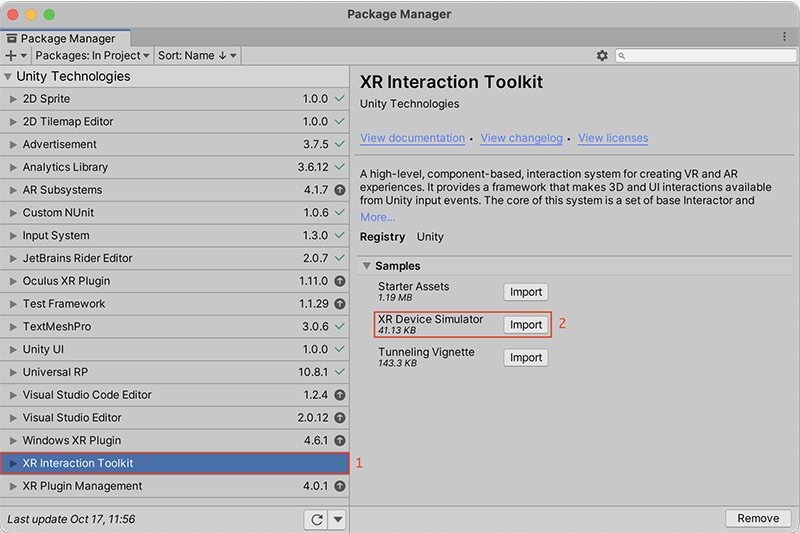
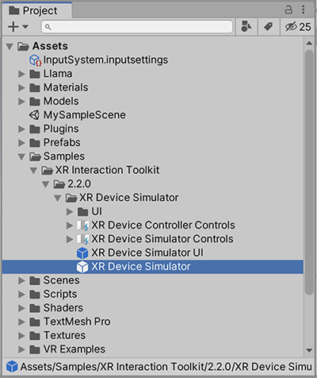
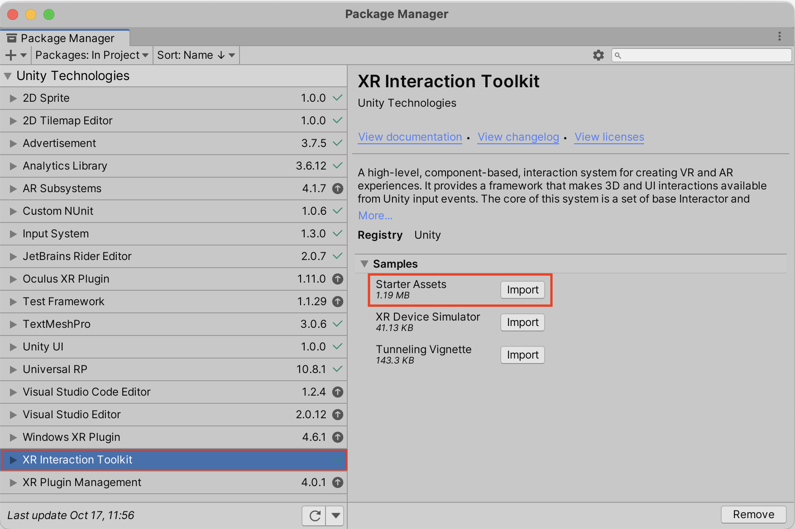
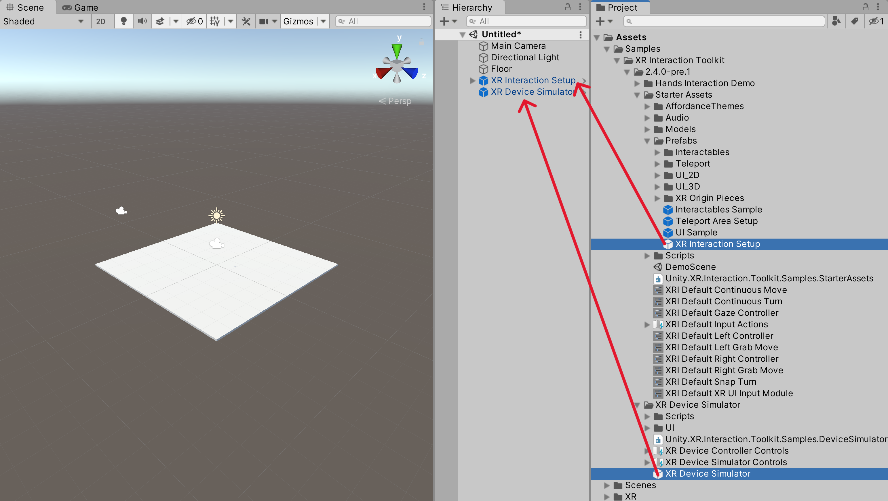
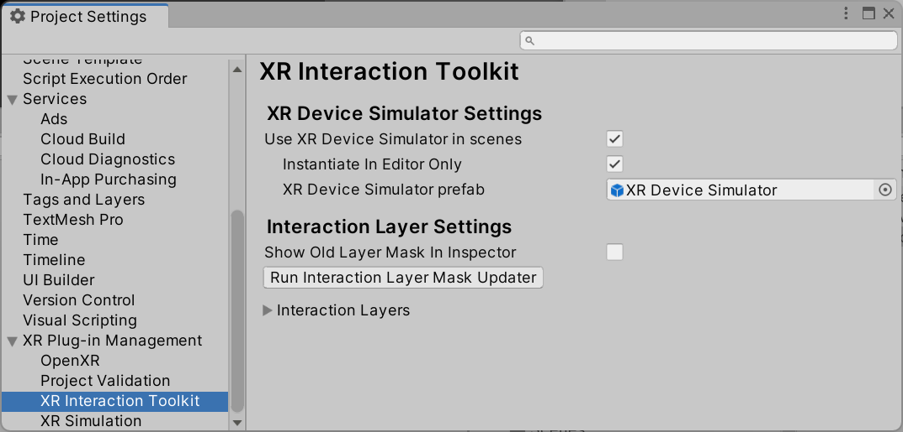
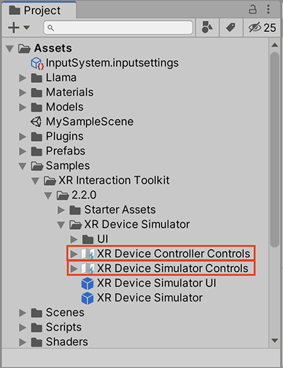
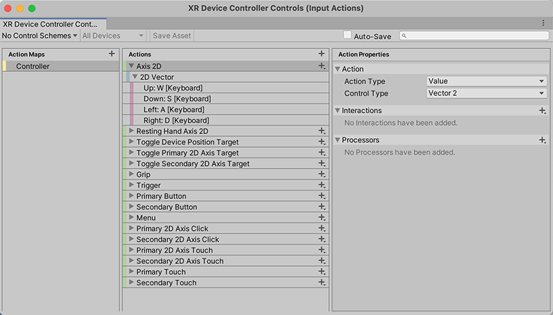
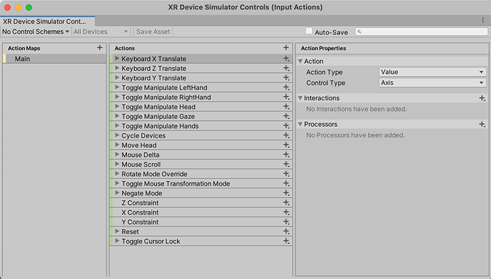

# XR Device Simulator overview

The XR Device simulator is a runtime utility that is included as part of the Samples add-on in this package. This utility lets you simulate user inputs from plain key presses (be it from a keyboard and mouse combo or a controller) to drive the XR headset and controller devices in the scene.

> [!NOTE]
> The simulator doesn't directly manipulate the camera or controllers that are part of the XR Origin but instead drives them indirectly through simulated input.

This section covers topics like how to install the XR Device Simulator, how to use it, how to set it up in a new empty scene, and how to change key bindings tied to the XR Device Simulator. You are encouraged to tweak the bindings to make the simulator fit your needs.

For more information about the specifics on the XR Device Simulator component, see the [XR Device Simulator](xr-device-simulator.md) page where you can get more info about the specific settings that are exposed for it.

# Installing the XR Device Simulator

To install the XR Device Simulator, go to the package manager (**Window** &gt; **Package Manager**), select the **XR Interaction Toolkit** package, and then click on the **Import** button next to **XR Device Simulator** under the samples section in the Package Manager.

Upon clicking the **Import** (Or **Reimport** to have the latest version) button, you will see a `Samples\XR Device Simulator` folder added to the Project window. The `XR Device Simulator` prefab in this folder is the asset that will be added to the scenes where you want to simulate XR input.

# Using the XR Device Simulator

As mentioned above, the XR Device Simulator prefab simulates user inputs from plain key presses to drive a XR System. For the XR Device Simulator to work in your scene, it must find a pre-configured XR Origin object.

This section covers a guide on how to set up the pre-configured XR Origin GameObject to use it along with the XR Device Simulator 

## Setting up a scene for the XR Device Simulator

To add an XR Origin prefab that is pre-configured to support the XR Device Simulator, open **Window** &gt; **Package Manager** and select the **XR Interaction Toolkit** package, and then click on the **Import** button next to the **Starter Assets** under the Samples section.

Upon importing the starter assets, drag the `XR Interaction Setup` and `XR Device Simulator` prefabs to your scene.

## Testing with the XR Device Simulator

After adding the `XR Device Simulator` and `XR Interaction Setup` to your scene as prefabs, press the **Play** button and you will be able to move around with the key bindings marked in the simulator. Press tab to cycle active control from Left Controller, Right Controller, and Head Mounted Display (HMD).

## Making the XR Device Simulator work automatically in your project

To automatically activate the XR Device Simulator across multiple scenes, go to **Edit** &gt; **Project Settings** &gt; **XR Plug-in Management** &gt; **XR Interaction Toolkit** and enable the **Use XR Device Simulator in scenes** option to automatically instantiate the sample's prefab at runtime.

[!Note]
> The XR Device Simulator is primarily designed as an Editor-only testing tool. If you wish to have the XR Device Simulator automatically instantiate the selected prefab on a standalone production build, you will need to either include the prefab in your scene or disable **Instantiate In Editor Only**.

This prefab will not be destroyed when changing between scenes and will persist across your project at runtime.

## Using the XR Device Simulator prefab

If you want to modify the Device Simulator or to explicitly add it to a specific scene, you can select the `XR Device Simulator` prefab and drag it to your scene.

# Setting the XR Device simulator to work with different input bindings

The XR Device Simulator can be set up to work with any type of input that is supported by the Input System. To change key bindings (keystrokes mapped to each device action) there are two files that you can tweak to meet your preferences. Upon setting the key bindings in these files, you will see the new bindings reflected in the Device Simulator UI when in Play mode.

Depending on which mapped actions you want to modify in the XR Device Simulator, you might need to modify the `XR Device Controller Controls` (for controller key bindings) or the `XR Device Simulator Controls` (for the simulator key bindings).

To modify the key bindings, double click on either of the asset files and you will get an Input Action window. Refer to [Editing Input Action Assets](https://docs.unity3d.com/Packages/com.unity.inputsystem@1.7/manual/ActionAssets.html#editing-input-action-assets) in the Input System documentation for more information on how to set up key bindings in an Input Action asset.

To set up the controller bindings like grip, primary / secondary buttons, joystick, etc, double click on the `XR Device Controller Controls`:

To set up the simulator bindings or headset bindings like move, look around, etc, double click on the `XR Device Simulator Controls`:

You might note that all the key bindings on each of these files are not reflected in the `XR Device Simulator UI` prefab. This is by design to not clutter the Simulator UI as only the most used controls are shown.