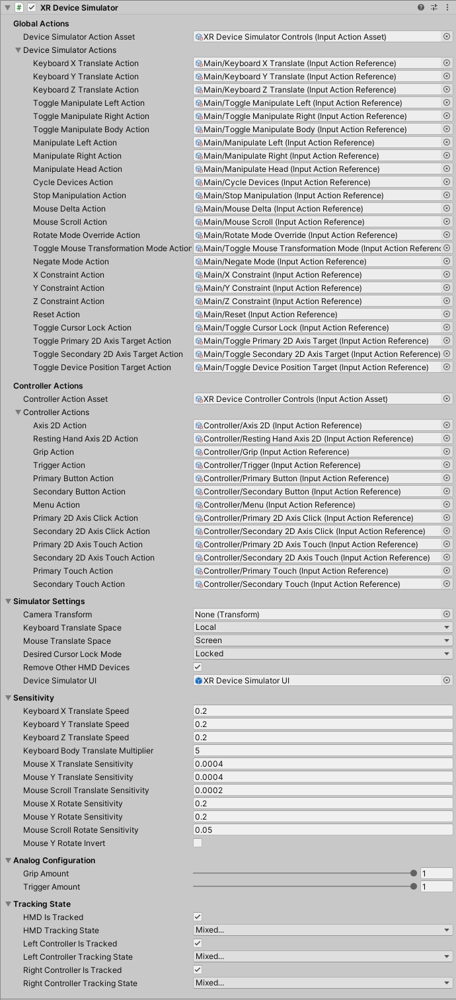

# XR Device Simulator

The XR Device Simulator component which handles mouse and keyboard input from the user and uses it to drive simulated XR controllers and an XR head mounted display (HMD).

This class does not directly manipulate the camera or controllers which are part of the XR Origin, but rather drives them indirectly through simulated input devices.

Use the Package Manager window to install the **XR Device Simulator** sample into your project to get sample mouse and keyboard bindings for Input System actions that this component expects. The sample also includes a prefab of a `GameObject` with this component attached that has references to those sample actions already set. To make use of this simulator, add the prefab to your scene.

For more information about how to install and how to set it up in a scene, refer to the [XR Device Simulator overview](xr-device-simulator-overview.md).

> [!NOTE]
> The XR Origin must read the position and rotation of the HMD and controllers by using Input System actions (such as by using `ActionBasedController` and `TrackedPoseDriver`) for this simulator to work as expected. Attempting to use XR input subsystem device methods (such as by using `XRController` and `SpatialTracking.TrackedPoseDriver`) will not work as expected since this simulator depends on the Input System to drive the simulated devices.

| **Property** | **Description** |
|---|---|
| **Global Actions** | |
| **Device Simulator Action Asset** | The Input Action Asset that contains the actions used in the global actions section.|
| **Keyboard X Translate Action** | The Input System Action used to translate in the x-axis (left/right) while held. Must be a `InputActionType.Value` `AxisControl`. The prefab in the XR Device Simulator sample has this action bound to the A key (left/negative) and D key (right/positive). |
| **Keyboard Y Translate Action** | The Input System Action used to translate in the y-axis (up/down) while held. Must be a `InputActionType.Value` `AxisControl`. The prefab in the XR Device Simulator sample has this action bound to the S key (backward/negative) and W key (forward/positive). |
| **Keyboard Z Translate Action** | The Input System Action used to translate in the z-axis (forward/back) while held. Must be a `InputActionType.Value` `AxisControl`. The prefab in the XR Device Simulator sample has this action bound to the S key (backward/negative) and D key (forward/positive). |
| **Toggle Manipulate Left Action** | The Input System Action used to enable manipulation of the left-hand controller when toggled. Must be a `ButtonControl`. Note that if controls on the left-hand controller are actuated when this action is released, those controls will continue to remain actuated. This is to allow for multi-hand interactions without needing to have dedicated bindings for manipulating each controller separately and concurrently. The prefab in the XR Device Simulator sample has this action bound to the T key. |
| **Toggle Manipulate Right Action** | The Input System Action used to enable manipulation of the right-hand controller when toggled. Must be a `ButtonControl`. Note that if controls on the right-hand controller are actuated when this action is released, those controls will continue to remain actuated. This is to allow for multi-hand interactions without needing to have dedicated bindings for manipulating each controller separately and concurrently. The prefab in the XR Device Simulator sample has this action bound to the Y key. |
| **Toggle Manipulate Body Action** | The Input System Action used to toggle enable looking around with the HMD and controllers. Must be a `ButtonControl`.  The prefab in the XR Device Simulator sample has this action bound to the U key. |
| **Manipulate Left Action** | The Input System Action used to enable manipulation of the left-hand controller while held. Must be a `ButtonControl`. Holding this action key when the right-hand controller is toggled enables to use both controllers simultaneously. Note that if controls on the left-hand controller are actuated when this action is released, those controls will continue to remain actuated. This is to allow for multi-hand interactions without needing to have dedicated bindings for manipulating each controller separately and concurrently. The prefab in the XR Device Simulator sample has this action bound to the Left Shift key. |
| **Manipulate Right Action** | The Input System Action used to enable manipulation of the right-hand controller while held/toggled. Must be a `ButtonControl`. Holding this action key when the left-hand controller is toggled enables to use both controllers simultaneously. Note that if controls on the right-hand controller are actuated when this action is released, those controls will continue to remain actuated. This is to allow for multi-hand interactions without needing to have dedicated bindings for manipulating each controller separately and concurrently. The prefab in the XR Device Simulator sample has this action bound to the Space key. |
| **Manipulate Head Action** | The Input System Action used to enable manipulation of the HMD while held. Must be a `ButtonControl`. The prefab in the XR Device Simulator sample has this action bound to the right mouse button. |
| **Hand Controller Mode Action** | The Input System Action used to change between hand and controller mode. Must be a `ButtonControl`. The prefab in the XR Device Simulator sample has this action bound to the `H` key. |
| **Cycle Devices Action** | The Input System Action used to cycle between the available devices (controllers and head) when pressed. Must be a `ButtonControl`. The prefab in the XR Device Simulator sample has this action bound to the `Tab` key. |
| **Stop Manipulation Action** | The Input System Action used to stop all manipulation of the controllers and head when pressed. Must be a `ButtonControl`. The prefab in the XR Device Simulator sample has this action bound to the `Escape` key. |
| **Mouse Delta Action** | The Input System Action used to translate or rotate by a scaled amount along or about the x- and y-axes. Must be a `InputActionType.Value` `Vector2Control`. Typically bound to the screen-space motion delta of the mouse in pixels. This is how the prefab in the XR Device Simulator sample is set up. |
| **Mouse Scroll Action** | The Input System Action used to translate or rotate by a scaled amount along or about the z-axis. Must be a `InputActionType.Value` `Vector2Control`. Typically bound to the horizontal and vertical scroll wheels, though only the vertical is used. This is how the prefab in the XR Device Simulator sample is set up. |
| **Rotate Mode Override Action** | The Input System Action used to cause the manipulated device(s) to rotate when moving the mouse when held. Must be a `ButtonControl`. Forces rotation mode when held, no matter what the current mouse transformation mode is. |
| **Toggle Mouse Transformation Mode Action** | The Input System Action used to toggle between translating or rotating the manipulated device(s). Must be a `ButtonControl`.  The prefab in the XR Device Simulator sample has this action bound to the `R` key. |
| **Negate Mode Action** | The Input System Action used to cause the manipulated device(s) to rotate when moving the mouse while held when it would normally translate, and vice-versa. Must be a `ButtonControl`. Can be used to temporarily change the mouse transformation mode to the other mode while held for making quick adjustments. |
| **X Constraint Action** | The Input System Action used to constrain the translation or rotation to the x-axis when moving the mouse or resetting. May be combined with another axis constraint to constrain to a plane. Must be a `ButtonControl`. The prefab in the XR Device Simulator sample has this action bound to the `X` key. |
| **Y Constraint Action** | The Input System Action used to constrain the translation or rotation to the y-axis when moving the mouse or resetting. May be combined with another axis constraint to constrain to a plane. Must be a `ButtonControl`. The prefab in the XR Device Simulator sample has this action bound to the `C` key. |
| **Z Constraint Action** | The Input System Action used to constrain the translation or rotation to the z-axis when moving the mouse or resetting. May be combined with another axis constraint to constrain to a plane. Must be a `ButtonControl`. The prefab in the XR Device Simulator sample has this action bound to the `Z` key. |
| **Reset Action** | The Input System Action used to cause the manipulated device(s) to reset position or rotation (depending on the effective manipulation mode). Must be a `ButtonControl`. Resets position to `Vector3.zero` and rotation to `Quaternion.identity`. May be combined with axis constraints (see above three actions). |
| **Toggle Cursor Lock Action** | The Input System Action used to toggle the cursor lock mode for the game window when pressed. Must be a `ButtonControl`. The prefab in the XR Device Simulator sample has this action bound to the \ key. |
| **Toggle Primary 2D Axis Target Action** | The Input System action used to toggle enable manipulation of the `Axis2DTargets.Primary2DAxis` of the controllers when pressed. Must be a `ButtonControl`. The prefab in the XR Device Simulator sample has this action bound to the `1` key. |
| **Toggle Secondary 2D Axis Target Action** | The Input System action used to toggle enable manipulation of the `Axis2DTargets.Secondary2DAxis` of the controllers when pressed. Must be a `ButtonControl`. The prefab in the XR Device Simulator sample has this action bound to the `2` key. |
| **Toggle Device Position Target Action** | The Input System Action used to toggle enable translation from keyboard inputs when pressed. Must be a `ButtonControl`. The prefab in the XR Device Simulator sample has this action bound to the `3` key. |
| **Controller Actions** | |
| **Controller Action Asset** | The Input Action Asset that contains the actions used in the controller actions section. This asset is enabled/disabled automatically as needed. |
| **Axis 2D Action** | The Input System Action used to control the value of one or more 2D Axis controls on the manipulated controller device(s). Must be a `InputActionType.Value` `Vector2Control`. The above two actions' toggles enable the ability to manipulate 2D Axis controls on the simulated controllers, and this action actually controls the value of them while those controller devices are being manipulated. Typically bound to WASD on a keyboard, and controls the primary and/or secondary 2D Axis controls on them. |
| **Resting Hand Axis 2D Action** | The Input System Action used to control one or more 2D Axis controls on the opposite hand of the exclusively manipulated controller device. Must be a `InputActionType.Value` `Vector2Control`. Typically bound to Q and E on a keyboard for the horizontal component, and controls the opposite hand's 2D Axis controls when manipulating one (and only one) controller. Can be used to quickly and simultaneously control the 2D Axis on the other hand's controller. In a typical setup of continuous movement bound on the left-hand controller stick, and turning bound on the right-hand controller stick, while exclusively manipulating the left-hand controller to move, this action can be used to trigger turning. |
| **Grip Action** | The Input System Action used to control the Grip control of the manipulated controller device(s). Must be a `ButtonControl`. The prefab in the XR Device Simulator sample has this action bound to the G key. |
| **Trigger Action** | The Input System Action used to control the Trigger control of the manipulated controller device(s). Must be a `ButtonControl`. The prefab in the XR Device Simulator sample has this action bound to Mouse 1 (the left mouse button). |
| **Primary Button Action** | The Input System Action used to control the PrimaryButton control of the manipulated controller device(s). Must be a `ButtonControl`. The prefab in the XR Device Simulator sample has this action bound to the B key. |
| **Secondary Button Action** | The Input System Action used to control the SecondaryButton control of the manipulated controller device(s). Must be a `ButtonControl`. The prefab in the XR Device Simulator sample has this action bound to the N key. |
| **Menu Action** | The Input System Action used to control the Menu control of the manipulated controller device(s). Must be a `ButtonControl`. The prefab in the XR Device Simulator sample has this action bound to the M key. |
| **Primary 2D Axis Click Action** | The Input System Action used to control the Primary2DAxisClick control of the manipulated controller device(s). Must be a `ButtonControl`. The prefab in the XR Device Simulator sample has this action bound to the 4 key. |
| **Secondary 2D Axis Click Action** | The Input System Action used to control the Secondary2DAxisClick control of the manipulated controller device(s). Must be a `ButtonControl`. The prefab in the XR Device Simulator sample has this action bound to the 5 key. |
| **Primary 2D Axis Touch Action** | The Input System Action used to control the Primary2DAxisTouch control of the manipulated controller device(s). Must be a `ButtonControl`. The prefab in the XR Device Simulator sample has this action bound to the 6 key. |
| **Secondary 2D Axis Touch Action** | The Input System Action used to control the Secondary2DAxisTouch control of the manipulated controller device(s). Must be a `ButtonControl`. The prefab in the XR Device Simulator sample has this action bound to the 7 key. |
| **Primary Touch Action** | The Input System Action used to control the PrimaryTouch control of the manipulated controller device(s). Must be a `ButtonControl`. The prefab in the XR Device Simulator sample has this action bound to the 8 key. |
| **Secondary Touch Action** | The Input System Action used to control the SecondaryTouch control of the manipulated controller device(s). Must be a `ButtonControl`. The prefab in the XR Device Simulator sample has this action bound to the 9 key. |
| **Hand Actions** | |
| **Hand Action Asset** | The Input Action Asset that contains the actions used in the hand actions section. This asset is enabled/disabled automatically as needed. |
| **Resting Hand Expression Capture** | The resting hand expression to use when no other hand expression is active. |
| **Simulated Hand Expressions** | The list of hand expressions to simulate. The prefab in the XR Device Simulator sample has the following poses and key bindings: Poke (N), Pinch (M), Grab (K), Thumbs Up (L), Open (O), Fist (P). Each entry in the list defines: <ul><li>**Name** The unique name for the hand expression.</li><li>**Toggle Action** The input action to trigger the hand expression.</li><li>**Capture** The captured hand expression to simulate when the input action is performed.</li></ul> |
| **Simulator Settings** | |
| **Camera Transform** | The `Transform` that contains the `Camera`. This is usually the "Head" of XR Origins. Automatically set to `Camera.main` if unset. |
| **Keyboard Translate Space** | The coordinate space in which keyboard translation should operate. |
| &emsp;Local | Set **Keyboard Translate Space** to **Local** to apply translations of a controller or HMD relative to its own coordinate space, considering its own rotations. Will translate a controller relative to itself, independent of the camera. |
| &emsp;Parent | Set **Keyboard Translate Space** to **Parent** to apply translations of a controller or HMD relative to its parent. If the object does not have a parent, meaning it is a root object, the parent coordinate space is the same as the world coordinate space. This is the same as **Local** but without considering its own rotations. |
| &emsp;Screen | Set **Keyboard Translate Space** to **Screen** to apply translations of a controller or HMD relative to the screen. Will translate a controller relative to the camera, independent of the controller's orientation. |
| **Mouse Translate Space** | The coordinate space in which mouse translation should operate. |
| &emsp;Local | Set **Mouse Translate Space** to **Local** to apply translations of a controller or HMD relative to its own coordinate space, considering its own rotations. Will translate a controller relative to itself, independent of the camera. |
| &emsp;Parent | Set **Mouse Translate Space** to **Parent** to apply translations of a controller or HMD relative to its parent. If the object does not have a parent, meaning it is a root object, the parent coordinate space is the same as the world coordinate space. This is the same as **Local** but without considering its own rotations. |
| &emsp;Screen | Set **Mouse Translate Space** to **Screen** to apply translations of a controller or HMD relative to the screen. Will translate a controller relative to the camera, independent of the controller's orientation. |
| **Desired Cursor Lock Mode** | The desired cursor lock mode to toggle to from `CursorLockMode.None`. |
| &emsp;Locked | Set **Desired Cursor Lock Mode** to **Locked** to toggle between `CursorLockMode.None` and locking the cursor to the center of the game window. |
| &emsp;Confined | Set **Desired Cursor Lock Mode** to **Confined** to toggle between `CursorLockMode.None` and confining the cursor to the game window. |
| **Remove Other HMD Devices** | Whether or not to remove other XR HMD devices in this session so that they don't conflict with the XR Device Simulator. |
| **Hand Tracking Capability** | Whether to create a simulated Hand Tracking Subsystem and provider on startup. Requires the XR Hands package. |
| **Device Simulator UI** | The prefab containing the UI to show for the XR Device Simulator. By default, the prefab in the XR Device Simulator sample is using the `XR Device Simulator UI` prefab. Removing this field will remove the UI in the Game view.|
| **Sensitivity** | |
| **Keyboard X Translate Speed** | Speed of translation in the x-axis (left/right) when triggered by keyboard input. |
| **Keyboard Y Translate Speed** | Speed of translation in the y-axis (up/down) when triggered by keyboard input. |
| **Keyboard Z Translate Speed** | Speed of translation in the z-axis (forward/back) when triggered by keyboard input. |
| **Keyboard Body Translate Multiplier** | Speed multiplier applied for body translation when triggered by keyboard input. |
| **Mouse X Translate Sensitivity** | Sensitivity of translation in the x-axis (left/right) when triggered by mouse input. |
| **Mouse Y Translate Sensitivity** | Sensitivity of translation in the y-axis (up/down) when triggered by mouse input. |
| **Mouse Scroll Translate Sensitivity** | Sensitivity of translation in the z-axis (forward/back) when triggered by mouse scroll input. |
| **Mouse X Rotate Sensitivity** | Sensitivity of rotation along the x-axis (pitch) when triggered by mouse input. |
| **Mouse Y Rotate Sensitivity** | Sensitivity of rotation along the y-axis (yaw) when triggered by mouse input. |
| **Mouse Scroll Rotate Sensitivity** | Sensitivity of rotation along the z-axis (roll) when triggered by mouse scroll input. |
| **Mouse Y Rotate Invert** | A boolean value of whether to invert the y-axis of mouse input when rotating by mouse input. A `false` value (default) means typical FPS style where moving the mouse up/down pitches up/down. A `true` value means flight control style where moving the mouse up/down pitches down/up. |
| **Analog Configuration** | |
| **Grip Amount** | The amount of the simulated grip on the controller when the Grip control is pressed. |
| **Trigger Amount** | The amount of the simulated trigger pull on the controller when the Trigger control is pressed. |
| **Tracking State** | |
| **HMD Is Tracked** | Whether the HMD should report the pose as fully tracked or unavailable/inferred. |
| **HMD Tracking State** | Which tracking values the HMD should report as being valid or meaningful to use, which could mean either tracked or inferred. |
| **Left Controller Is Tracked** | Whether the left-hand controller should report the pose as fully tracked or unavailable/inferred. |
| **Left Controller Tracking State** | Which tracking values the left-hand controller should report as being valid or meaningful to use, which could mean either tracked or inferred. |
| **Right Controller Is Tracked** | Whether the right-hand controller should report the pose as fully tracked or unavailable/inferred. |
| **Right Controller Tracking State** | Which tracking values the right-hand controller should report as being valid or meaningful to use, which could mean either tracked or inferred. |
| **Left Hand Is Tracked** | Whether the left hand should report the pose as fully tracked or unavailable/inferred. |
| **Right Hand Is Tracked** | Whether the right hand should report the pose as fully tracked or unavailable/inferred. |

## Sample Controls

Each simulated XR HMD or XR Controller must be manipulated before controls/values will be modified. If controls on a manipulated controller are actuated when you stop manipulating, those controls will continue to remain actuated. This is to allow for multi-hand interactions without needing to have dedicated bindings for manipulating each controller separately and concurrently.

* Mouse2 (Right Mouse Button) [Hold]
  - Manipulate the HMD
    - You can use mouse input (moving and scroll wheel delta) to either **Translate** or **Rotate** manipulated device(s) (see `R`).
* T [Toggle]
  - Toggle to manipulate the left-hand controller only  
    - You can use mouse input (moving and scroll wheel delta) to either **Translate** or **Rotate** manipulated device(s) (see `R`) and use controls associated to that controller.
* Left Shift [Hold]
  - Hold to temporary manipulate the left-hand controller (can be used while manipulating the right-hand controller simultaneously)
    - You can use mouse input (moving and scroll wheel delta) to either **Translate** or **Rotate** manipulated device(s) (see `R`) and use controls associated to that controller.
* Y [Toggle]
  - Toggle to manipulate the right-hand controller only
     - You can use mouse input (moving and scroll wheel delta) to either **Translate** or **Rotate** manipulated device(s) (see `R`) and use controls associated to that controller.
* Space [Hold]
  - Hold to temporary manipulate the right-hand controller (can be used while manipulating the left-hand controller simultaneously)
    - You can use mouse input (moving and scroll wheel delta) to either **Translate** or **Rotate** manipulated device(s) (see `R`) and use controls associated to that controller.
* U [Toggle]
  - Toggle to enable looking around with the HMD and controllers.
* Tab [Press]
  - Cycle though available devices (in the following order Left Controller > Right Controller > Head)
* R [Toggle]
  - Toggle between Translate or Rotate mode for mouse input
* Ctrl [Hold]
  - Temporarily forces into Rotate mode while held
* Mouse 3 (Middle Mouse Button) [Hold]
  - Temporarily forces into Rotate mode while held
* Z [Hold]
  - Constrain translation/rotation/reset to z-axis
* X [Hold]
  - Constrain translation/rotation/reset to x-axis
* C [Hold]
  - Constrain translation/rotation/reset to y-axis
* V [Press]
  - Reset position or rotation (depending on current mode being Translate or Rotate)
* \ [Toggle]
  - Toggles between the mouse cursor being unlocked or locked to the game window. There is a value dropdown in the inspector to choose between Locked or Confined.
* G [Hold]
  - Grip
* Mouse 1 (Left Mouse Button) [Hold]
  - Trigger
* B [Hold]
  - Primary Button
* N [Hold]
  - Secondary Button
* M [Hold]
  - Menu
* 4 [Hold]
  - Primary 2D Axis Click
* 5 [Hold]
  - Secondary 2D Axis Click
* 6 [Hold]
  - Primary 2D Axis Touch
* 7 [Hold]
  - Secondary 2D Axis Touch
* 8 [Hold]
  - Primary Touch
* 9 [Hold]
  - Secondary Touch
The `Vector2` controls on the controllers and device position use the WASD keys, and which ones of those will take input are enabled through toggles (more than one can be active):
* 1 [Toggle]
  - Toggles whether keyboard inputs apply to **Primary 2D Axis** (the thumbstick for manipulating controller(s))
* 2 [Toggle]
  - Toggles whether keyboard inputs apply to **Secondary 2D Axis** (the touchpad on the manipulating controller(s))
* 3 [Toggle]
  - Toggles whether keyboard inputs apply to HMD/Controller **Position**

Default behavior or when **Position** is enabled:
* WASD [Hold]
  - Forward/Left/Backward/Right translation of HMD/Controller (mimics Unity Editor Scene view)
* QE [Hold]
  - Down/Up translation of the HMD/Controller (mimics Unity Editor Scene view)

When **Primary/Secondary 2D Axis** is enabled:
* WASD [Hold]
  - Forward/Left/Backward/Right push of the Controller Primary/Secondary 2D Axis
* QE [Hold]
  - Left/Right of the opposite controller Primary/Secondary 2D Axis (only works when manipulating a single controller)
* Mouse4 (Forward Button) and Mouse 5 (Backward Button) [Hold]
  - Up/Down of the opposite controller Primary/Secondary 2D Axis (only works when manipulating a single controller)
* IJKL [Hold]
  - Alternate input for Forward/Left/Backward/Right push of the opposite controller Primary/Secondary 2D Axis (only works when manipulating a single controller)
