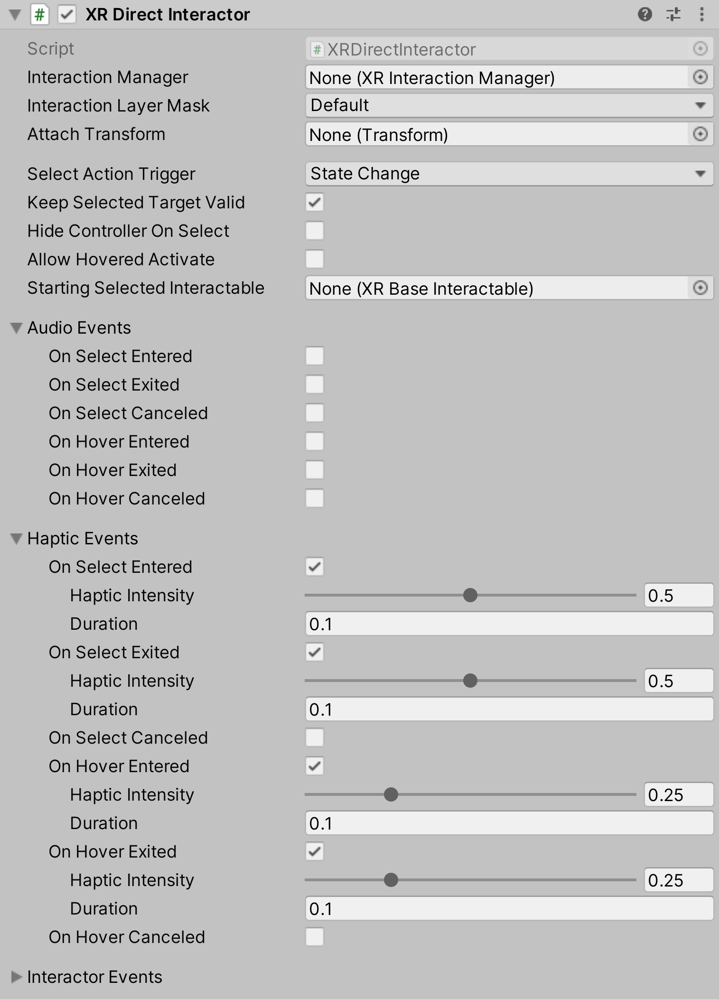

# XR Direct Interactor

Interactor used for directly interacting with Interactables that are touching. This is handled via trigger volumes that update the current set of valid targets for this interactor. This component must have a collision volume that is set to be a trigger to work.

| **Property** | **Description** |
|---|---|
| **Interaction Manager** | The [XRInteractionManager](xr-interaction-manager.md) that this Interactor will communicate with (will find one if **None**). |
| **Interaction Layer Mask** | Allows interaction with Interactables whose [Interaction Layer Mask](interaction-layers.md) overlaps with any Layer in this Interaction Layer Mask. |
| **Attach Transform** | The `Transform` that is used as the attach point for Interactables. Automatically instantiated and set in `Awake` if **None**. Setting this will not automatically destroy the previous object. |
| **Disable Visuals When Blocked In Group** | Whether to disable visuals when this Interactor is part of an [Interaction Group](xr-interaction-group.md) and is incapable of interacting due to active interaction by another Interactor in the Group. |
| **Improve Accuracy With Sphere Collider** | Generates contacts using optimized sphere cast calls every frame instead of relying on contact events on Fixed Update. Disable to force the use of trigger events. |
| **Physics Layer Mask** | Physics layer mask used for limiting direct interactor overlaps when using the Improve Accuracy With Sphere Collider option. |
| **Physics Trigger Interaction** | Determines whether the direct interactor sphere overlap will hit triggers when using the Improve Accuracy With Sphere Collider option. |
| **Select Action Trigger** | Choose how Unity interprets the select input action from the controller. Controls between different input styles for determining if this Interactor can select, such as whether the button is currently pressed or just toggles the active state. When this is set to `State` and multiple interactors select an interactable set to `InteractableSelectMode.Single`, you may experience undesired behavior where the selection of the interactable is passed back and forth between the interactors each frame. This can also cause the select interaction events to fire each frame. This can be resolved by setting this to `State Change` which is the default and recommended option. |
| &emsp;State | Unity will consider the input active while the button is pressed. A user can hold the button before the interaction is possible and still trigger the interaction when it is possible. |
| &emsp;State Change | Unity will consider the input active only on the frame the button is pressed, and if successful remain engaged until the input is released. A user must press the button while the interaction is possible to trigger the interaction. They will not trigger the interaction if they started pressing the button before the interaction was possible. |
| &emsp;Toggle | The interaction starts on the frame the input is pressed and remains engaged until the second time the input is pressed. |
| &emsp;Sticky | The interaction starts on the frame the input is pressed and remains engaged until the second time the input is released. |
| **Keep Selected Target Valid** | Whether to keep selecting an Interactable after initially selecting it even when it is no longer a valid target. Enable to make the `XRInteractionManager` retain the selection even if the Interactable is not contained within the list of valid targets. Disable to make the Interaction Manager clear the selection if it isn't within the list of valid targets. A common use for disabling this is for Ray Interactors used for teleportation to make the teleportation Interactable no longer selected when not currently pointing at it. |
| **Hide Controller On Select** | Controls whether this Interactor should hide the controller model on selection. |
| **Allow Hovered Activate** | Controls whether to send activate and deactivate events to interactables that this interactor is hovered over but not selected when there is no current selection. By default, the interactor will only send activate and deactivate events to interactables that it's selected. |
| **Target Track Mode** | Specifies how many Interactables that should be tracked in the Targets For Selection property, useful for custom feedback. The options are in order of best performance. |
| **Starting Selected Interactable** | The Interactable that this Interactor automatically selects at startup (optional, may be **None**). |
| **Audio Events** | These tie into the same selection and hover events as the **Interactor Events** further below - these audio events provide a convenient way to play specified audio clips for any of those events you want. |
| On Select Entered | If enabled, the Unity editor will display UI for supplying the audio clip to play when this Interactor begins selecting an Interactable. |
| On Select Exited | If enabled, the Unity editor will display UI for supplying the audio clip to play when this Interactor successfully exits selection of an Interactable. |
| On Select Canceled | If enabled, the Unity editor will display UI for supplying the audio clip to play when this Interactor cancels selection of an Interactable. |
| On Hover Entered | If enabled, the Unity editor will display UI for supplying the audio clip to play when this Interactor begins hovering over an Interactable. |
| On Hover Exited | If enabled, the Unity editor will display UI for supplying the audio clip to play when this Interactor successfully ends hovering over an Interactable. |
| On Hover Canceled | If enabled, the Unity editor will display UI for supplying the audio clip to play when this Interactor cancels hovering over an Interactable. |
| Allow Hover Audio While Selecting | Whether to allow playing audio from hover events if the hovered Interactable is currently selected by this Interactor. This is enabled by default. |
| **Haptic Events** | These tie into the same selection and hover events as the **Interactor Events** further below - these haptic events provide a convenient way to provide haptic feedback for any of those events you want. |
| On Select Entered | If enabled, the Unity editor will display UI for supplying the duration (in seconds) and intensity (normalized) to play in haptic feedback when this Interactor begins selecting an Interactable. |
| On Select Exited | If enabled, the Unity editor will display UI for supplying the duration (in seconds) and intensity (normalized) to play in haptic feedback when this Interactor successfully exits selection of an Interactable. |
| On Select Canceled | If enabled, the Unity editor will display UI for supplying the duration (in seconds) and intensity (normalized) to play in haptic feedback when this Interactor cancels selection of an Interactable. |
| On Hover Entered | If enabled, the Unity editor will display UI for supplying the duration (in seconds) and intensity (normalized) to play in haptic feedback when this Interactor begins hovering over an Interactable. |
| On Hover Exited | If enabled, the Unity editor will display UI for supplying the duration (in seconds) and intensity (normalized) to play in haptic feedback when this Interactor successfully ends hovering over an Interactable. |
| On Hover Canceled | If enabled, the Unity editor will display UI for supplying the duration (in seconds) and intensity (normalized) to play in haptic feedback when this Interactor cancels hovering over an Interactable. |
| Allow Hover Haptics While Selecting | Whether to allow playing haptics from hover events if the hovered Interactable is currently selected by this Interactor. This is enabled by default. |
| **Interactor Events** | See the [Interactor Events](interactor-events.md) page. |