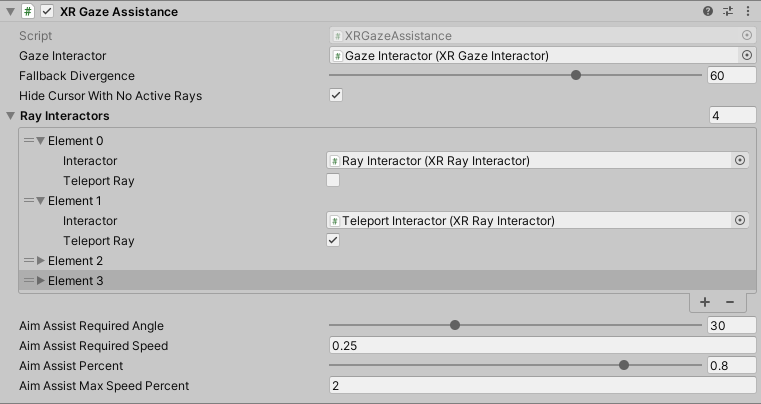

# XR Gaze Assistance

Allow specified ray interactors to fallback to eye-gaze when they are off screen or pointing off screen. This component enables split interaction functionality to allow the user to aim with eye gaze and select with a controller.

| **Property** | **Description** |
|---|---|
| **Gaze Interactor** | Eye data source - used as fallback data and to determine if fallback is necessary. |
| **Fallback Divergence** | The angle at which fallback data will be used instead of the original interactor ray. |
| **Hide Cursor With No Active Rays** | If the eye reticle should be hidden when all interactors are using their original data. |
| **Ray Interactors** | Interactors that can fall back to gaze data. |
| &emsp;**Interactor** | Instance of a Ray Interactor that can fallback to gaze data. |
| &emsp;**Teleport Ray** | Set to true if the Ray Interactor is used for teleportation. |
| **Aim Assist Required Angle** | How far projectiles can aim outside of eye gaze and still be considered for aim assist. |
| **Aim Assist Required Speed** | How fast a projectile must be moving to be considered for aim assist. |
| **Aim Assist Percent** | How much of the corrected aim velocity to use, as a percentage. 1.0 will auto-hit if possible. |
| **Aim Assist Max Speed Percent** | How much additional speed a projectile can receive from aim assistance, as a percentage. |