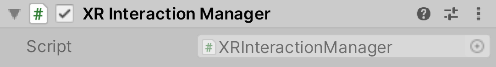

# XR Interaction Manager

The Interaction Manager acts as an intermediary between Interactors and Interactables. It is possible to have multiple Interaction Managers, each with their own valid set of Interactors and Interactables. Upon being enabled, both Interactors and Interactables register themselves with a valid Interaction Manager (if a specific one has not already been assigned in the inspector). The loaded scenes must have at least one Interaction Manager for Interactors and Interactables to be able to communicate.

Many of the methods on the Interactors and Interactables are designed to be called by this Interaction Manager rather than being called directly in order to maintain consistency between both targets of an interaction event.

